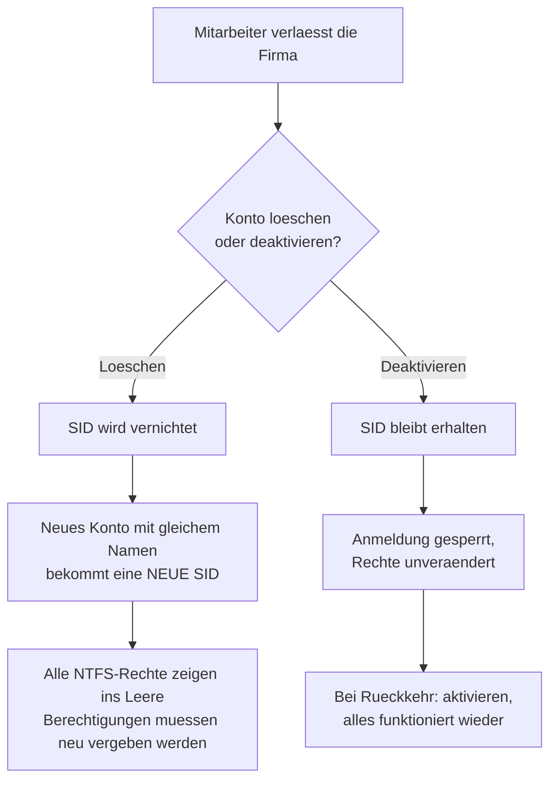

# Lokale Benutzer, Gruppen und Absicherung des Administrator-Kontos

## Worum es geht

Jede frische Windows-Server-Installation bringt ein eingebautes Konto mit: `Administrator`. Dieses Konto hat auf jedem Windows-System dieselbe SID-Endung, die Zahl 500. Man nennt das RID 500.

Das ist der eigentliche Punkt. Ein Angreifer muss den Benutzernamen nicht erraten, denn er weiss schon, dass es dieses Konto gibt und dass es volle Rechte hat. Er braucht nur noch das Kennwort. Ausserdem greift die normale Kontosperrung bei diesem Konto standardmässig nicht, es lässt sich also beliebig oft ausprobieren.

Die übliche Gegenmassnahme besteht aus zwei Schritten: einen eigenen Administrator anlegen und danach das eingebaute Konto deaktivieren. Ab diesem Moment muss ein Angreifer zwei Dinge raten, den Namen und das Kennwort.

## Das Kontomodell im Lab

Ich habe auf allen Servern dasselbe Schema verwendet, damit ich später nicht überlegen muss, welche Maschine welche Konten hat.

| Konto | Rolle | Gruppe | Status | Kennwortoption |
| :--- | :--- | :--- | :--- | :--- |
| `adm_local` | mein Administrator | Administratoren | aktiv | Kennwort läuft nie ab |
| `kurs_user` | normaler Testbenutzer | Benutzer | aktiv | muss beim ersten Anmelden geändert werden |
| `Administrator` | eingebautes Konto | Administratoren | **deaktiviert** | — |

Die beiden Kennwortoptionen sind bewusst unterschiedlich gesetzt, weil sie unterschiedliche Zwecke haben:

- **Benutzer muss Kennwort bei der nächsten Anmeldung ändern.** Das ist der Normalfall für einen neuen Mitarbeiter. Die Administration vergibt ein Startkennwort, kennt es also, und der Mitarbeiter setzt beim ersten Anmelden sein eigenes. Danach kennt es niemand mehr ausser ihm.
- **Kennwort läuft nie ab.** Das gehört eigentlich nur auf Dienstkonten. Wenn bei einem Dienstkonto das Kennwort abläuft, bleibt irgendwann nachts ein Dienst stehen und niemand weiss warum. Für einen normalen Benutzer ist diese Option dagegen eine Schwachstelle. Ich habe sie hier gesetzt, weil das eine Testumgebung ist, und schreibe das bewusst dazu.
- **Konto ist deaktiviert.** Der Schalter, mit dem man ein Konto stilllegt, ohne es zu verlieren. Dazu gleich mehr.

## Warum man Konten deaktiviert und nicht löscht

Das war für mich der wichtigste Punkt in diesem Thema, weil ich vorher gedacht hatte, es sei nur eine Frage der Ordnung.

Windows verwaltet Berechtigungen nicht über den Benutzernamen, sondern über die SID, eine eindeutige Kennung wie `S-1-5-21-...-1004`. Der Name ist nur die Anzeige. In jedem NTFS-Ordner, in jeder Freigabe und in jeder Gruppenmitgliedschaft steht die SID.



Deshalb lautet die Regel in Unternehmen fast immer: deaktivieren, eine Zeit lang liegen lassen, erst nach Ablauf einer Aufbewahrungsfrist löschen. Bei Elternzeit, längerer Krankheit oder einer internen Versetzung will man das Konto ohnehin behalten.

## Auf dem Server mit Oberfläche

Auf den Maschinen mit Desktopdarstellung läuft das über die Konsole `lusrmgr.msc`, die man auch über `compmgmt.msc` erreicht.

Der Ablauf: neuen Benutzer anlegen, Beschreibung und Kennwort setzen, die beiden Haken passend setzen. Danach über die Eigenschaften und den Reiter **Mitglied von** die Gruppe `Administratoren` hinzufügen. Das ist ein eigener Schritt, denn ein neuer Benutzer landet zuerst immer nur in `Benutzer`.


Erst danach habe ich das eingebaute Konto deaktiviert: Rechtsklick auf `Administrator`, Eigenschaften, Haken bei **Konto ist deaktiviert**.

## Auf Server Core

Auf den Maschinen ohne Oberfläche gibt es `lusrmgr.msc` nicht. Die Aufgabe bleibt dieselbe, nur der Weg ist ein anderer.

```powershell
# Kennwort als sicheres Objekt vorbereiten
$Pass = ConvertTo-SecureString "<Kennwort>" -AsPlainText -Force

# Konto anlegen
New-LocalUser -Name "adm_local" -Password $Pass `
              -Description "Primaerer lokaler Administrator" `
              -PasswordNeverExpires

# In die Administratorengruppe aufnehmen
Add-LocalGroupMember -Group "Administrators" -Member "adm_local"

# Testbenutzer
New-LocalUser -Name "kurs_user" -Password $Pass
Set-LocalUser  -Name "kurs_user" -PasswordNeverExpires $false

# Erst ganz am Schluss: eingebautes Konto stilllegen
Disable-LocalUser -Name "Administrator"
```

Dasselbe geht auch mit den alten `net`-Befehlen, die auf jedem Windows funktionieren:

```cmd
net user adm_local <Kennwort> /add /expires:never
net localgroup administrators adm_local /add
net user administrator /active:no
```

Ein Detail, über das ich gestolpert bin: die Gruppe heisst je nach Sprachversion `Administrators` oder `Administratoren`. In einem Skript, das auf beiden laufen soll, spricht man die Gruppe besser über ihre feste SID an, denn die ist überall gleich:

```powershell
Add-LocalGroupMember -SID "S-1-5-32-544" -Member "adm_local"
```

## Kontrolle

Ohne Oberfläche sieht man das Ergebnis nicht, also muss man es abfragen:

```powershell
Get-LocalUser
Get-LocalGroupMember -Group "Administrators"
whoami
```


Wichtig ist die Spalte `Enabled`. `adm_local` steht auf `True`, `Administrator` auf `False`. Genau so soll es aussehen.

## Server Core trotzdem grafisch verwalten

Server Core kann nicht weniger, es wird nur anders bedient. Wenn man doch eine Oberfläche möchte, kann man sich von einem Server mit Desktopdarstellung aus verbinden:

1. `compmgmt.msc` öffnen
2. Rechtsklick auf **Computerverwaltung (Lokal)**
3. **Verbindung mit anderem Computer herstellen**
4. Namen oder IP des Core-Servers eintragen

Danach verwaltet man dessen Benutzer im gewohnten Fenster. Die Verbindung läuft über WinRM und RPC.


## Wenn man sich ausgesperrt hat

Für den Fall, dass das eigene Konto nicht funktioniert und das eingebaute schon deaktiviert ist, hilft nur noch der lokale Zugang über die Konsole des Hypervisors:

```cmd
net user Administrator /active:yes
```

## Was ich dabei gelernt habe

**Die Reihenfolge ist nicht egal.** Beim ersten Versuch wollte ich das eingebaute Konto direkt nach dem Anlegen des neuen Benutzers deaktivieren. Das ist riskant, denn wenn bei der Gruppenzuweisung etwas schiefgeht, hat man keinen Administrator mehr auf der Maschine. Seitdem gehe ich immer so vor: anlegen, in die Gruppe aufnehmen, **einmal komplett damit anmelden**, und erst dann das alte Konto stilllegen.

**Umbenennen reicht nicht.** Man kann das eingebaute Konto auch nur umbenennen. Das bringt aber wenig, weil die SID gleich bleibt und mit einfachen Mitteln auslesbar ist. Ein Angreifer findet das Konto über die RID 500, egal wie es heisst.

**Der Unterschied zwischen Name und SID zieht sich durch alles.** Er erklärt, warum Löschen Berechtigungen zerstört, warum Umbenennen nichts absichert und warum man Gruppen in Skripten besser über die SID anspricht. Das ist mir hier zum ersten Mal richtig klar geworden.
