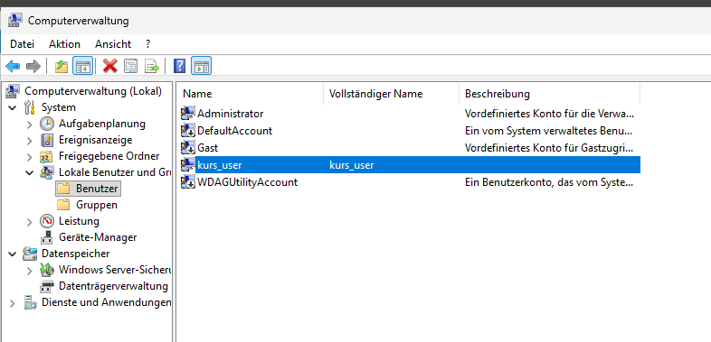
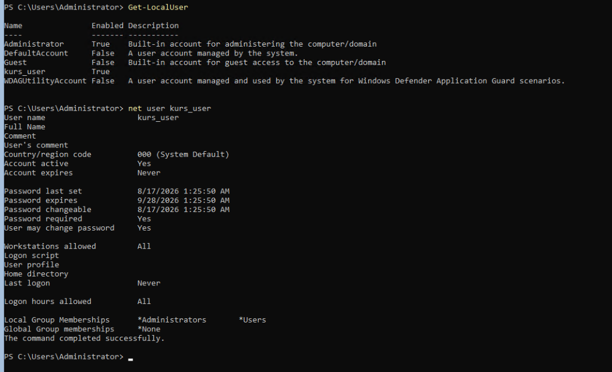

# Lokale Benutzer und Absicherung des Administrator-Kontos

## Warum ich das gemacht habe

Jede frische Windows-Server-Installation hat ein eingebautes Konto: `Administrator`. Dieses Konto hat immer die gleiche SID-Endung (RID 500). Das heisst, ein Angreifer muss den Benutzernamen nicht raten. Er kennt ihn schon und kann direkt Passwörter durchprobieren.

Deshalb ist die übliche Praxis: einen eigenen Administrator anlegen, ihn testen und danach das eingebaute Konto deaktivieren. Genau das habe ich auf allen Lab-Servern gemacht.

Ich habe drei Konten definiert:

| Konto | Aufgabe | Status |
| :--- | :--- | :--- |
| `adm_local` | mein eigener Administrator | aktiv, Kennwort läuft nie ab |
| `kurs_user` | normaler Testbenutzer | aktiv, muss Kennwort ändern |
| `Administrator` | eingebautes Konto | deaktiviert |

## Deaktivieren statt löschen

Das war für mich der wichtigste Punkt in diesem Thema, weil ich es vorher falsch verstanden hatte.

Wenn man einen Benutzer löscht, verschwindet seine SID. Die SID ist die eigentliche Identität, nicht der Name. Legt man später einen Benutzer mit genau dem gleichen Namen wieder an, bekommt er eine neue SID. Alle NTFS-Berechtigungen zeigen aber noch auf die alte SID und sind damit weg.

Beim Deaktivieren bleibt die SID erhalten. Kommt der Mitarbeiter zurück, aktiviert man das Konto und alle Rechte sind wieder da. In einer Firma ist das der normale Weg, zum Beispiel bei Elternzeit oder einer längeren Krankheit.

## GUI-Server: Computerverwaltung

Auf dem Server mit Desktopdarstellung habe ich `lusrmgr.msc` benutzt. Neuer Benutzer, Beschreibung, Kennwort, danach über den Reiter "Mitglied von" die Gruppe `Administratoren` zuweisen.



Beim Anlegen sind zwei Haken wichtig. "Benutzer muss Kennwort bei der nächsten Anmeldung ändern" habe ich für meinen Admin entfernt, "Kennwort läuft nie ab" gesetzt. Das ist im Lab praktisch, in einer echten Firma aber nur für Dienstkonten sinnvoll. Für normale Mitarbeiter wäre das eine Schwachstelle.

## Server Core: der gleiche Job ohne Fenster

Auf den Core-Servern gibt es keine grafische Oberfläche. Die Aufgabe ist aber dieselbe, nur der Weg ist ein anderer:

```powershell
$Pass = ConvertTo-SecureString "<Kennwort>" -AsPlainText -Force
New-LocalUser -Name "adm_local" -Password $Pass -PasswordNeverExpires
Add-LocalGroupMember -Group "Administrators" -Member "adm_local"
Disable-LocalUser -Name "Administrator"
```

Danach habe ich das Ergebnis geprüft:

```powershell
Get-LocalUser
Get-LocalGroupMember -Group "Administrators"
```



In der Ausgabe sieht man, was ich sehen wollte: `adm_local` steht auf `Enabled = True`, `Administrator` auf `False`.

## Was ich dabei gelernt habe

Die Reihenfolge ist nicht egal. Beim ersten Versuch wollte ich das eingebaute Konto direkt nach dem Anlegen des neuen Benutzers deaktivieren. Das ist gefährlich: wenn bei der Gruppenzuweisung etwas schiefgeht, hat man plötzlich keinen Administrator mehr auf der Maschine.

Seitdem mache ich es immer so: neues Konto anlegen, in die Gruppe aufnehmen, einmal komplett damit anmelden und erst dann das alte Konto deaktivieren.

Ein zweiter Punkt: auf Server Core gibt es kein `lusrmgr.msc`. Man kann sich aber vom GUI-Server aus über die Computerverwaltung mit "Verbindung mit anderem Computer herstellen" auf den Core-Server verbinden und die Benutzer trotzdem grafisch verwalten. Das läuft über WinRM und war für mich eine gute Erinnerung daran, dass Server Core nicht weniger kann, sondern nur anders bedient wird.
