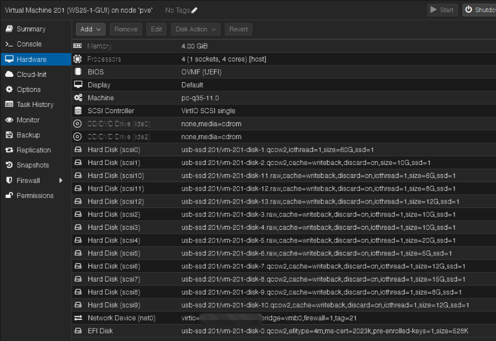
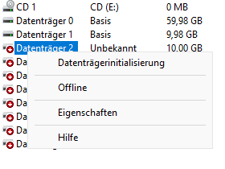
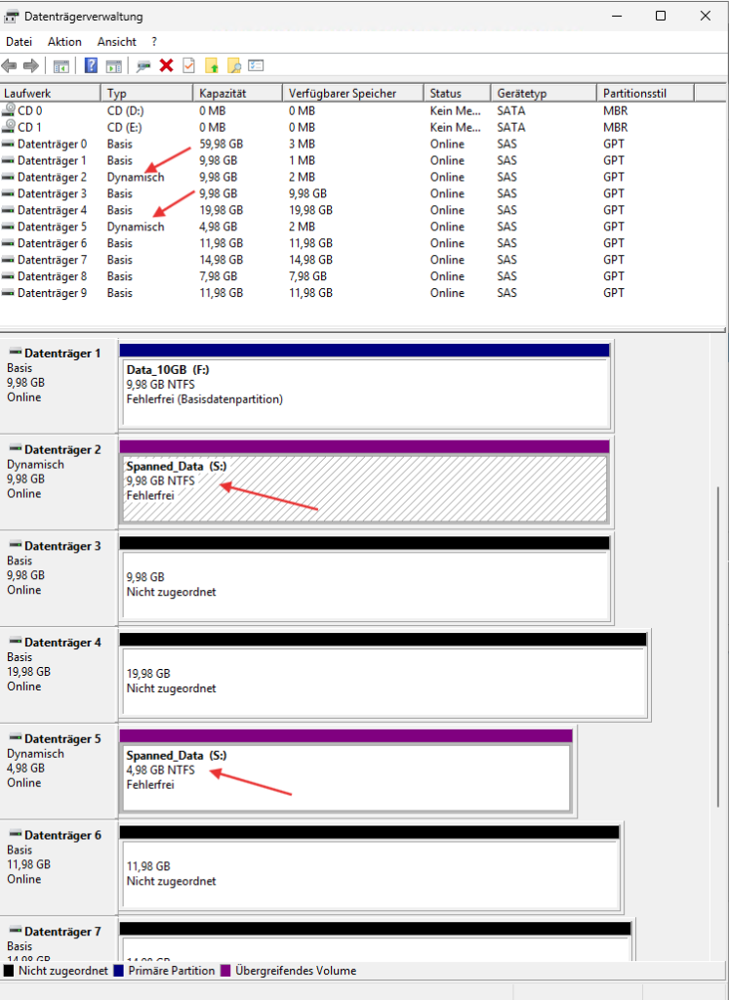
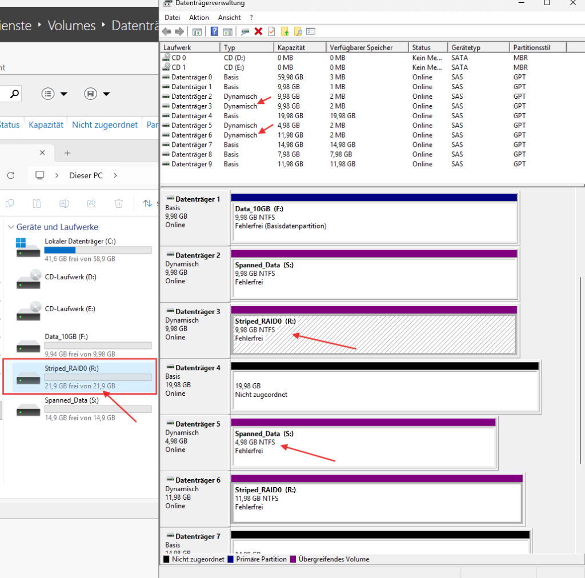
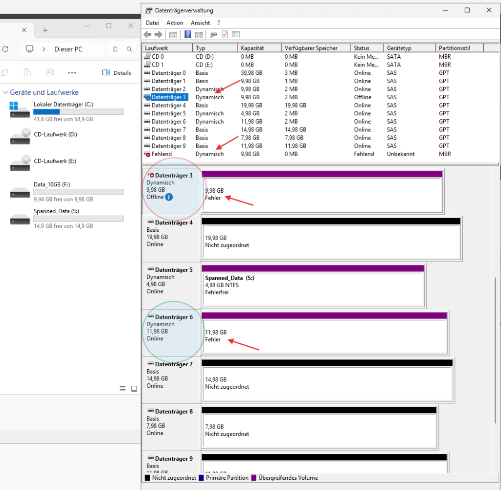
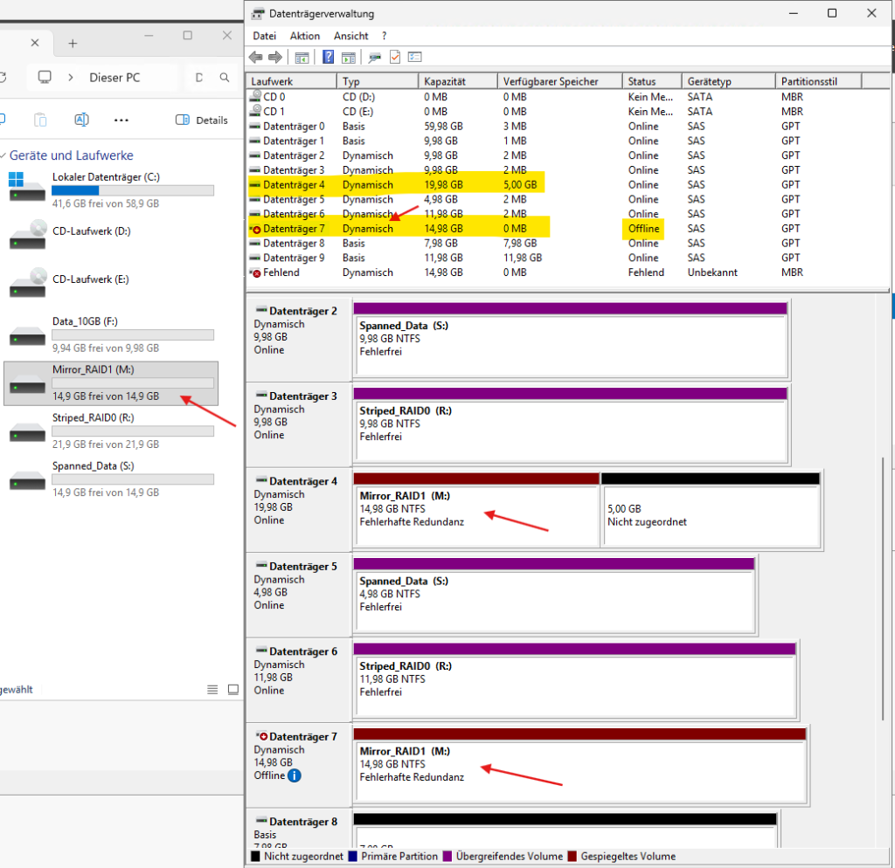
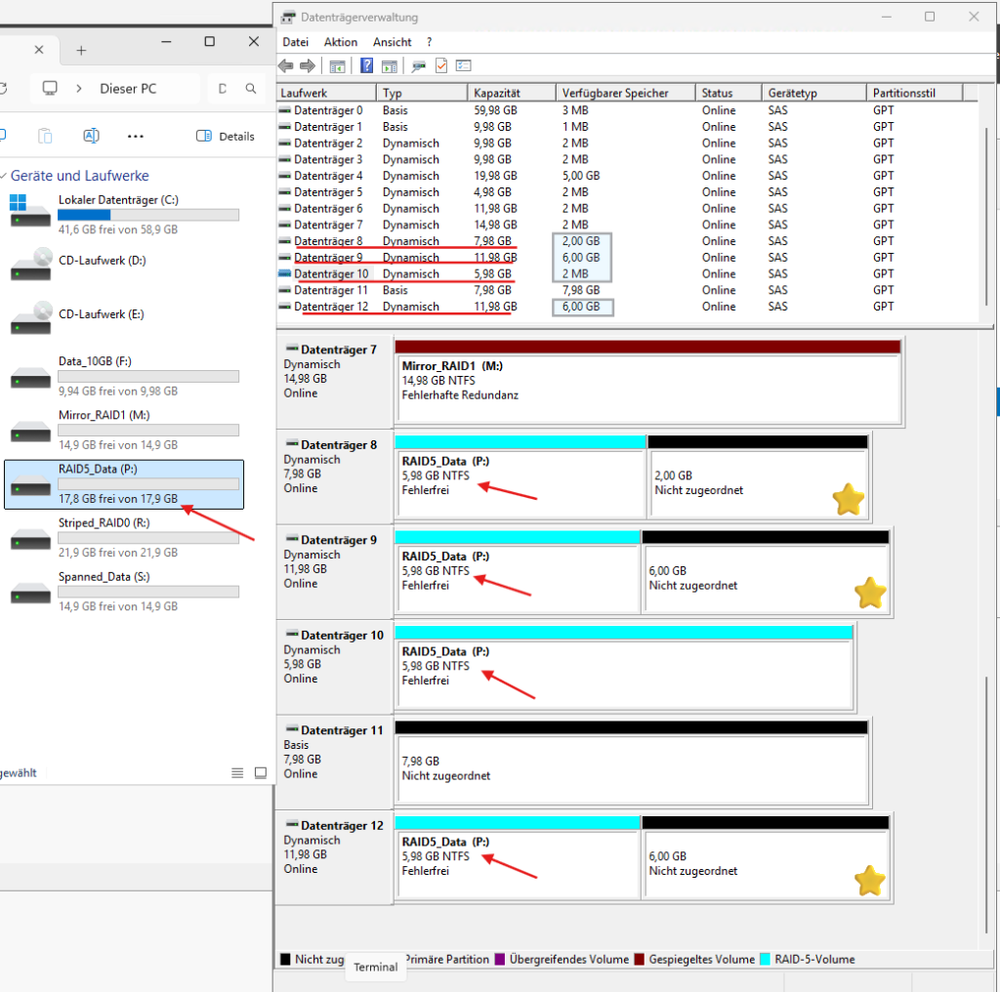
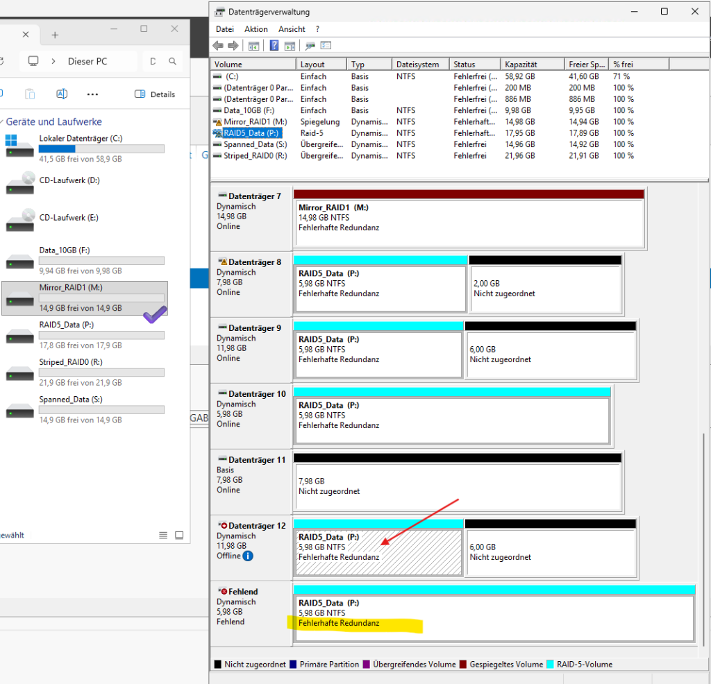
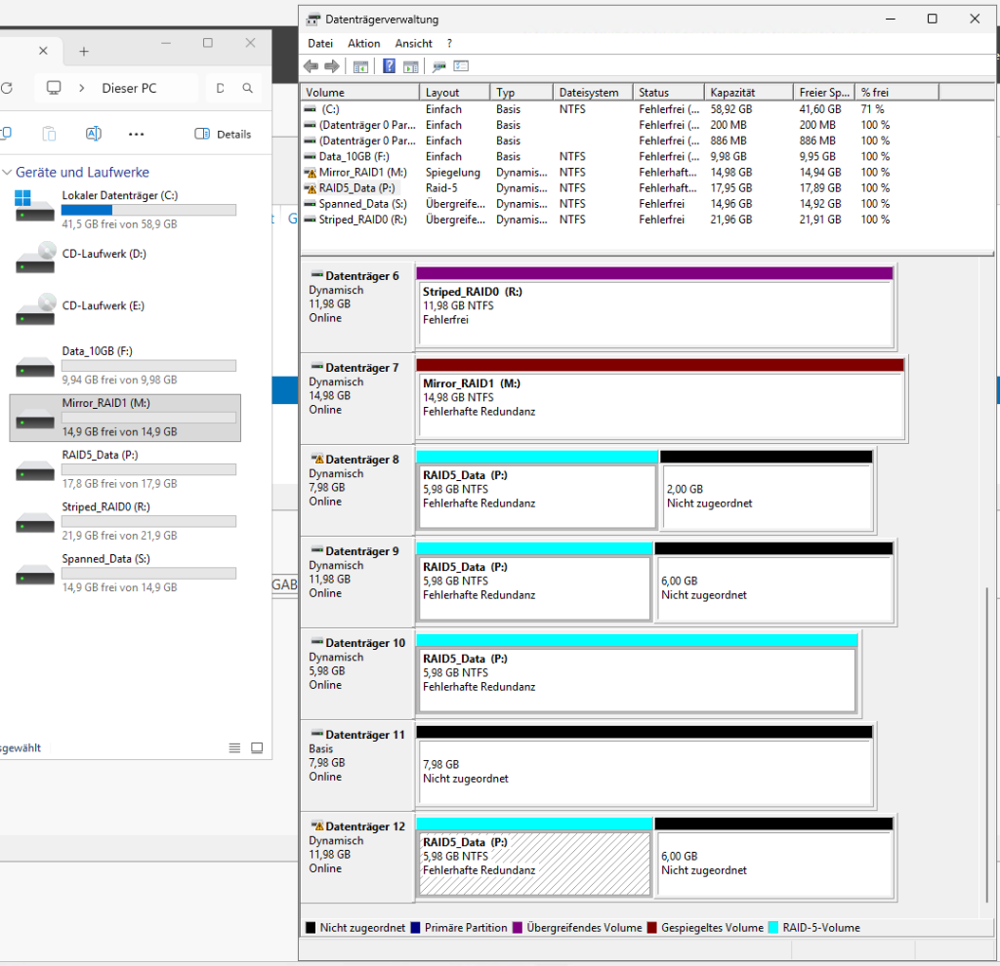

# Datenträger, Volumes und Software-RAID

## Warum ich das gemacht habe

RAID kannte ich vorher nur aus der Theorie: RAID 0 ist schnell, RAID 1 ist sicher, RAID 5 hat Parität. Das kann man auswendig lernen, aber man versteht es erst, wenn man eine Platte absichtlich abschaltet und sieht, was danach passiert.

Windows Server kann Software-RAID über dynamische Datenträger. Für den produktiven Einsatz nimmt man das heute selten, weil Storage Spaces oder ein Hardware-Controller besser sind. Zum Lernen ist es aber ideal: ich kann in Proxmox in einer Minute fünf virtuelle Platten anlegen, jede Variante durchspielen und Fehler simulieren, ohne echte Hardware zu riskieren.

## Vorbereitung im Hypervisor

Die Platten habe ich direkt über die Proxmox-Shell angelegt. Über die Weboberfläche geht es auch, aber bei fünf Platten ist die Kommandozeile schneller:

```bash
qm set <VMID> --scsi1 <storage>:10,cache=writeback,discard=on,ssd=1,iothread=1
qm set <VMID> --scsi2 <storage>:10,cache=writeback,discard=on,ssd=1,iothread=1
qm set <VMID> --scsi5 <storage>:5,cache=writeback,discard=on,ssd=1,iothread=1
```

Ich habe absichtlich unterschiedliche Grössen genommen (5, 10 und 20 GB). Der Grund kommt weiter unten.



Im Gastsystem sind die Platten danach offline und nicht initialisiert. Erst nach "Online" und der Initialisierung als GPT kann man sie benutzen.



## Eine Beobachtung, die ich nicht erwartet hatte

Ich habe ein einfaches Volume über die ganze Platte angelegt, es dann verkleinert und aus dem freien Platz ein zweites Volume gemacht. Zwei normale Partitionen auf einer Basisplatte.


Danach habe ich zwei Varianten getestet, und das Ergebnis war unterschiedlich:

- **Freier Platz rechts vom Volume:** Erweitern funktioniert normal. Die Platte bleibt eine Basisplatte, das Volume bleibt ein zusammenhängender Block.
- **Freier Platz links vom Volume:** Windows fragt nicht lange und wandelt die Platte in eine **dynamische** Platte um. Im Explorer sieht man ein Laufwerk, in der Datenträgerverwaltung liegt es aber in zwei getrennten Teilen.

Der Grund ist einfach, wenn man ihn einmal gesehen hat: eine Partition auf einer Basisplatte kann ihren Startsektor nicht nach vorne verschieben. Nach hinten wachsen geht, nach vorne nicht. Nur die dynamische Platte kann ein Volume aus mehreren Bereichen zusammensetzen.

Für mich war das der Moment, in dem der Unterschied zwischen Basis und Dynamisch nicht mehr eine Definition war, sondern etwas Sichtbares.

## Die RAID-Varianten im Vergleich

### Übergreifendes Volume (JBOD)

Zwei Platten mit 10 und 5 GB werden zu einem Laufwerk mit 15 GB. Die Daten laufen linear: erst wird die eine Platte voll, dann die nächste.



Kapazität ist der einzige Vorteil. Es gibt keine Geschwindigkeit und keine Sicherheit. Fällt eine Platte aus, ist alles weg.

### Striped Volume (RAID 0)

Hier werden die Blöcke abwechselnd auf beide Platten geschrieben, das bringt Tempo.



Hier ist mir zum ersten Mal die Regel der kleinsten Platte aufgefallen. Ich habe eine 10-GB- und eine 12-GB-Platte kombiniert und bekam nicht 22 GB, sondern nur 20. Von jeder Platte wird immer nur so viel benutzt wie die kleinste hergibt. Die restlichen 2 GB bleiben ungenutzt liegen.

Dann habe ich eine Platte offline geschaltet:



Das Volume war sofort im Status "Fehler" und das Laufwerk im Explorer nicht mehr da. Bei RAID 0 gibt es keine halben Sachen.

### Gespiegeltes Volume (RAID 1)

Zwei Platten, gleicher Inhalt. Die Hälfte der Kapazität ist der Preis dafür.

Der gleiche Test, aber ein ganz anderes Ergebnis: das Volume ging in den Status "Fehlerhafte Redundanz", das Laufwerk blieb aber im Explorer und die Daten waren normal lesbar.



Nebenbei: bei einer 15-GB- und einer 20-GB-Platte bleiben auf der grossen Platte 5 GB frei. Anders als bei einem Hardware-Controller kann man diesen Rest bei Windows weiter benutzen, zum Beispiel als einfaches Volume.

### RAID 5

Vier Platten, verteilte Parität. Die nutzbare Kapazität ist (Anzahl − 1) mal die kleinste Platte. Bei 8, 12, 6 und 12 GB rechnet Windows also mit 6 GB pro Platte und ich bekomme rund 18 GB.



Der Verschnitt ist hier gut zu sehen: auf drei der vier Platten bleibt ein grosser Teil ungenutzt. Wer RAID 5 plant, sollte gleich grosse Platten kaufen.

Nach dem Abschalten einer Platte lief das Laufwerk weiter, genau wie beim Spiegel:



Beim Wiedereinschalten übernimmt Windows die Platte nicht automatisch. Man muss "Volume reaktivieren" wählen. Danach läuft die Synchronisierung, und erst wenn sie fertig ist, steht wieder "Fehlerfrei".



## Was ich dabei gelernt habe

Der Rebuild war der eigentliche Lerneffekt. Die Platte war nach dem Einschalten wieder da, aber das Volume war noch nicht sicher. Zwischen "Platte online" und "Fehlerfrei" liegt die Synchronisierung, und in dieser Zeit hat man weiterhin keine Redundanz. Fällt in diesem Fenster eine zweite Platte aus, sind die Daten weg.

Deshalb ist ein degradiertes RAID kein Zustand, mit dem man ein paar Tage warten sollte. Es sieht im Explorer völlig normal aus, und genau das ist die Gefahr.
