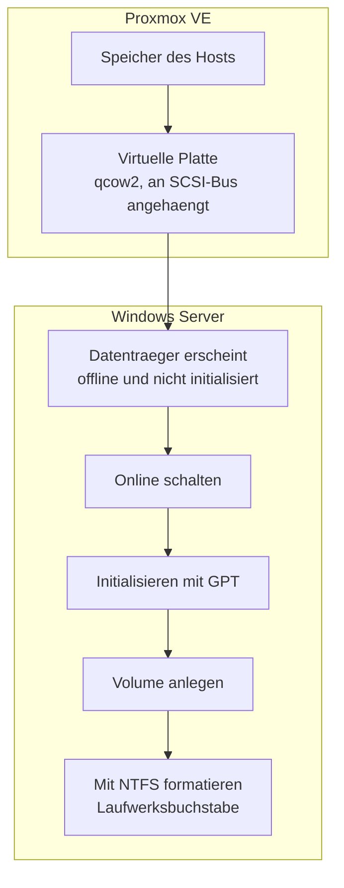

# Datenträgerverwaltung: von der virtuellen Platte zum Laufwerk

## Worum es geht

Bevor ich mit RAID und Speicherpools anfangen konnte, musste ich verstehen, was zwischen einer neuen Platte und einem nutzbaren Laufwerk alles passiert. In einer virtuellen Umgebung sind das zwei Ebenen: erst der Hypervisor, dann das Gastsystem.



Jeder dieser Schritte kann schiefgehen, und die Fehlermeldung sagt nicht immer, auf welcher Ebene das Problem liegt. Deshalb lohnt es sich, beide Seiten zu kennen.

## Die Hypervisor-Seite

Eine Platte in Proxmox hinzuzufügen dauert eine Minute, aber die Optionen dabei sind nicht egal. Ich habe für alle Lab-Platten dieselben Werte verwendet:

| Option | Wert | Warum |
| :--- | :--- | :--- |
| Bus | `SCSI` | `scsi0` ist das Betriebssystem, alles ab `scsi1` sind Datenplatten |
| Controller | `VirtIO SCSI single` | paravirtualisiert, deutlich schneller als eine emulierte Platte |
| Format | `qcow2` | wächst mit den Daten und kann Snapshots |
| Cache | `Write back` | beste Schreibleistung, im Lab vertretbar |
| Discard | an | gibt gelöschte Blöcke an den Host zurück, sonst wächst die Datei immer weiter |
| SSD-Emulation | an | Windows behandelt die Platte als SSD und defragmentiert nicht |
| IO Thread | an | eigener Thread pro Platte, wichtig bei mehreren Platten gleichzeitig |

Über die Weboberfläche geht das alles auch, aber bei mehreren Platten ist die Shell schneller:

```bash
qm set <VMID> --scsi1 <storage>:10,cache=writeback,discard=on,ssd=1,iothread=1
```

Der Punkt, den ich mir gemerkt habe: **Discard und SSD-Emulation gehören zusammen.** Ohne Discard meldet Windows zwar gelöschte Blöcke, der Host gibt sie aber nie frei, und die Image-Datei wächst dauerhaft. Bei einem Test, bei dem ich mehrfach formatiert habe, war das gut sichtbar.

## Die Windows-Seite

Eine neu angehängte Platte ist im Gastsystem zuerst **offline** und **nicht initialisiert**. Das ist kein Fehler, sondern eine Schutzmassnahme: Windows fasst fremde Platten nicht von allein an.

Drei Schritte in `diskmgmt.msc`:

1. **Online schalten.** Rechtsklick auf den Datenträger.
2. **Initialisieren.** Hier fragt Windows nach dem Partitionsstil. Ich nehme immer **GPT**.
3. **Volume anlegen.** Rechtsklick auf den schwarzen, nicht zugeordneten Bereich, dann durch den Assistenten: Grösse, Laufwerksbuchstabe, Dateisystem, Bezeichnung.

### MBR oder GPT

Diese Frage kommt bei jeder neuen Platte, deshalb einmal ausführlich:

| | MBR | GPT |
| :--- | :--- | :--- |
| Maximale Plattengrösse | 2 TB | praktisch unbegrenzt |
| Partitionen | 4 primäre, mehr nur über erweiterte | 128 |
| Partitionstabelle | einmal vorhanden | mehrfach vorhanden, mit Prüfsumme |
| Start | BIOS | UEFI |

GPT ist heute der Normalfall. MBR braucht man nur noch, wenn ein sehr altes System die Platte lesen soll. Da meine VMs mit UEFI starten, wäre MBR ohnehin die falsche Wahl.

### Schnellformatierung oder nicht

Der Assistent bietet **Schnellformatierung** an, und der Haken ist standardmässig gesetzt.

- **Mit Haken:** Es wird nur eine neue, leere Dateizuordnungstabelle geschrieben. Die alten Daten liegen physisch noch da, sind aber nicht mehr auffindbar. Dauert Sekunden.
- **Ohne Haken:** Zusätzlich wird die gesamte Oberfläche auf defekte Sektoren geprüft. Dauert bei grossen Platten sehr lange.

Im Lab immer mit Haken. Ohne Haken ist bei physischen Platten sinnvoll, bei denen man einen Defekt vermutet. Wichtig zu wissen: Schnellformatierung ist **kein sicheres Löschen**. Wer eine Platte weitergibt, muss sie überschreiben.

## Verkleinern und Erweitern

Ein bestehendes Volume lässt sich nachträglich ändern, und beide Richtungen haben ihre eigenen Regeln.

**Verkleinern** geht nur so weit, wie am Ende der Partition zusammenhängend freier Platz vorhanden ist. Windows zeigt oft weniger an, als eigentlich frei ist. Der Grund sind unbewegliche Dateien wie die Auslagerungsdatei oder Schattenkopien, die mitten in der Partition liegen und beim Verkleinern nicht verschoben werden.

**Erweitern** geht nur in den direkt danebenliegenden freien Bereich, und zwar nach rechts. Warum das so ist und was passiert, wenn der freie Platz links liegt, habe ich im [nächsten Kapitel](03-raid.md) mit Screenshots durchgetestet. Das Ergebnis hat mich überrascht.

## Alles auf einmal per PowerShell

Für eine einzelne Platte reicht die Oberfläche. Sobald es mehrere sind, ist die Pipeline schneller und man vertippt sich nicht:

```powershell
Get-Disk | Where-Object PartitionStyle -eq 'RAW' |
    Initialize-Disk -PartitionStyle GPT -PassThru |
    New-Partition -AssignDriveLetter -UseMaximumSize |
    Format-Volume -FileSystem NTFS -NewFileSystemLabel "Data" -Confirm:$false
```

Die Kette liest sich wie der Ablauf selbst: alle rohen Platten suchen, als GPT initialisieren, eine Partition über die volle Grösse anlegen, formatieren. Der Filter auf `RAW` ist die Sicherung. Ohne ihn würde der Befehl auch Platten treffen, auf denen schon Daten liegen.

## Test und Verifikation

Nach jeder Änderung an Platten prüfe ich drei Ebenen, und zwar in dieser Reihenfolge. Alle Ausgaben stammen von `SRV25-GUI` (`172.16.10.21`).

### Ebene 1: Sieht das Gastsystem die Platte?

```powershell
Get-Disk | Select-Object Number, FriendlyName, OperationalStatus, PartitionStyle, `
                         @{n='GB';e={[math]::Round($_.Size/1GB,1)}}
```

```
Number FriendlyName    OperationalStatus PartitionStyle   GB
------ ------------    ----------------- --------------   --
     0 QEMU HARDDISK   Online            GPT            60.0
     1 QEMU HARDDISK   Online            GPT            10.0
     2 QEMU HARDDISK   Offline           RAW            10.0
```

Zwei Zustände sind hier wichtig. `Offline` heisst, die Platte ist da, aber Windows fasst sie nicht an. `RAW` heisst, sie ist noch nicht initialisiert. Beides ist kein Fehler, sondern der normale Auslieferungszustand einer neuen Platte.

Taucht eine gerade angehängte Platte gar nicht auf, hilft ein erneuter Scan des Speicherbusses:

```powershell
Update-HostStorageCache
```

### Ebene 2: Stimmt die Partitionierung?

```powershell
Get-Partition -DiskNumber 1 |
    Select-Object PartitionNumber, DriveLetter, Type, `
                  @{n='GB';e={[math]::Round($_.Size/1GB,1)}}
```

```
PartitionNumber DriveLetter Type      GB
--------------- ----------- ----      --
              1             Reserved 0.0
              2 F           Basic    10.0
```

Die erste Partition ohne Laufwerksbuchstaben ist normal: GPT legt einen kleinen reservierten Bereich für Verwaltungsdaten an.

### Ebene 3: Ist das Dateisystem in Ordnung?

```powershell
Get-Volume -DriveLetter F |
    Select-Object DriveLetter, FileSystemLabel, FileSystem, HealthStatus, `
                  @{n='FreiGB';e={[math]::Round($_.SizeRemaining/1GB,1)}}
```

```
DriveLetter FileSystemLabel FileSystem HealthStatus FreiGB
----------- --------------- ---------- ------------ ------
F           Data_10GB       NTFS       Healthy         9.9
```

`HealthStatus` ist die Spalte, auf die es ankommt. In den nächsten beiden Kapiteln steht dort nach einem simulierten Ausfall etwas anderes, und daran erkennt man den Unterschied zwischen "Laufwerk ist weg" und "Laufwerk läuft, aber ohne Redundanz".

### Schreibtest

Ein Volume, das sich anzeigen lässt, muss noch nicht beschreibbar sein:

```powershell
"Test" | Out-File F:\test.txt
Get-Content F:\test.txt
Remove-Item F:\test.txt
```

## Fehlersuche

| Symptom | Ursache | Lösung |
| :--- | :--- | :--- |
| Platte fehlt in `Get-Disk` | im Hypervisor nicht angehängt oder Bus nicht neu gelesen | VM-Hardware prüfen, dann `Update-HostStorageCache` |
| Platte ist `Offline` | Schutzverhalten bei fremden Platten | `Set-Disk -Number N -IsOffline $false` |
| Platte ist `RAW` | noch nicht initialisiert | `Initialize-Disk -Number N -PartitionStyle GPT` |
| Verkleinern bietet kaum Platz an | unbewegliche Dateien liegen mitten in der Partition | Auslagerungsdatei und Schattenkopien vorübergehend abschalten |
| Erweitern ist ausgegraut | freier Bereich liegt nicht direkt rechts daneben | Reihenfolge prüfen, siehe [Kapitel 3](03-raid.md) |
| Nur 2 TB nutzbar | Platte als MBR initialisiert | mit GPT neu initialisieren, Daten gehen verloren |
| Image-Datei wächst immer weiter | `discard` im Hypervisor nicht gesetzt | Option nachtragen, danach `Optimize-Volume -ReTrim` |

## Begriffe, die in den nächsten Kapiteln wiederkommen

| Deutsch | Englisch | Bedeutung |
| :--- | :--- | :--- |
| Datenträgerverwaltung | Disk Management | die Konsole `diskmgmt.msc` |
| Basisdatenträger | Basic Disk | normale Platte mit Partitionen |
| dynamischer Datenträger | Dynamic Disk | Voraussetzung für Software-RAID unter Windows |
| Volume | Volume | logische Einheit mit Laufwerksbuchstaben |
| nicht zugeordnet | Unallocated | freier, noch nicht partitionierter Bereich |
| Volume verkleinern | Shrink Volume | Partition verkleinern, freien Platz erzeugen |
| Volume erweitern | Extend Volume | freien Platz an eine Partition anhängen |
| Schnellformatierung | Quick Format | formatieren ohne Oberflächenprüfung |

## Dieselben Schritte auf Server Core

Auf `SRV22-CORE` (`172.16.10.30`) gibt es keine Datenträgerverwaltung. Die Aufgabe bleibt dieselbe, man sieht nur nichts dabei. Deshalb arbeitet man dort in kleinen Schritten und prüft nach jedem:

```powershell
Get-Disk | Where-Object PartitionStyle -eq 'RAW'
Initialize-Disk -Number 1 -PartitionStyle GPT
New-Partition -DiskNumber 1 -AssignDriveLetter -UseMaximumSize
Format-Volume -DriveLetter F -FileSystem NTFS -NewFileSystemLabel "Data" -Confirm:$false
```

Man kann das auch aus der Ferne machen, ohne sich anzumelden:

```powershell
Invoke-Command -ComputerName 172.16.10.30 -Credential SRV22-CORE\adm_local -ScriptBlock {
    Get-Disk | Select-Object Number, OperationalStatus, PartitionStyle
}
```

Genau dieser Weg wird im [Kapitel über iSCSI](07-iscsi.md) wieder gebraucht, wenn eine Platte über das Netzwerk ankommt und auf dem Core-Server eingerichtet werden muss.

## Was ich dabei gelernt habe

Der Zustand **offline und nicht initialisiert** hat mich beim ersten Mal ein paar Minuten gekostet. Ich hatte die Platte in Proxmox angelegt, in Windows nachgesehen und nichts gefunden. Sie war da, nur eben nicht angefasst. Seitdem ist der erste Griff bei einer neuen Platte immer `Update-HostStorageCache` und danach ein Blick in `Get-Disk`.

Der zweite Punkt ist die Trennung der Ebenen. Wenn eine Platte in Windows fehlt, kann das am Hypervisor liegen oder am Gastsystem. Es hilft, zuerst zu schauen, ob die Platte in der VM-Hardware überhaupt auftaucht, bevor man in Windows sucht.
