# Volume-Typen und Software-RAID in der Datenträgerverwaltung

## Worum es geht

RAID lässt sich in einer Tabelle auswendig lernen: RAID 0 ist schnell, RAID 1 ist sicher, RAID 5 hat Parität. Was diese Sätze wirklich bedeuten, merkt man aber erst, wenn man eine Platte abschaltet und zusieht, was mit den Daten passiert.

Windows Server kann Software-RAID über dynamische Datenträger. Produktiv nimmt man das heute selten, weil Storage Spaces und Hardware-Controller besser sind. Zum Lernen ist es ideal: in Proxmox sind fünf Platten in einer Minute angelegt, jede Variante ist in ein paar Klicks gebaut, und einen Ausfall simuliert man mit einem Rechtsklick.

Ich habe alle Typen einmal gebaut, danach jeweils eine Platte offline geschaltet und dokumentiert, was übrig blieb.

## Vorbereitung

Fünf Platten mit **absichtlich unterschiedlichen Grössen**, weil sich daran später eine wichtige Regel zeigt:

```bash
qm set <VMID> --scsi1 <storage>:10,cache=writeback,discard=on,ssd=1,iothread=1
qm set <VMID> --scsi2 <storage>:10,cache=writeback,discard=on,ssd=1,iothread=1
qm set <VMID> --scsi3 <storage>:10,cache=writeback,discard=on,ssd=1,iothread=1
qm set <VMID> --scsi4 <storage>:20,cache=writeback,discard=on,ssd=1,iothread=1
qm set <VMID> --scsi5 <storage>:5,cache=writeback,discard=on,ssd=1,iothread=1
```


Im Gastsystem tauchen sie zuerst offline auf. Die Serververwaltung zeigt das im Bereich Datenträger:

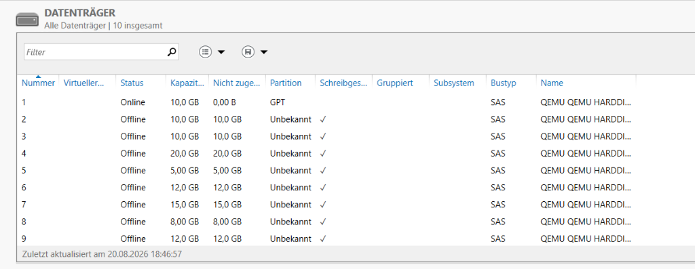

Nach dem Onlineschalten kommt die Initialisierung. GPT, wie im vorherigen Kapitel beschrieben:


## Die Farben in der Datenträgerverwaltung

Ein Detail, das mir das Lesen der Screenshots sehr erleichtert hat: die Datenträgerverwaltung färbt jeden Volume-Typ anders ein. Man erkennt den Typ also, ohne irgendwo nachzusehen.

| Farbe | Typ |
| :--- | :--- |
| Dunkelblau | einfaches Volume auf einer Basisplatte |
| Olivgrün | einfaches Volume auf einer dynamischen Platte |
| Violett | übergreifendes Volume |
| Türkis | Stripesetvolume, RAID 0 |
| Bordeaux | gespiegeltes Volume, RAID 1 |
| Hellblau | RAID-5-Volume |
| Schwarz | nicht zugeordneter Bereich |

## Erstes Experiment: verkleinern, löschen, erweitern

Bevor ich zu RAID kam, wollte ich den Unterschied zwischen Basisplatte und dynamischer Platte verstehen. Der Versuch hat ein Ergebnis geliefert, mit dem ich nicht gerechnet hatte.

Ausgangslage: ein Volume über die ganze 10-GB-Platte. Danach verkleinern.

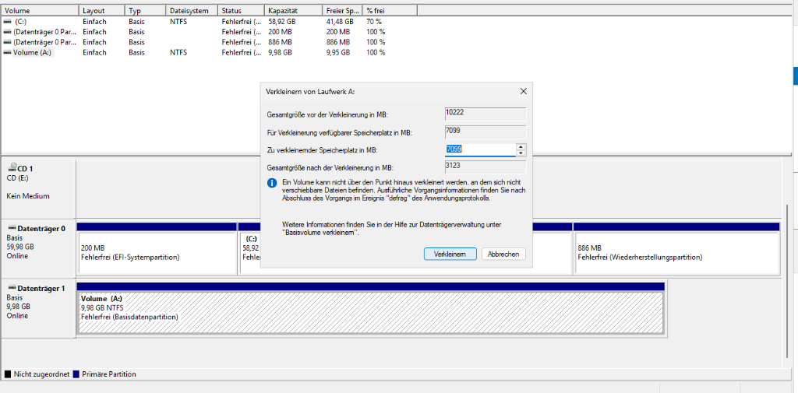

Der Dialog zeigt vier Zahlen, und die dritte ist die einzige, die man eingibt. Von rund 10 GB waren etwa 7 GB verfügbar, es blieben gut 3 GB stehen. Aus dem frei gewordenen Bereich habe ich ein zweites Volume gemacht. Zwei ganz normale Partitionen auf einer Basisplatte:

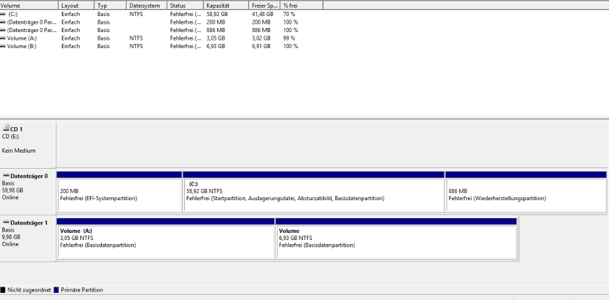

Jetzt der eigentliche Versuch. Ich habe zwei Varianten getestet.

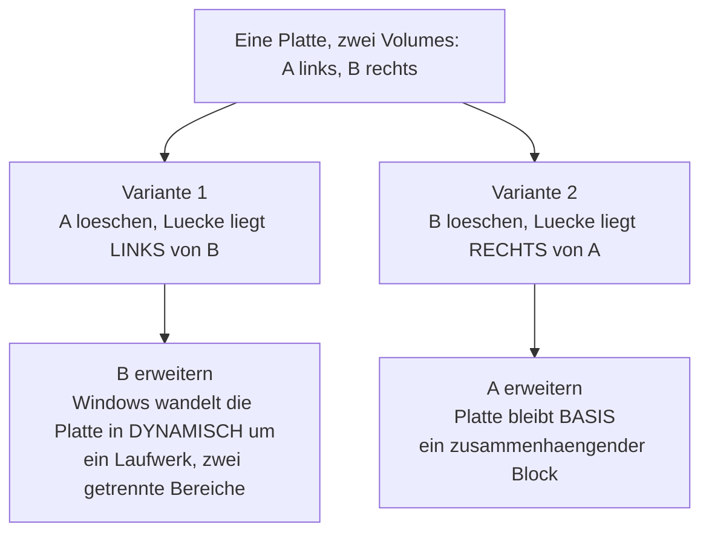

### Variante 1: freier Platz links

Zuerst das linke Volume gelöscht. Windows warnt hier deutlich, weil dabei Daten verloren gehen:

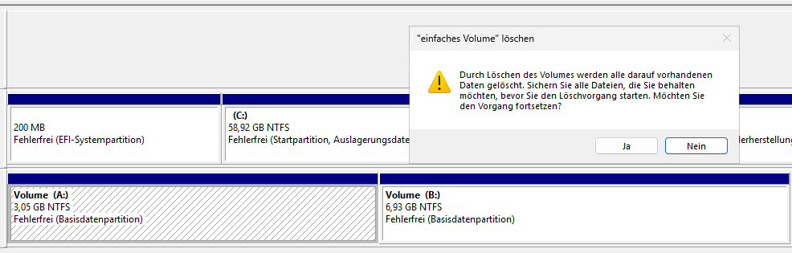

Danach steht der freie Bereich links, das verbleibende Volume rechts davon. Ich habe versucht, es nach links zu erweitern:

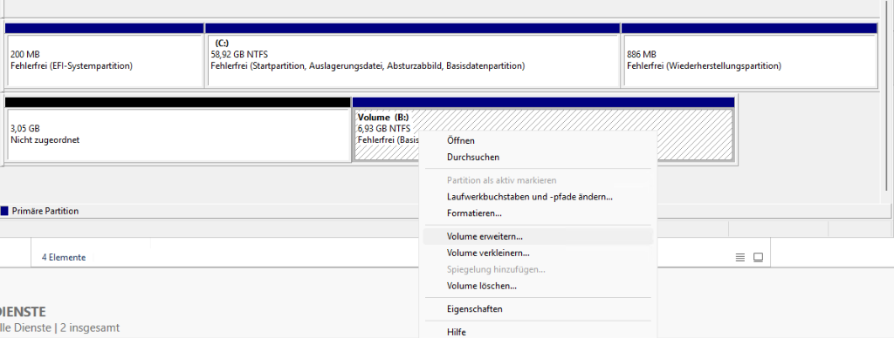

Windows fragt nicht lange und wandelt die Platte in eine **dynamische** Platte um. Das Ergebnis sieht im Explorer aus wie ein einziges Laufwerk mit rund 10 GB, in der Datenträgerverwaltung liegt es aber in zwei getrennten Bereichen, und die Platte ist olivgrün:

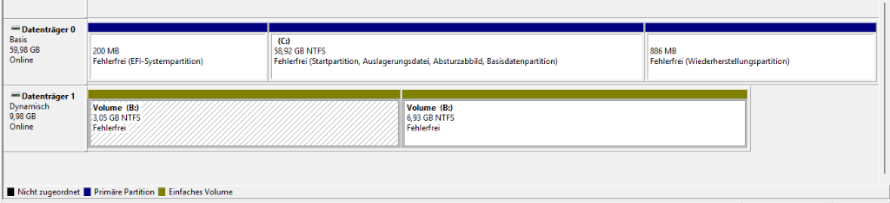

### Variante 2: freier Platz rechts

Derselbe Aufbau, nur andersherum. Der freie Bereich liegt direkt rechts neben dem Volume:

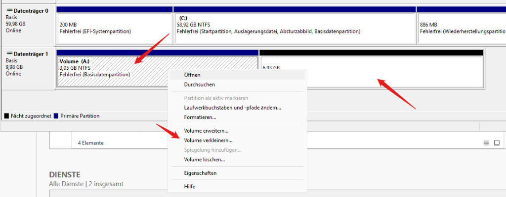

Der Assistent bietet den anschliessenden Bereich an:

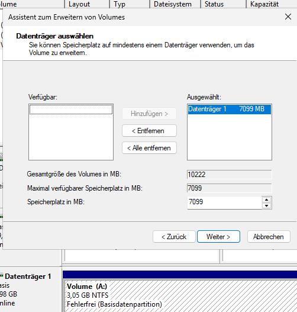

Diesmal keine Umwandlung. Die Platte bleibt eine Basisplatte, das Volume ist ein durchgehender dunkelblauer Block:

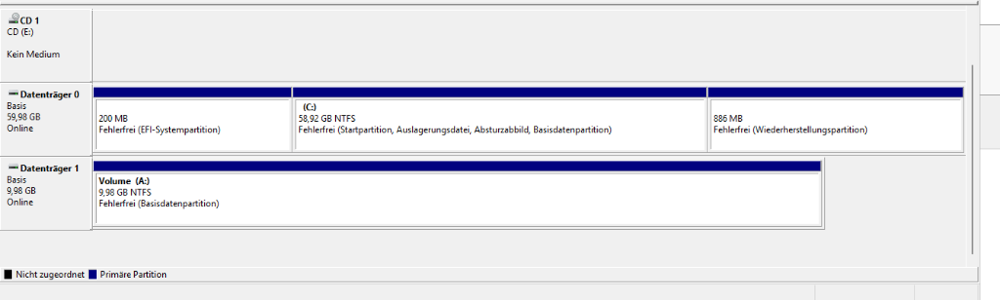

### Warum das so ist

Eine Partition auf einer Basisplatte wird durch Startsektor und Länge beschrieben. Nach hinten wachsen heisst: die Länge erhöhen. Nach vorne wachsen hiesse: den Startsektor verschieben, und dann läge jeder Block der vorhandenen Daten an der falschen Stelle.

Die dynamische Platte arbeitet anders. Sie führt eine eigene Datenbank, in der ein Volume aus mehreren Bereichen zusammengesetzt sein darf. Deshalb kann sie die Lücke links anhängen, und deshalb muss Windows umwandeln.

Wichtig dabei: **die Umwandlung ist eine Einbahnstrasse.** Zurück zu einer Basisplatte kommt man nur, indem man alle Volumes löscht.

## Übergreifendes Volume

Zwei Platten mit 10 und 5 GB werden zu einem Laufwerk mit 15 GB zusammengefasst. Die Auswahl im Assistenten:

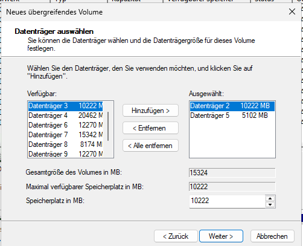

Die Daten laufen linear: erst wird die erste Platte gefüllt, dann die nächste.


Der einzige Vorteil ist Kapazität, und zwar die volle Summe, auch bei ungleichen Platten. Es gibt keine höhere Geschwindigkeit und keinerlei Sicherheit. Fällt eine der beiden Platten aus, ist das gesamte Volume verloren, auch der Teil, der auf der intakten Platte liegt, denn die Verwaltungsstrukturen des Dateisystems sind verteilt.

## Stripesetvolume, RAID 0

Hier werden die Daten blockweise abwechselnd auf beide Platten geschrieben. Zwei Platten schreiben gleichzeitig, das bringt Tempo.


An dieser Stelle ist mir zum ersten Mal die **Regel der kleinsten Platte** begegnet. Ich habe eine 10-GB- und eine 12-GB-Platte kombiniert und statt 22 GB nur 20 GB bekommen. Von jeder Platte wird immer nur so viel benutzt, wie die kleinste hergibt, denn die Streifen müssen auf allen Platten gleich gross sein. Die restlichen 2 GB bleiben als nicht zugeordneter Bereich liegen.

Dann der Ausfalltest. Eine Platte offline geschaltet:


Das Volume steht sofort auf **Fehler**, das Laufwerk ist im Explorer verschwunden. Bei RAID 0 gibt es keine halben Zustände: jeder zweite Block fehlt, damit ist keine einzige Datei mehr vollständig.

Wichtig für die Einordnung: RAID 0 erhöht das Ausfallrisiko sogar. Zwei Platten haben zusammen eine höhere Ausfallwahrscheinlichkeit als eine einzelne, und hier reicht eine davon.

## Gespiegeltes Volume, RAID 1

Zwei Platten, identischer Inhalt. Man bezahlt mit der Hälfte der Kapazität.

Ich habe eine 15-GB- und eine 20-GB-Platte genommen. Der Spiegel richtet sich nach der kleineren, auf der grösseren bleiben rund 5 GB übrig:

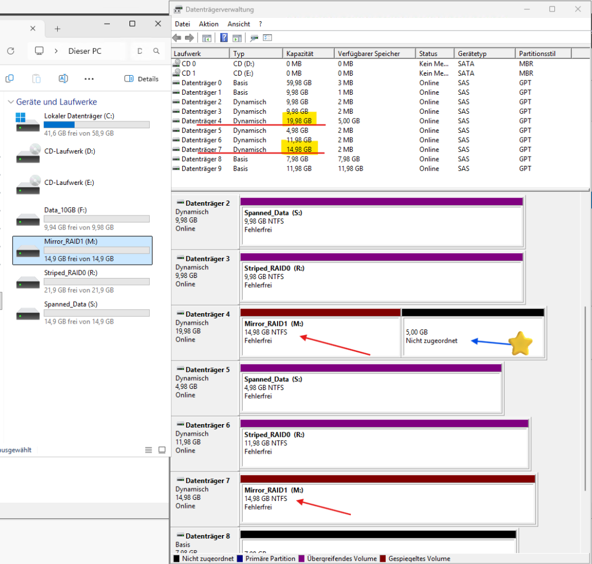

Interessant ist, was mit diesem Rest passieren darf. Bei einem Hardware-Controller wäre er verloren. Windows dagegen verwaltet die Platte weiter, der freie Bereich lässt sich als eigenes Volume nutzen oder in eine andere Konstruktion einbauen.

Der Ausfalltest, gleiche Vorgehensweise wie bei RAID 0, aber ein völlig anderes Ergebnis:


Das Volume meldet **Fehlerhafte Redundanz**, das Laufwerk bleibt aber im Explorer und die Daten sind normal lesbar. Genau das ist der Zweck.

Der Zustandsname ist gut gewählt: nicht die Daten sind fehlerhaft, sondern die Redundanz. Die Sicherheitsreserve ist aufgebraucht. Fällt jetzt die zweite Platte aus, sind die Daten weg.

## RAID 5

Vier Platten mit verteilter Parität. Die Parität ist eine XOR-Verknüpfung: aus den vorhandenen Blöcken lässt sich der fehlende zurückrechnen. Sie liegt nicht auf einer eigenen Platte, sondern reihum verteilt, damit keine Platte zum Flaschenhals wird.

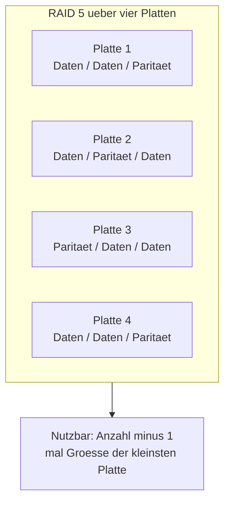

Die Plattenauswahl im Assistenten, bewusst mit vier verschiedenen Grössen:

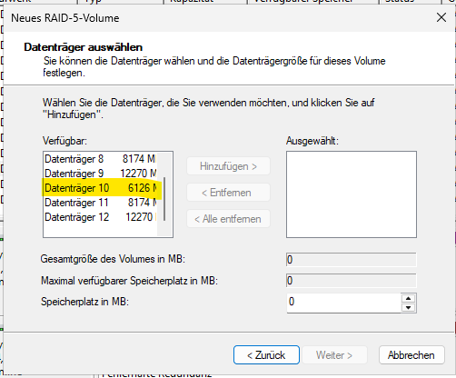

Die Kapazitätsanzeige zeigt das Ergebnis der Regel der kleinsten Platte:

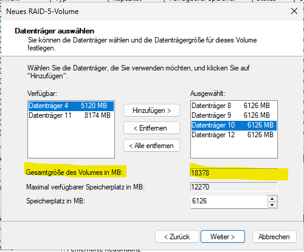

Bei 8, 12, 6 und 12 GB rechnet Windows mit 6 GB pro Platte. Nutzbar sind also drei mal 6 GB, rund 18 GB, obwohl 38 GB verbaut sind. Der Rest bleibt liegen:


Der Verschnitt ist auf den Platten gut zu sehen. Bei gleich grossen Platten wäre er null, und die Effizienz steigt mit der Anzahl:

| Platten | Nutzbar | Effizienz |
| :--- | :--- | :--- |
| 3 mal 10 GB | 20 GB | 67 % |
| 4 mal 10 GB | 30 GB | 75 % |
| 5 mal 10 GB | 40 GB | 80 % |

Danach Testdaten geschrieben und eine Platte offline geschaltet:


Wie beim Spiegel: Warnung ja, Datenverlust nein. Das Laufwerk zeigt weiterhin die volle Kapazität und die Dateien lassen sich öffnen. Windows rechnet die fehlenden Blöcke bei jedem Zugriff aus der Parität zurück. Das kostet Leistung, aber der Betrieb läuft.

## Der Rebuild

Beim Wiedereinschalten übernimmt Windows die Platte nicht von allein. Sie ist wieder da, das Volume bleibt aber im Fehlerzustand, bis man **Volume reaktivieren** wählt.


Danach läuft die Synchronisierung mit einer Prozentanzeige, und erst wenn sie durch ist, steht wieder **Fehlerfrei**.

## Was ich dabei gelernt habe

**Der Rebuild ist die kritische Phase, nicht der Ausfall.** Zwischen "Platte wieder online" und "Fehlerfrei" liegt die Synchronisierung, und in dieser Zeit gibt es weiterhin keine Redundanz. Bei RAID 5 wird dabei jede andere Platte vollständig gelesen, also genau die Belastung, bei der eine schwächelnde Platte ausfällt. Bei grossen Platten dauert das Stunden.

**Ein degradiertes RAID sieht völlig normal aus.** Im Explorer ist nichts zu sehen: gleiche Kapazität, alle Dateien da. Nur die Datenträgerverwaltung zeigt den Zustand. Ohne Überwachung merkt man den ersten Ausfall gar nicht und erfährt vom Problem erst beim zweiten, wenn es zu spät ist.

**Die Regel der kleinsten Platte kostet echtes Geld.** Bei meinem RAID 5 aus 8, 12, 6 und 12 GB waren 14 GB ungenutzt, mehr als ein Drittel. Wer RAID plant, kauft gleich grosse Platten.

**RAID ist kein Backup.** Es schützt gegen Plattenausfall, sonst gegen nichts. Eine gelöschte Datei ist auf beiden Spiegelhälften gleichzeitig gelöscht. Verschlüsselungstrojaner, Bedienfehler und ein Defekt am Controller treffen alle Platten zusammen.
