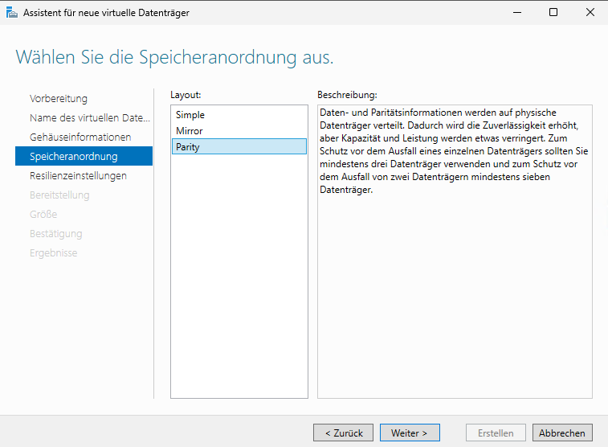
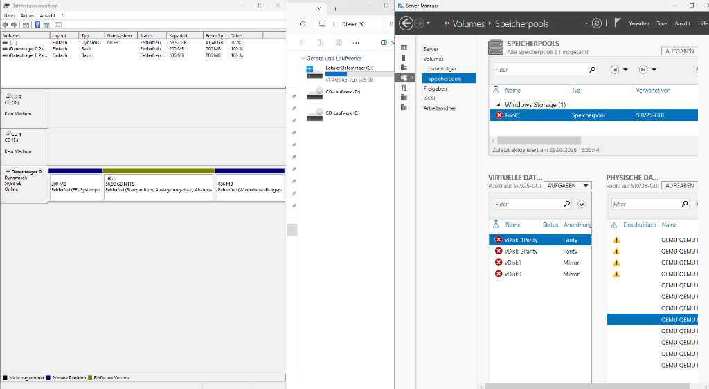
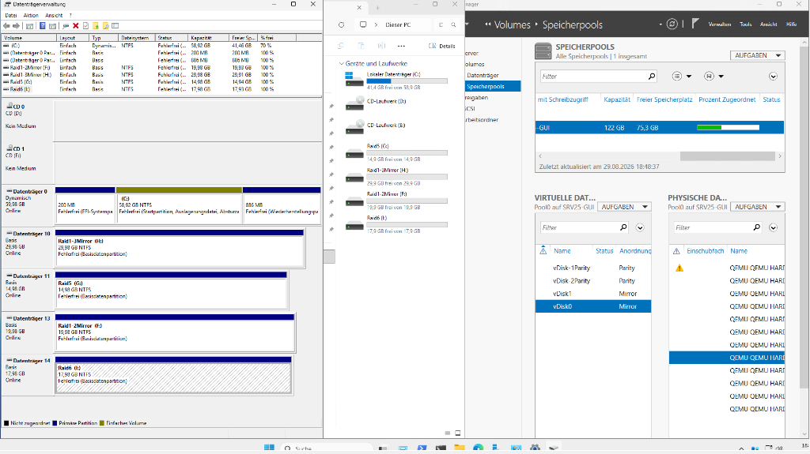

# Speicherpools und Speicherplätze

## Warum ich das gemacht habe

Nach dem Software-RAID aus dem vorherigen Kapitel wollte ich sehen, wie Microsoft das Thema heute löst. Bei Storage Spaces arbeitet man nicht mehr direkt mit Platten, sondern legt zuerst einen Pool an. Aus diesem Pool schneidet man dann virtuelle Datenträger, und jeder davon kann eine eigene Absicherung haben.

Das ist ein anderer Denkansatz als klassisches RAID. Beim RAID legt man sich einmal fest und die ganze Gruppe hat dieses Verhalten. Beim Pool kann ein Laufwerk gespiegelt sein und das nächste mit Parität arbeiten, obwohl beide aus denselben Platten kommen.

Mich hat vor allem interessiert, was passiert, wenn Platten ausfallen. Deshalb habe ich am Ende Platten im laufenden Betrieb aus der VM entfernt und geschaut, welche Laufwerke überleben.

## Aufbau

Ich habe der VM zwölf virtuelle Platten in verschiedenen Grössen gegeben, zusammen rund 128 GB.


Bevor Windows die Platten in einen Pool aufnimmt, müssen sie leer sein. Alte Partitionen aus früheren Versuchen stören:

```powershell
Update-HostStorageCache
Get-Disk | Where-Object Number -ge 1 | Clear-Disk -RemoveData -RemoveOEM -Confirm:$false
```

Danach liegen alle Platten im sogenannten Primordial-Pool. Das ist kein richtiger Pool, sondern nur die Liste der Platten, die verfügbar wären.


## Hot-Spare

Beim Anlegen des Pools kann man Platten als Reserve markieren. Diese Platten liegen im Pool, sind aber nicht Teil der Kapazität.


Ich habe zwei Platten dafür genommen. Der Sinn: fällt eine aktive Platte aus, zieht sich das System die Reserve automatisch heran und stellt die Redundanz wieder her, ohne dass jemand ins Rechenzentrum fahren muss. Bei klassischem Software-RAID unter Windows gibt es das nicht.

In der Kapazität sieht man das direkt. Von 128 GB brutto bleiben rund 113 GB übrig, der Rest liegt in der Reserve. Nach Abzug der Metadaten zeigt der Pool am Ende etwa 122 GB an.


## Die Absicherungsarten

Beim virtuellen Datenträger wählt man das Layout. Ich habe alle Varianten einmal angelegt, um sie später vergleichen zu können.


| Layout | Verträgt | Platten mindestens |
| :--- | :--- | :--- |
| Einfach | keinen Ausfall | 1 |
| Zwei-Wege-Spiegelung | 1 Platte | 2 |
| Drei-Wege-Spiegelung | 2 Platten | 5 |
| Parität | 1 Platte | 3 |
| Doppelte Parität | 2 Platten | 7 |

Bei der Drei-Wege-Spiegelung hat mich die Zahl 5 zuerst gewundert. Man hält doch nur drei Kopien, warum dann fünf Platten? Der Grund liegt nicht bei den Daten, sondern bei den Metadaten: das System muss auch nach dem Ausfall von zwei Platten noch eine klare Mehrheit haben, um zu entscheiden, welche Version die richtige ist.



Bei der Grösse gibt es zwei Modi. **Fest** reserviert den Platz sofort im Pool. **Dünn** reserviert nur wenige Megabyte und holt sich Platz erst dann, wenn wirklich geschrieben wird. Damit kann man auch ein Laufwerk mit 100 GB anlegen, obwohl der Pool das gar nicht hat. Das ist praktisch, aber man muss den Pool im Auge behalten, sonst steht man irgendwann vor einem vollen Pool und einem Laufwerk, das laut Explorer noch Platz hätte.

Am Ende hatte ich vier Laufwerke aus einem einzigen Pool, jedes mit einer anderen Absicherung:


## Der eigentliche Test: Platten abziehen

Jetzt kam der Teil, für den ich das Ganze eigentlich gebaut hatte. Ich habe im laufenden Betrieb eine Platte nach der anderen aus der VM entfernt.

**Nach der ersten Platte:** Der Pool ging auf Warnung. Der Zwei-Wege-Spiegel war sofort weg und im Explorer nicht mehr sichtbar. Die Drei-Wege-Spiegelung und beide Paritäts-Laufwerke liefen normal weiter.


**Nach der zweiten Platte:** Auch die doppelte Parität gab auf. Übrig blieben die einfache Parität und die Drei-Wege-Spiegelung. Beide noch lesbar, beide mit Warnung.

**Nach der dritten Platte:** Der komplette Pool fiel aus. Nicht nur einzelne Laufwerke, sondern alle auf einmal. Im Explorer war nur noch `C:` übrig.



Das war der Punkt, an dem ich verstanden habe, dass der Pool eine eigene Ebene ist. Die Laufwerke waren rechnerisch teilweise noch zu retten, aber der Pool hatte die Mehrheit für seine Metadaten verloren. In dieser Lage schaltet Storage Spaces lieber alles ab, als beschädigte Daten auszuliefern. Aus Sicht des Systems ist das richtig, auch wenn es im ersten Moment übertrieben wirkt.

## Die Wiederherstellung

Beim Zurückstecken kam die Überraschung. Ich hatte damit gerechnet, dass ich viel von Hand reparieren muss.

Schon die erste zurückgesteckte Platte hat gereicht, damit der Pool die Notabschaltung aufhebt. Zwei Laufwerke waren sofort wieder da. Nach der dritten Platte war alles wieder online und die Synchronisierung lief von allein.



## Was ich dabei gelernt habe

Zwei Punkte sind mir geblieben.

Erstens: die Reihenfolge der Ausfälle war nicht die, die ich erwartet hatte. Ich hätte gedacht, dass die doppelte Parität am längsten hält, weil sie zwei Ausfälle verträgt. Tatsächlich hat die Drei-Wege-Spiegelung länger durchgehalten. Der Grund ist, dass Parität beim Lesen rechnen muss, während der Spiegel einfach eine andere Kopie nimmt. Wenn Platten wegbrechen, ist die einfachere Lösung die robustere.

Zweitens: Redundanz auf Laufwerksebene hilft nichts, wenn der Pool selbst kippt. Alle vier Laufwerke lagen im selben Pool und sind gemeinsam ausgefallen. Für echte Sicherheit braucht man ein Backup ausserhalb des Pools. Das steht in jedem Lehrbuch, aber es einmal auf dem Bildschirm zu sehen, ist etwas anderes.
