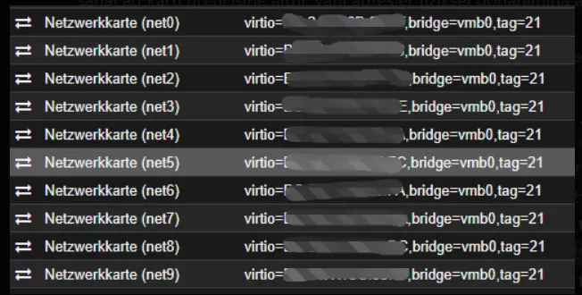
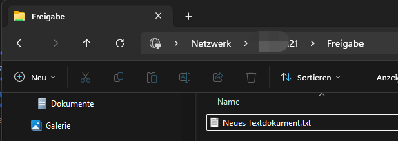
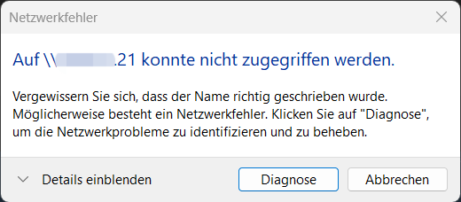
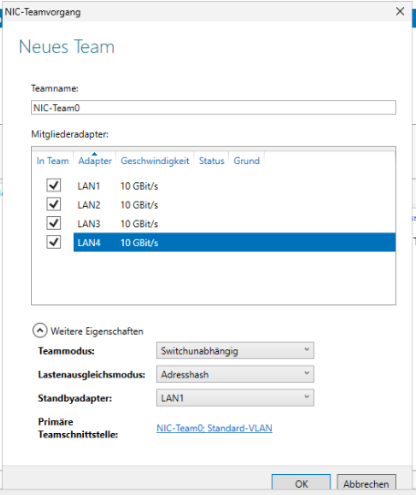
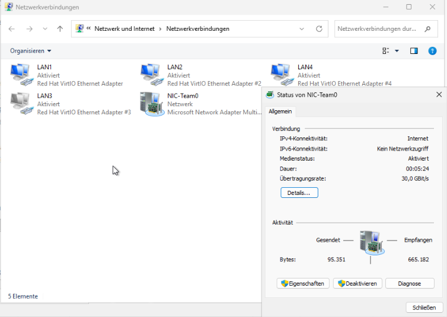
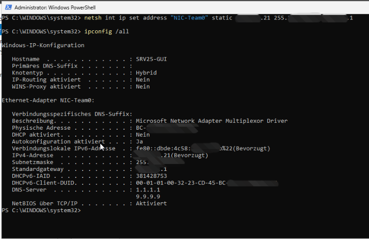
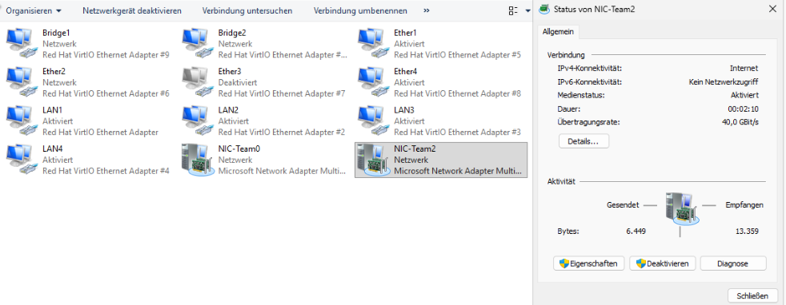
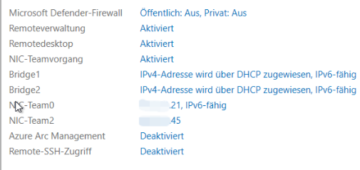
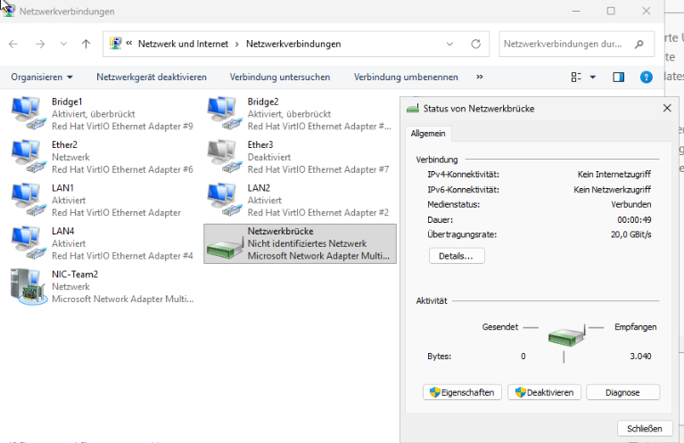

# NIC-Teaming, Failover und Netzwerkbrücke

## Warum ich das gemacht habe

Ein Server mit nur einer Netzwerkkarte hat einen Single Point of Failure. Wenn diese Karte, das Kabel oder der Switchport ausfällt, ist der Dienst weg, obwohl der Server selbst noch läuft.

Ich wollte das nicht nur lesen, sondern sehen. Also habe ich der VM zehn virtuelle Netzwerkkarten gegeben und daraus drei Gruppen gebaut: ein Team mit Reserveadapter, ein Team mit allen Karten aktiv und eine Netzwerkbrücke.

Ein Hinweis vorweg, damit die Zahlen richtig eingeordnet werden: das sind virtuelle Karten in Proxmox. Die angezeigten 30 oder 40 GBit/s sind das, was Windows aus 3 beziehungsweise 4 mal 10 GBit/s zusammenrechnet. Ich habe hier keine echte Hardware mit dieser Bandbreite. Was ich testen konnte, war das Verhalten bei Ausfällen, und darum ging es mir.




## Zuerst der Fehlerfall ohne Team

Bevor ich ein Team gebaut habe, wollte ich das Problem selbst erzeugen. Jede Karte hatte eine eigene Adresse: `LAN1` fest auf `172.16.10.21`, die anderen per DHCP.

Auf dem Server habe ich einen SMB-Ordner freigegeben, ein Client hat darauf zugegriffen:



Dann habe ich `LAN1` deaktiviert. Das Ergebnis kam sofort:



Der Server lief weiter, die anderen Karten waren online, aber der Client kam nicht mehr an seine Freigabe. Über die DHCP-Adresse einer anderen Karte wäre der Zugriff möglich gewesen, doch dafür müsste jeder Benutzer diese Adresse kennen. Und nach einem Neustart wäre sie vielleicht wieder anders.

Das ist genau der Punkt, an dem Teaming ansetzt: die Adresse soll bleiben, auch wenn eine Karte ausfällt.

## Team 1: eine Karte in Reserve

Vier Karten, davon eine als Standby.



Beim Lastenausgleich musste ich von der Empfehlung abweichen. Windows schlägt normalerweise **Dynamisch** vor, aber in einer VM funktioniert das nicht, weil dem Gast die nötige Hardwareunterstützung fehlt. In virtuellen Umgebungen nimmt man **Adresshash**. Das war der erste Fehler, in den ich gelaufen bin.



Die IP-Adresse bekommt jetzt das Team, nicht mehr die einzelne Karte:


Wenn man danach die Eigenschaften einer Mitgliedskarte öffnet, sieht man den eigentlichen Mechanismus: bei der Karte ist IPv4 nicht mehr aktiviert, dafür steht dort nur noch das **Multiplexorprotokoll**. Die physische Karte transportiert, die Identität liegt beim Team.

In der Ausgabe von `ipconfig /all` sieht man dasselbe von der anderen Seite: die einzelnen Karten tauchen nicht mehr mit eigener Adresse auf, sondern nur der Team-Adapter mit einer IP und einem Standardgateway.



## Team 2: alle Karten aktiv

Beim zweiten Team gibt es keinen Standby, alle vier Karten tragen Daten.




Auch hier habe ich im laufenden Betrieb eine Karte deaktiviert. Das Team ist nicht ausgefallen, die verbleibenden drei Karten haben die Verbindung weitergeführt. Nur die angezeigte Bandbreite ist entsprechend gesunken.



## Zwei Teams, ein Netz: das hat nicht sofort funktioniert

Das zweite Team bekam die Adresse `172.16.10.45`, im selben Subnetz wie das erste. Der Client konnte das erste Team anpingen, das zweite aber nicht. Beide Teams waren online, die Konfiguration sah richtig aus.

Der Grund ist das **Strong-Host-Modell**, das Windows standardmässig verwendet. Eine Anfrage kommt bei Team 2 an, für die Antwort sucht Windows aber die Route über das Standardgateway und landet bei Team 1. Diese asymmetrische Zustellung wird blockiert.

Die Lösung ist, das Verhalten auf **Weak Host** umzustellen. Dann darf jede Schnittstelle über sich selbst antworten:

```powershell
Set-NetIPInterface -InterfaceAlias "NIC-Team2" -WeakHostSend Enabled -WeakHostReceive Enabled
Set-NetIPInterface -InterfaceAlias "NIC-Team0" -WeakHostSend Enabled -WeakHostReceive Enabled
```

Danach war beides erreichbar. Auf dem Client musste ich noch `arp -d *` ausführen, weil dort die alten Einträge im Cache standen.

## Ein Fehler, den ich fast übersehen hätte

Nach dem Anlegen des ersten Teams blieb im System eine ungültige zweite Standardroute mit dem Ziel `0.0.0.0` zurück. Das Tückische daran war, dass alles funktioniert zu haben schien: der Ping auf den Router im selben Subnetz ging durch, weil dieses Ziel direkt über ARP erreicht wird und die Routingtabelle dafür gar nicht gebraucht wird.

Weg war nur alles andere: kein Internet und keine RDP-Verbindung aus einem anderen Subnetz.

Geprüft habe ich es so:

```powershell
Get-NetRoute -DestinationPrefix "0.0.0.0/0" |
    Format-Table ifIndex,InterfaceAlias,NextHop,RouteMetric -AutoSize
```

Da darf nur eine Zeile stehen. Bei mir waren es zwei. Sauber bekommen habe ich es mit einem einzigen Befehl, der die Adresse noch einmal komplett setzt:

```cmd
netsh int ip set address "NIC-Team0" static 172.16.10.21 255.255.255.0 172.16.10.1
```

## Netzwerkbrücke: ähnlich, aber etwas anderes

Zum Schluss habe ich aus zwei weiteren Karten eine Netzwerkbrücke gebaut. Auf den ersten Blick sieht das Ergebnis aus wie ein Team.



Der Zweck ist aber ein anderer. Ein Team macht den Server selbst ausfallsicher. Eine Brücke macht aus dem Server einen kleinen Switch, der zwei Netzsegmente verbindet, zum Beispiel LAN und WLAN.

| | Teaming | Brücke |
| :--- | :--- | :--- |
| Zweck | Ausfallsicherheit für den Server | zwei Segmente verbinden |
| Rolle des Servers | Endgerät | Weiterleitung |
| CPU-Last | sehr gering, läuft im Treiber | höher, jedes Paket wird geprüft |
| Schleifengefahr | keine | vorhanden, wenn beide Karten im selben VLAN hängen |

Der letzte Punkt ist der wichtigste. Wenn man zwei Karten im gleichen VLAN überbrückt und im Netz kein Spanning Tree läuft, baut man sich eine Schleife und legt damit unter Umständen das ganze Segment lahm.

## Was ich dabei gelernt habe

Das Team hat den Ausfall genau so aufgefangen, wie ich es erwartet hatte. Gelernt habe ich trotzdem am meisten aus den beiden Problemen, die nichts mit Teaming zu tun hatten.

Die Sache mit der `0.0.0.0`-Route hat mir gezeigt, dass ein erfolgreicher Ping wenig beweist. Ein Ping auf ein Gerät im gleichen Subnetz sagt nur, dass ARP funktioniert. Ob das Routing stimmt, sieht man erst, wenn man ein Ziel ausserhalb testet.

Und Strong Host gegen Weak Host hätte ich ohne diesen Test wahrscheinlich nie verstanden. Solange ein Server nur eine Adresse hat, merkt man davon nichts.
