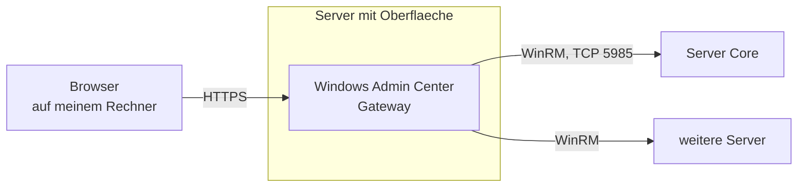
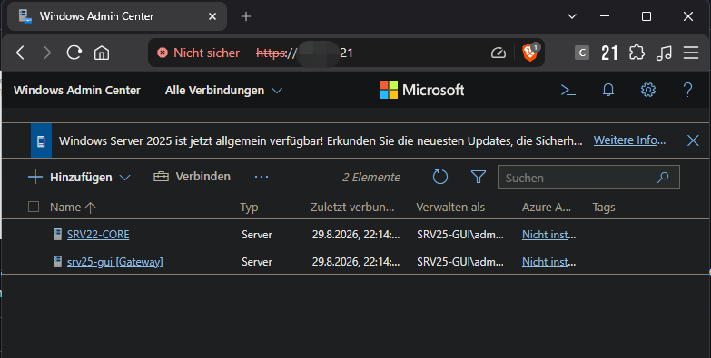
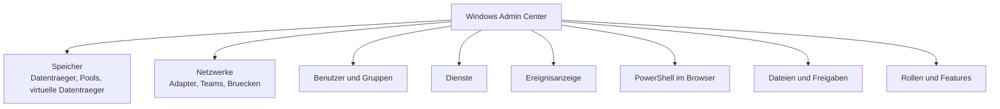
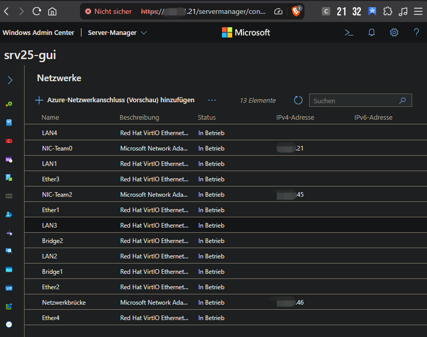
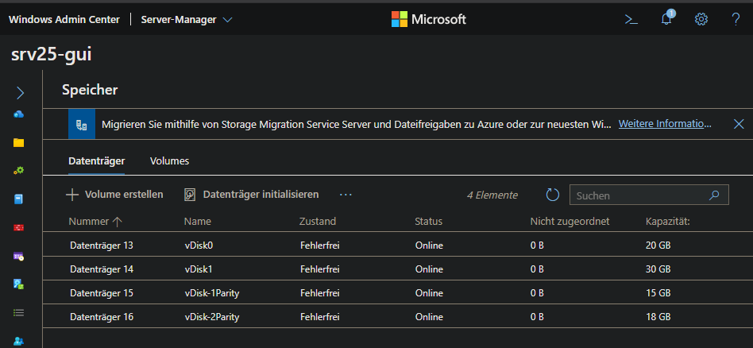
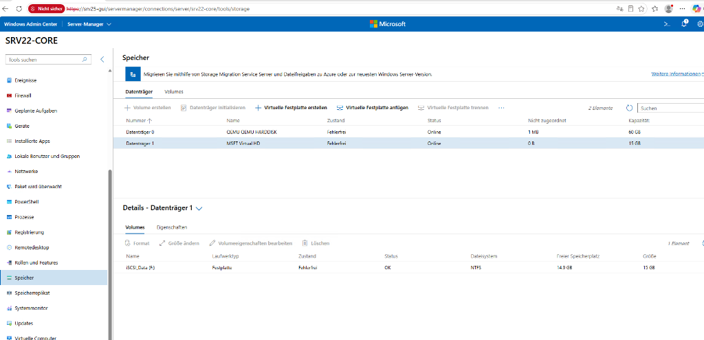

# Windows Admin Center

## Worum es geht

In meinem Lab laufen zwei Server ohne grafische Oberfläche. Das ist die empfohlene Installationsart: Server Core braucht weniger Arbeitsspeicher, weniger Plattenplatz, deutlich weniger Neustarts nach Updates und bietet weniger Angriffsfläche, weil vieles gar nicht erst installiert ist.

Für mich als Anfänger war das am Anfang unbequem. Auf einem Server Core sieht man nichts. Man muss wissen, wonach man fragt.

Windows Admin Center schliesst diese Lücke. Es wird auf einem Server installiert und ist danach über den Browser erreichbar. Von dieser einen Stelle aus verwaltet man alle anderen Server mit, auch die ohne Oberfläche. Auf den verwalteten Maschinen muss nichts installiert werden, die Verbindung läuft über WinRM, das ohnehin vorhanden ist.



Wichtig zu verstehen: der Browser spricht nur mit dem Gateway. Das Gateway spricht mit den Servern. Es ist kein Agent auf den Zielsystemen, sondern eine Fernsteuerung über Bordmittel.

## Einrichtung

Das Setup ist ein normaler Installer mit zwei Entscheidungen:

- **Port.** Voreingestellt ist 6516. Man kann auch 443 nehmen, dann muss man beim Aufruf keine Portnummer eintippen. Voraussetzung ist, dass auf dem Server keine andere Anwendung schon auf 443 hört.
- **Zertifikat.** Im Lab reicht ein selbst signiertes Zertifikat, das der Installer erzeugt. Der Browser zeigt dann bei jedem Aufruf eine Warnung, weil niemand dieses Zertifikat bestätigt. In einer echten Umgebung würde man ein Zertifikat der internen Zertifizierungsstelle hinterlegen.

Bei der ersten Anmeldung bin ich in einen Fehler gelaufen, der bei Arbeitsgruppen typisch ist. Ich habe nur `adm_local` eingegeben und bekam "Zugriff verweigert". Windows sucht das Konto dann an der falschen Stelle. Richtig ist:

```
.\adm_local
```

Der Punkt mit Backslash bedeutet "auf diesem Computer". Alternativ schreibt man den Rechnernamen davor, also `SRV25-GUI\adm_local`.

Falls das Konto trotzdem abgewiesen wird, fehlt die Mitgliedschaft in der zuständigen Gruppe:

```powershell
Add-LocalGroupMember -Group "Windows Admin Center Administrators" -Member "adm_local"
```

## Server ohne Domäne anbinden

Meine Maschinen stehen in einer Arbeitsgruppe, nicht in einer Domäne. Deshalb gibt es keine gemeinsame Vertrauensstellung, und das Gateway darf sich nicht einfach bei einem anderen Server anmelden.

Die Lösung ist eine Liste vertrauenswürdiger Gegenstellen auf dem Gateway:

```powershell
Set-Item WSMan:\localhost\Client\TrustedHosts -Value "172.16.10.*" -Concatenate -Force
Get-Item WSMan:\localhost\Client\TrustedHosts
```

`-Concatenate` hängt den Eintrag an die bestehende Liste an, statt sie zu überschreiben. Ohne diesen Schalter löscht man sich die vorherigen Einträge weg, was ich beim ersten Mal genau so gemacht habe.

Beim Hinzufügen eines Servers muss man dann **Anmeldeinformationen separat angeben** wählen und wieder `.\adm_local` eintragen. Ohne diesen Haken versucht das Gateway, die eigene Anmeldung weiterzureichen, und das funktioniert in der Arbeitsgruppe nicht.

Sobald die Maschinen später in einer Domäne sind, fällt dieser ganze Teil weg. Dann übernimmt Kerberos die Vertrauensstellung und der Server wird einfach über seinen Namen hinzugefügt.

### Das Ergebnis: beide Server in einer Übersicht



In der Liste stehen jetzt zwei Einträge:

| Verbindung | Art | Konto | Rolle |
| :--- | :--- | :--- | :--- |
| `srv25-gui [Gateway]` | Server | `SRV25-GUI\adm_local` | der Gateway selbst |
| `SRV22-CORE` | Server | `SRV25-GUI\adm_local` | Server Core, remote verwaltet |

Der Gateway verwaltet sich also auch selbst, und daneben steht der Core-Server. Auffällig ist die Kontospalte: für **beide** Verbindungen wird dasselbe lokale Konto des Gateways benutzt. Genau dafür war die TrustedHosts-Liste nötig, denn ohne Domäne muss das Zielsystem diesem fremden lokalen Konto ausdrücklich vertrauen.

## Was man damit macht



Drei Bereiche habe ich im Lab wirklich benutzt, und in allen dreien zeigt das Windows Admin Center mehr als die klassischen Werkzeuge.

### Netzwerk: Teams und Brücke auf einen Blick

Nach dem Aufbau aus dem [Kapitel über NIC-Teaming](06-nic-teaming.md) hat der Server 13 Netzwerkelemente. In `ncpa.cpl` sieht man Adapter und Adressen, aber nicht, welche Karte zu welchem Team gehört. Die Serververwaltung zeigt die Teams, aber nicht die Adressen daneben. Im Windows Admin Center steht beides in einer Tabelle:



| Element | Typ | Adresse | Rolle |
| :--- | :--- | :--- | :--- |
| `NIC-Team0` | Multiplexor | `172.16.10.21` | Team mit Reservekarte, Hauptadresse mit Gateway |
| `NIC-Team2` | Multiplexor | `172.16.10.45` | Team mit allen Karten aktiv |
| `Netzwerkbrücke` | Bridge | `172.16.10.46` | Brücke aus zwei Karten |
| `LAN1` bis `LAN4` | VirtIO | — | Mitglieder von Team 0 |
| `Ether1` bis `Ether4` | VirtIO | — | Mitglieder von Team 2 |
| `Bridge1`, `Bridge2` | VirtIO | — | Mitglieder der Brücke |

Die zehn physischen Karten haben keine eigene Adresse mehr. Das ist genau das Verhalten aus dem Teaming-Kapitel: der Multiplexortreiber übernimmt die Identität, die Karten transportieren nur noch. Hier sieht man es in einer einzigen Ansicht, statt es aus mehreren Fenstern zusammenzusuchen.

### Speicher: die Ebene, die `diskmgmt.msc` nicht zeigt

Das war für mich der überzeugendste Punkt. Die klassische Datenträgerverwaltung zeigt Platten und Volumes. Was sie **nicht** zeigt, ist der Speicherpool dahinter und die Absicherung eines virtuellen Datenträgers. Dort erscheint ein Spiegel als ganz normale Platte.



Hier stehen die vier virtuellen Datenträger aus dem [Kapitel über Storage Spaces](04-storage-spaces.md) mit Namen und Zustand:

| Datenträger | Name | Absicherung | Grösse | Zustand |
| :--- | :--- | :--- | :--- | :--- |
| 13 | `vDisk0` | Spiegel, 2 Kopien | 20 GB, dünn | fehlerfrei |
| 14 | `vDisk1` | Spiegel, 3 Kopien | 30 GB, dünn | fehlerfrei |
| 15 | `vDisk-1Parity` | einfache Parität | 15 GB, dünn | fehlerfrei |
| 16 | `vDisk-2Parity` | doppelte Parität | 18 GB, dünn | fehlerfrei |

Beim Ausfalltest im Storage-Spaces-Kapitel musste ich für diese Information zwischen Serververwaltung und PowerShell hin und her springen. Hier steht sie an einer Stelle, mit dem Zustand daneben.

### Server Core mit einer Netzwerkplatte

Und hier verwalte ich den Core-Server, der selbst keine Oberfläche hat, und sehe eine Festplatte, die über das Netzwerk angebunden ist:



| | |
| :--- | :--- |
| Verwalteter Server | `SRV22-CORE`, Server Core ohne Oberfläche |
| Datenträger | Typ einer virtuellen Festplatte, 15 GB, über iSCSI angebunden |
| Volume | `iSCSI_Data (F:)`, NTFS, 14,9 GB frei |

Das ist der Aufbau aus dem [iSCSI-Kapitel](07-iscsi.md) von der anderen Seite gesehen. Auf dem Core-Server müsste ich diese Angaben sonst mit `Get-Disk`, `Get-Partition` und `Get-Volume` einzeln zusammensuchen und mir selbst zusammenreimen.

### Weitere Bereiche

| Bereich | Wofür |
| :--- | :--- |
| Rollen und Features | Rollen nachinstallieren, ohne die genauen Featurenamen zu kennen |
| Dienste | Dienst starten, stoppen, Starttyp ändern |
| Ereignisanzeige | Fehler suchen, ohne die Protokollnamen auswendig zu wissen |
| PowerShell | eine Sitzung direkt im Browserfenster, ohne RDP |
| Dateien und Freigaben | SMB-Freigaben anlegen und Berechtigungen setzen |

Der eingebaute PowerShell-Bereich ist dabei fast der nützlichste. Man arbeitet grafisch, findet die richtige Stelle, und wenn man dann doch einen Befehl braucht, ist die Konsole einen Klick entfernt.

## Wenn es nicht geht

| Symptom | Ursache | Lösung |
| :--- | :--- | :--- |
| Zugriff verweigert bei der Anmeldung | Konto ohne `.\` eingegeben oder nicht in der WAC-Gruppe | `.\adm_local` verwenden, Gruppenmitgliedschaft prüfen |
| WinRM-Fehler beim Hinzufügen eines Core-Servers | WinRM lauscht nicht oder Gegenstelle nicht in TrustedHosts | auf dem Zielserver `winrm quickconfig`, dann TrustedHosts prüfen |
| Zertifikatswarnung im Browser | selbst signiertes Zertifikat | im Lab über "Erweitert" fortfahren, produktiv ein richtiges Zertifikat hinterlegen |

Fast immer lag es bei mir an WinRM oder an der TrustedHosts-Liste, nicht am Windows Admin Center selbst.

## Was ich dabei gelernt habe

**Windows Admin Center ersetzt PowerShell nicht.** Alles, was man wiederholt oder auf mehreren Servern gleichzeitig macht, gehört in ein Skript. Die Oberfläche macht keine Schleifen und dokumentiert nichts.

**Sein eigentlicher Wert ist die Zusammenführung.** Netzwerkkarten, Teams und Adressen liegen in `ncpa.cpl` und in der Serververwaltung getrennt. Speicherpools und virtuelle Datenträger zeigt `diskmgmt.msc` überhaupt nicht. Hier steht beides an einer Stelle und für alle Server, auch die ohne Oberfläche. Beim Ausfalltest im Storage-Kapitel hätte mir das viel Umherspringen erspart.

**Für das Lernen ist die Reihenfolge hilfreich.** Vorher musste ich bei einem Core-Server raten, welcher Befehl mir den Zustand zeigt. Jetzt klicke ich mich einmal durch, sehe die Lage und weiss danach, wonach ich in PowerShell suchen muss.

**Der Gateway-Server ist eine kritische Stelle.** Er darf sich bei allen anderen Servern anmelden, und wie die Verbindungsübersicht zeigt, mit demselben Konto. Wer ihn übernimmt, hat Zugriff auf die ganze Umgebung. Deshalb gehört er abgesichert wie ein Verwaltungsserver, und deshalb war es sinnvoll, vorher das eingebaute Administratorkonto zu deaktivieren.
