# NIC-Teaming, Failover und Netzwerkbrücke

## Worum es geht

Ein Server mit einer Netzwerkkarte hat eine Stelle, an der alles hängt. Fällt die Karte, das Kabel oder der Switchport aus, ist der Dienst nicht mehr erreichbar, obwohl der Server selbst einwandfrei läuft.

NIC-Teaming fasst mehrere Karten zu einer logischen Karte zusammen. Windows nennt das LBFO, Load Balancing and Failover. Die IP-Adresse gehört danach dem Team, nicht mehr den einzelnen Karten. Fällt eine aus, merken die Clients davon nichts.

Ich habe der VM zehn virtuelle Karten gegeben und daraus drei Gruppen gebaut: ein Team mit Reservekarte, ein Team mit allen Karten aktiv und eine Netzwerkbrücke.

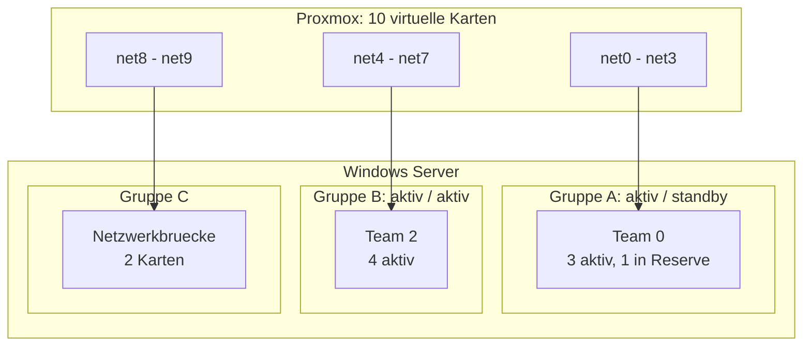

Ein Hinweis zu den Zahlen, damit sie richtig eingeordnet werden: das sind virtuelle Karten. Die angezeigten 30 oder 40 GBit/s sind das, was Windows aus mehreren 10-GBit/s-Karten zusammenrechnet. Echte Hardware mit dieser Bandbreite habe ich nicht. Testen konnte ich das **Verhalten** bei Ausfällen, und darum ging es mir.


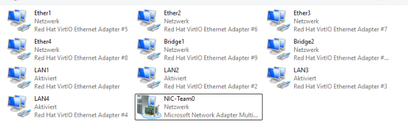

## Zuerst das Problem erzeugen

Bevor ich ein Team gebaut habe, wollte ich den Ausfall selbst sehen. Jede Karte hatte eine eigene Adresse: die erste fest, die übrigen per DHCP.

Auf dem Server eine SMB-Freigabe eingerichtet:

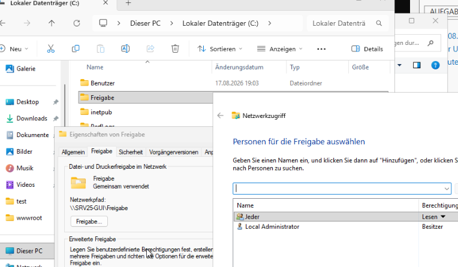

Vom Client aus erreichbar:


Dann die primäre Karte deaktiviert, was einem Kabelbruch entspricht:

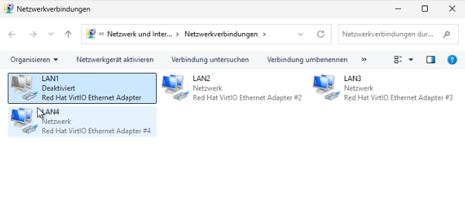

Das Ergebnis kam sofort:


Der Server lief weiter, drei weitere Karten waren online, aber der Client kam nicht mehr an seine Freigabe. Über die DHCP-Adresse einer anderen Karte wäre der Zugriff technisch möglich gewesen. Nur: jeder Benutzer müsste diese Adresse kennen, und nach einem Neustart wäre sie vielleicht eine andere.

Das ist der Punkt, an dem Teaming ansetzt. Nicht die Kabel sind das Problem, sondern dass die Adresse an einer einzelnen Karte hängt.

## Team 1: eine Karte in Reserve

Vier Karten, davon eine als Standby.


Zwei Einstellungen sind hier entscheidend.

**Teammodus.** Ich habe **Switchunabhängig** gewählt. Der Switch weiss dann nichts vom Team und muss nicht konfiguriert werden. Der Vorteil: die Karten dürfen sogar an verschiedenen Switches hängen, was gegen den Ausfall eines ganzen Switches schützt. Die Alternative wäre LACP, das aber eine passende Konfiguration auf dem Switch verlangt.

**Lastenausgleich.** Hier musste ich von der Empfehlung abweichen. Windows schlägt normalerweise **Dynamisch** vor. In einer VM funktioniert das nicht, weil dem Gastsystem die nötige Hardwareunterstützung fehlt, und Windows quittiert es mit einem Fehler. In virtuellen Umgebungen nimmt man **Adresshash**: aus IP-Adressen und Ports wird ein Hashwert gebildet, der die Karte bestimmt. Das war der erste Fehler, in den ich gelaufen bin.

Nach dem Anlegen zeigt die Übersicht die Rollenverteilung, eine Karte steht auf Standby:

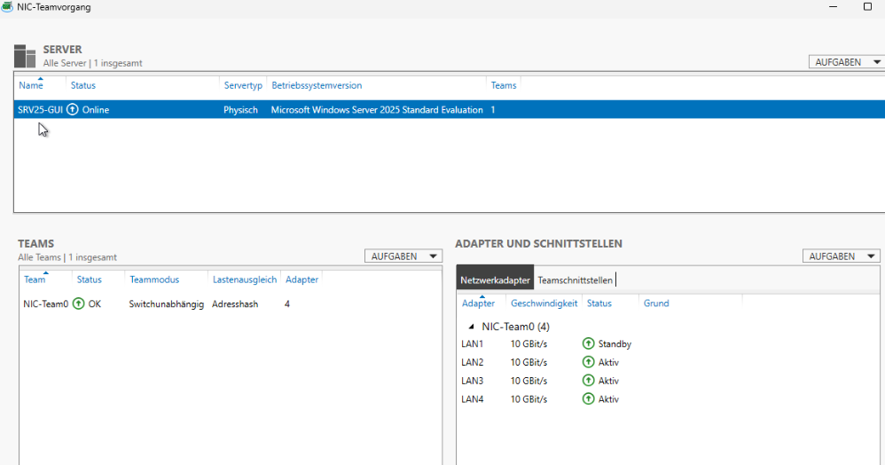


Die Standby-Karte trägt im Normalbetrieb keine Daten. Deshalb zeigt das Team die Summe von drei Karten, nicht von vier. Fällt eine aktive Karte aus, springt die Reserve ein und die Bandbreite bleibt gleich.

## Team 2: alle Karten aktiv

Beim zweiten Team gibt es keinen Standby, alle vier tragen Daten:

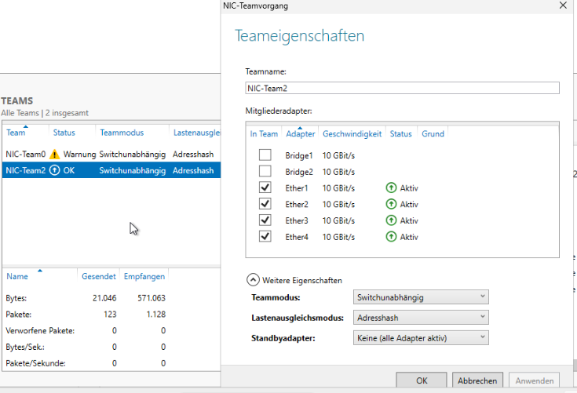


Auch hier habe ich im laufenden Betrieb eine Karte deaktiviert. Das Team ist nicht ausgefallen, die verbleibenden drei haben weitergemacht, nur die angezeigte Bandbreite sank entsprechend.

Der Unterschied zwischen den beiden Modellen ist eine Abwägung:

| | mit Reserve | alle aktiv |
| :--- | :--- | :--- |
| Bandbreite im Normalbetrieb | geringer, eine Karte wartet | maximal |
| Bandbreite nach einem Ausfall | unverändert | sinkt |
| Sinnvoll bei | gleichbleibender Leistung, auch im Fehlerfall | maximalem Durchsatz |

Die IP-Konfiguration des zweiten Teams, bewusst **ohne Standardgateway**:

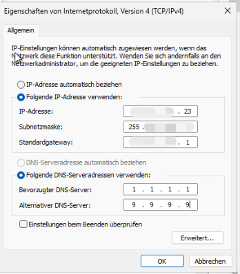

Windows hat mich beim Eintragen sogar gewarnt, dass im selben Subnetz bereits ein Standardgateway existiert. Zwei Standardgateways im selben Netz führen zu widersprüchlichen Routen, und der Rechner entscheidet dann anhand von Metriken, was schwer nachvollziehbar wird. Ein Gateway pro System, alles andere nur mit Adresse.


## Zwei Teams im selben Netz

Das zweite Team bekam die Adresse `172.16.10.45`, also dasselbe Subnetz wie das erste mit `172.16.10.21`. Der Client konnte das erste Team anpingen, das zweite aber nicht, obwohl beide online waren und die Konfiguration richtig aussah.

Der Grund ist das **Strong-Host-Modell**, das Windows standardmässig verwendet:

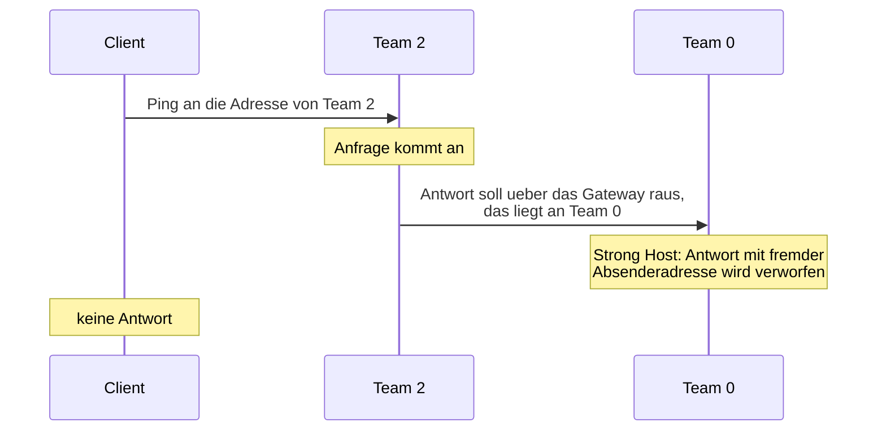

Beim Strong-Host-Modell gehört eine Adresse fest zu einer Schnittstelle. Ein Paket darf nur über die Schnittstelle hinausgehen, zu der seine Absenderadresse gehört. Die Antwort von Team 2 will aber den Weg über das Gateway nehmen, das an Team 1 hängt, und wird deshalb verworfen.

Das **Weak-Host-Modell** erlaubt genau das. Umgestellt wird es pro Schnittstelle:

```powershell
Set-NetIPInterface -InterfaceAlias "NIC-Team2" -WeakHostSend Enabled -WeakHostReceive Enabled
Set-NetIPInterface -InterfaceAlias "NIC-Team0" -WeakHostSend Enabled -WeakHostReceive Enabled
```

Danach war beides erreichbar:

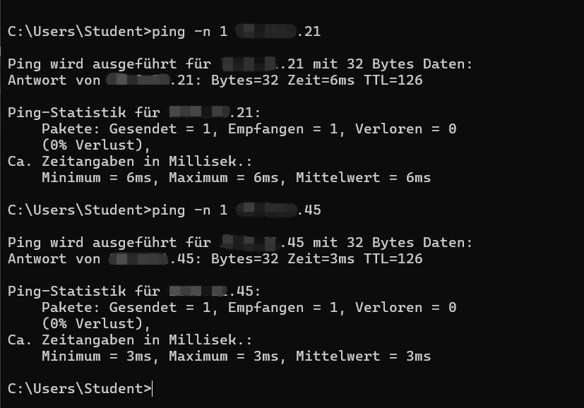

Auf dem Client musste ich noch `arp -d *` ausführen, weil dort die alten Einträge im Zwischenspeicher standen und der Rechner weiterhin die alte Zuordnung benutzte.

Erwähnenswert: Strong Host ist die sicherere Voreinstellung, weil sie bestimmte Angriffe über gefälschte Absenderadressen erschwert. Man schaltet sie nicht ohne Grund ab. In einem Testnetz mit zwei Teams im selben Subnetz ist es vertretbar, in einem echten Netz würde man die Teams eher in getrennte Subnetze legen.

## Wie das Team technisch funktioniert

Die IP-Adresse gehört jetzt dem Team:

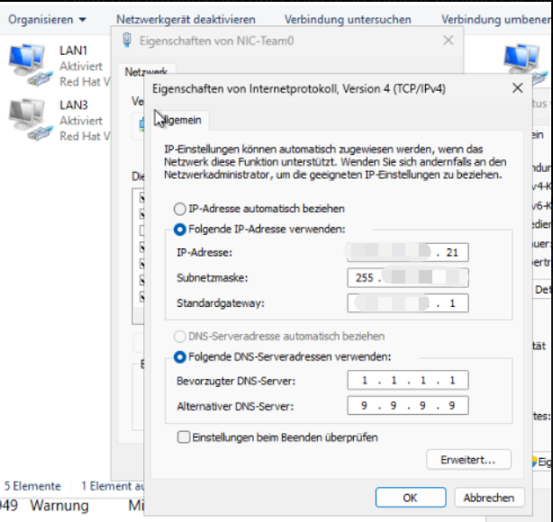

Interessanter ist, was mit den Mitgliedskarten passiert. In deren Eigenschaften ist IPv4 nicht mehr aktiviert, stattdessen steht dort das **Multiplexorprotokoll**:

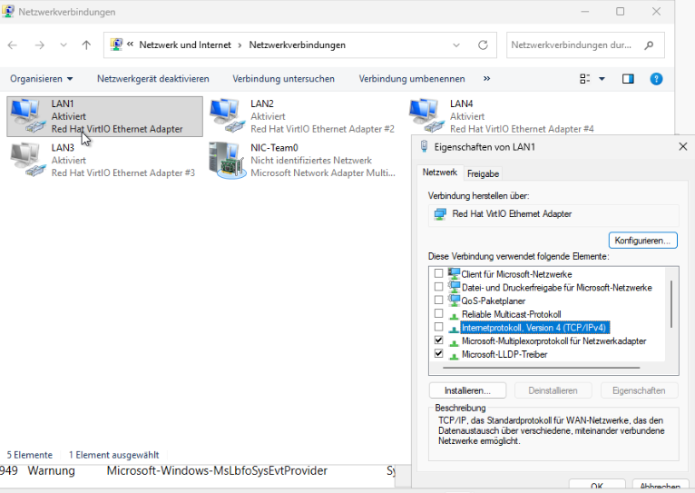

Der Multiplexor ist ein Treiber, der sich zwischen die physischen Karten und den Netzwerkstapel legt. Nach aussen meldet er eine einzige Karte. Die physischen Karten sind nur noch Transportwege ohne eigene Identität.

Dasselbe von der Kommandozeile aus:


Die einzelnen Karten tauchen nicht mehr mit eigener Adresse auf, nur der Team-Adapter mit einer IP und einem Gateway.

## Ein Fehler, den ich fast übersehen hätte

Nach dem Anlegen des ersten Teams blieb eine ungültige zweite Standardroute mit dem Ziel `0.0.0.0` im System zurück, ein Rest der alten Konfiguration.

Das Tückische war, dass zunächst alles zu funktionieren schien. Der Ping auf den Router im selben Subnetz ging durch. Weg war nur alles andere: kein Internet, keine RDP-Verbindung aus einem anderen Subnetz.

Der Grund ist, dass ein Ziel im eigenen Subnetz direkt über ARP erreicht wird. Die Routingtabelle wird dafür gar nicht befragt. Ein erfolgreicher Ping auf den eigenen Router beweist deshalb nur, dass ARP funktioniert, und sagt nichts über das Routing.

Geprüft habe ich es so:

```powershell
Get-NetRoute -DestinationPrefix "0.0.0.0/0" |
    Format-Table ifIndex,InterfaceAlias,NextHop,RouteMetric -AutoSize
```

Dort darf nur eine Zeile stehen. Bei mir waren es zwei, eine davon mit `0.0.0.0` als nächstem Ziel. Sauber bekommen habe ich es, indem ich die Adresse in einem Rutsch neu gesetzt habe:

```cmd
netsh int ip set address "NIC-Team0" static 172.16.10.21 255.255.255.0 172.16.10.1
```

## Netzwerkbrücke

Aus den letzten beiden Karten habe ich eine Brücke gebaut. Man markiert beide Karten und wählt **Verbindungen überbrücken**:

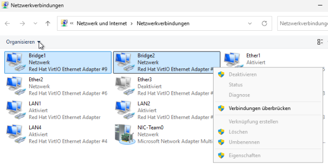

Es entsteht ein neuer Adapter namens Netzwerkbrücke:


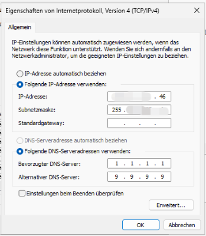

Die Brücke bekam `172.16.10.46`, wieder ohne Standardgateway. Damit hat der Server jetzt drei Adressen im selben Subnetz: `.21` am ersten Team, `.45` am zweiten und `.46` an der Brücke.

Auch hier trat das Strong-Host-Problem wieder auf, und die Lösung war dieselbe:

```powershell
Set-NetIPInterface -InterfaceAlias "*brücke*" -WeakHostSend Enabled -WeakHostReceive Enabled
Get-NetConnectionProfile -InterfaceAlias "*brücke*" | Set-NetConnectionProfile -NetworkCategory Private
```

Das Netzwerkprofil auf **Privat** zu setzen war nötig, weil die Firewall im öffentlichen Profil eingehende Pings blockiert.

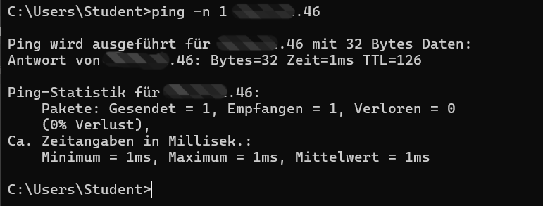

### Brücke ist nicht Teaming

Das Ergebnis sieht ähnlich aus, der Zweck ist ein völlig anderer.

| | Teaming | Brücke |
| :--- | :--- | :--- |
| Zweck | Ausfallsicherheit für den Server selbst | zwei Netzsegmente verbinden |
| Rolle des Servers | Endgerät | Weiterleitung, wie ein kleiner Switch |
| Lastverteilung | über Hashwerte, gezielt | keine, es wird nur weitergeleitet |
| Verschiedene Medien | nein, nur gleiches Ethernet | ja, etwa LAN und WLAN |
| CPU-Last | sehr gering, im Treiber | höher, jedes Paket wird geprüft |
| Schleifengefahr | keine | vorhanden |

Der letzte Punkt ist der wichtigste. Wer zwei Karten im selben VLAN überbrückt und im Netz kein Spanning Tree hat, baut eine Schleife. Broadcasts laufen dann im Kreis und können das Segment lahmlegen. Eine Brücke gehört zwischen **verschiedene** Segmente.

## Vergleich mit Cisco

Aus dem Netzwerkunterricht kannte ich EtherChannel und LACP. Der Vergleich hat mir geholfen, das Windows-Teaming einzuordnen:

| | Cisco EtherChannel / LACP | Windows LBFO, switchunabhängig |
| :--- | :--- | :--- |
| Wo konfiguriert | auf dem Switch | im Betriebssystem |
| Switch muss mitspielen | ja, zwingend | nein |
| Karten an verschiedenen Switches | nur mit Stacking | ohne Weiteres möglich |
| Aushandlung | über LACP-Pakete | keine, der Switch merkt nichts |

Beides erreicht dasselbe Ziel auf verschiedenen Ebenen. Der switchunabhängige Modus ist flexibler und einfacher, LACP kann dafür den eingehenden Verkehr besser verteilen, weil beide Seiten Bescheid wissen.

## Automatisierung

```powershell
Get-NetAdapter | Select-Object Name, InterfaceDescription, LinkSpeed, Status

New-NetLbfoTeam -Name "NIC-Team0" -TeamMembers "LAN1","LAN2","LAN3","LAN4" `
    -TeamingMode SwitchIndependent -LoadBalancingAlgorithm AddressHash -Confirm:$false

Set-NetLbfoTeamMember -Name "LAN1" -AdministrativeMode Standby

New-NetIPAddress -InterfaceAlias "NIC-Team0" -IPAddress "172.16.10.21" `
    -PrefixLength 24 -DefaultGateway "172.16.10.1"

Get-NetLbfoTeam
```

## Begriffe

| Deutsch | Englisch | Bedeutung |
| :--- | :--- | :--- |
| NIC-Teaming | LBFO | mehrere Karten als eine logische Karte |
| switchunabhängiger Modus | Switch Independent | Team ohne Konfiguration am Switch |
| Adresshash | Address Hash | Verteilung über einen Hashwert aus Adressen und Ports |
| Standby-Adapter | Standby Adapter | Reservekarte, trägt im Normalbetrieb keine Daten |
| Multiplexortreiber | Multiplexor Driver | Treiber, der die Karten zusammenfasst |
| Netzwerkbrücke | Network Bridge | Verbindung zweier Segmente auf Layer 2 |
| Multihoming | Multihoming | mehrere Adressen oder Schnittstellen an einem System |
| Strong- / Weak-Host-Modell | Strong / Weak Host | ob eine Antwort die Schnittstelle wechseln darf |

## Was ich dabei gelernt habe

**Das Teaming selbst war der unproblematischste Teil.** Es hat den Ausfall genau so aufgefangen, wie es soll. Die Zeit ging für zwei Dinge drauf, die nichts mit Teaming zu tun hatten.

**Ein erfolgreicher Ping beweist wenig.** Die Sache mit der `0.0.0.0`-Route hat mir das deutlich gezeigt. Ein Ping auf ein Gerät im eigenen Subnetz sagt nur, dass ARP funktioniert. Ob das Routing stimmt, sieht man erst bei einem Ziel ausserhalb. Seitdem teste ich Netzwerkprobleme immer in dieser Reihenfolge: erst im eigenen Subnetz, dann ausserhalb, dann mit Namen statt Adressen.

**Strong Host gegen Weak Host hätte ich sonst nie verstanden.** Solange ein Server nur eine Adresse hat, merkt man davon nichts. Erst mit zwei Teams im selben Netz wird sichtbar, dass Windows Adressen fest an Schnittstellen bindet.

**Empfehlungen gelten nicht überall.** Der Lastenausgleich **Dynamisch** ist auf physischer Hardware richtig und in einer VM schlicht nicht verfügbar. Bei einer Empfehlung lohnt die Frage, unter welchen Voraussetzungen sie gilt.
