# iSCSI: Speicher auf Blockebene über das Netzwerk

## Worum es geht

Eine SMB-Freigabe kannte ich schon: der Server verwaltet das Dateisystem, der Client bekommt Zugriff auf Ordner und Dateien.

Bei iSCSI ist es anders. Der Server gibt keine Dateien heraus, sondern rohe Blöcke. Er verpackt SCSI-Befehle in TCP-Pakete und schickt sie über das Netz. Auf dem Client erscheint das als ganz normale Festplatte, die man selbst initialisieren und formatieren muss. Der Client merkt nicht, dass die Platte in einem anderen Gebäude stehen könnte.

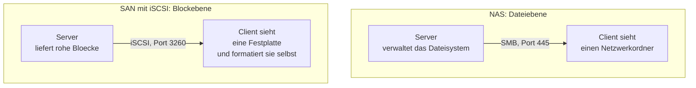

Der Unterschied ist nicht akademisch. Datenbanken, Exchange und Failover-Cluster brauchen Blockzugriff und laufen auf einer normalen SMB-Freigabe nicht oder nur eingeschränkt, weil sie eigene Sperren auf Blockebene setzen.

| | SMB-Freigabe | iSCSI |
| :--- | :--- | :--- |
| Ebene | Datei | Block |
| Port | 445 | 3260 |
| Dateisystem verwaltet | der Server | der Client |
| Der Client sieht | einen Netzwerkordner | eine lokale Festplatte |
| Anmeldung über | Benutzer und Kennwort | IQN, IP-Filter oder CHAP |
| Mehrere Clients gleichzeitig | ja, der Server koordiniert | nur mit Cluster-Dateisystem |

Zwei Begriffe tauchen ständig auf:

- **Target** ist die Seite, die Speicher anbietet. **Initiator** ist die Seite, die ihn benutzt.
- **LUN** ist der Speicherbereich, den ein Target herausgibt. Bei Windows ist das technisch eine VHDX-Datei.
- **IQN** ist der Name, unter dem sich Target und Initiator kennen, zum Beispiel `iqn.1991-05.com.microsoft:servername-zielname-target`.

## Serverseite

Die Rolle heisst **iSCSI-Zielserver** und liegt unter den Datei- und Speicherdiensten:

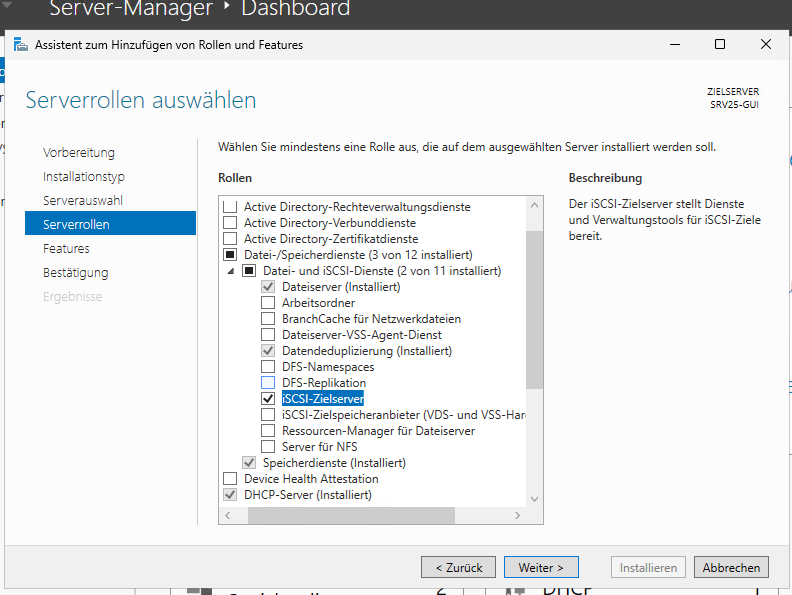

```powershell
Install-WindowsFeature -Name FS-iSCSITarget-Server -IncludeManagementTools
```

Danach gibt es in der Serververwaltung einen neuen Bereich für iSCSI:

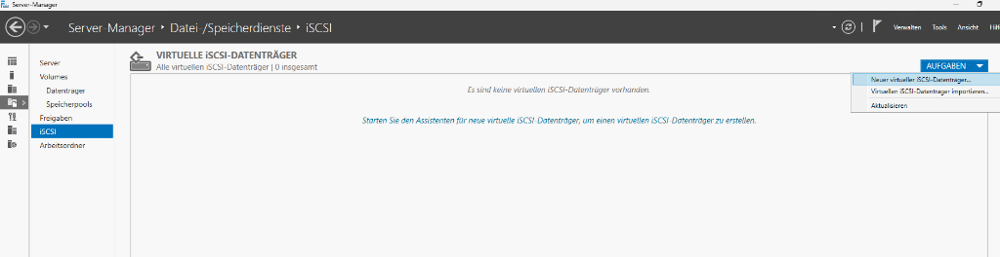

### Wo die LUN liegt

Als Ablageort habe ich bewusst das Volume genommen, das ich im Kapitel über Storage Spaces mit doppelter Parität gebaut hatte:

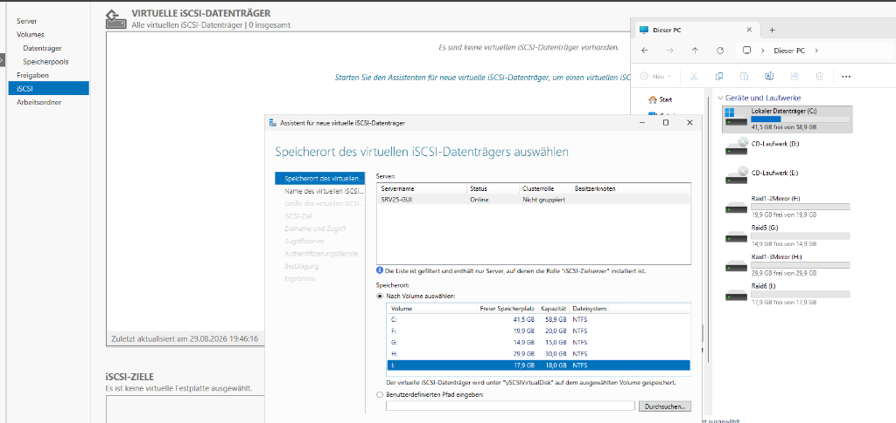

Damit stapeln sich die Schichten übereinander, und das war für mich der interessanteste Teil des ganzen Aufbaus:

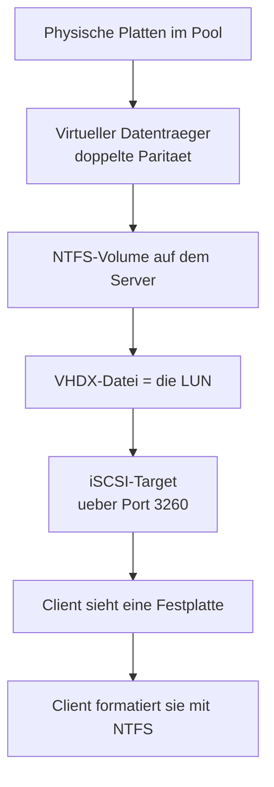

Der Client formatiert also ein Dateisystem, das in einer Datei liegt, die auf einem Dateisystem liegt, das auf einem virtuellen Datenträger liegt, der über zwölf physische Platten verteilt ist. Und für den Client sieht das aus wie eine ganz normale Platte.

Praktisch bedeutet das: die Netzwerkplatte des Clients verträgt den Ausfall von zwei Platten im Server, ohne dass der Client etwas davon weiss oder dafür etwas konfigurieren müsste.

### Grösse und Zuweisung

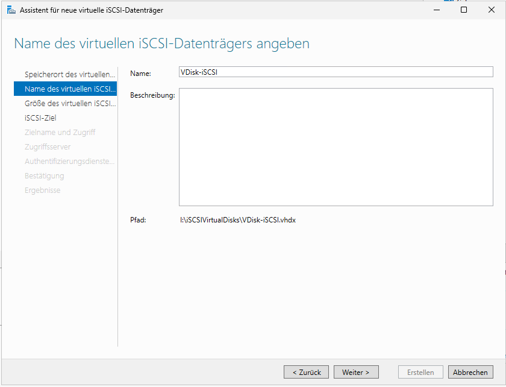

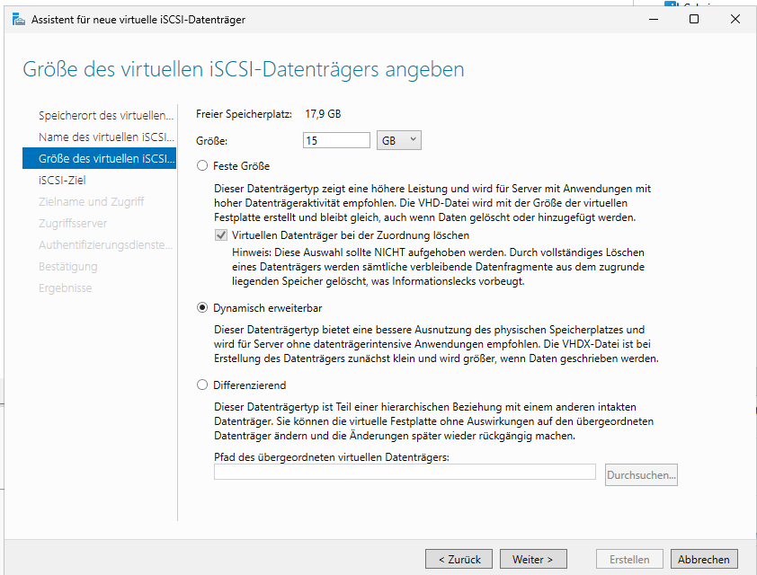

**Dynamisch erweiterbar** entspricht der dünnen Bereitstellung: die VHDX-Datei ist am Anfang nur wenige Megabyte gross und wächst mit den Daten. Die Alternative wäre eine feste Grösse, die sofort den vollen Platz belegt und etwas schneller ist.

Ein Detail, das man wissen sollte: die Datei wächst mit, schrumpft aber nicht von allein wieder. Löscht der Client Daten, bleibt die VHDX gross.

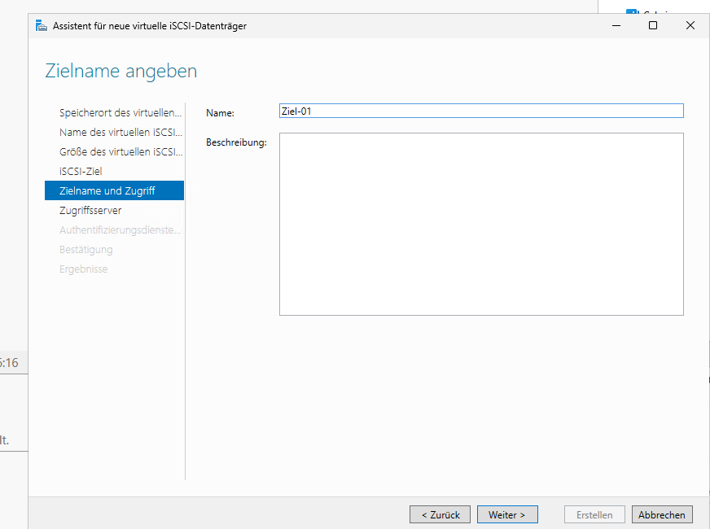

### Wer sich verbinden darf

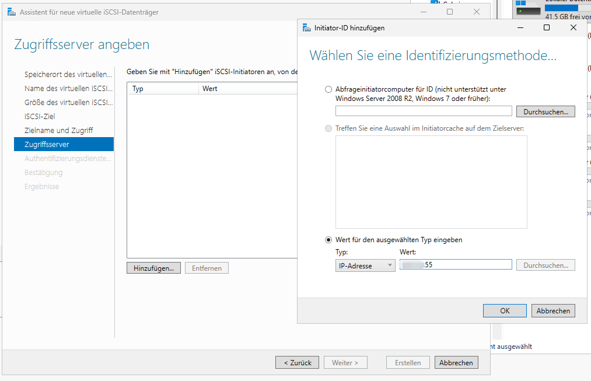

Dieser Schritt ist wichtiger, als er aussieht. Ohne Einschränkung dürfte sich jeder im Netz mit dem Ziel verbinden, und da ein Client die Platte als seine eigene ansieht, wäre das eine schlechte Idee.

Drei Möglichkeiten stehen zur Wahl:

- **IP-Adresse.** Am einfachsten, im Lab habe ich das benutzt. Schwach, weil sich Adressen fälschen lassen.
- **IQN.** Der Client identifiziert sich über seinen Namen. Etwas besser, aber auch nur ein Name.
- **CHAP.** Anmeldung mit Benutzername und Kennwort. Das ist die einzige Variante, die man produktiv einsetzen würde.

Im Verlauf des Labs habe ich nacheinander mehrere Clients freigegeben: den Core-Server und später einen normalen Windows-Rechner.

## Clientseite auf Server Core

Auf dem Core-Server gibt es keine Oberfläche, also läuft alles über PowerShell. Der Initiator-Dienst ist standardmässig ausgeschaltet:

```powershell
# 1. Dienst starten und dauerhaft aktivieren
Start-Service -Name MSiSCSI
Set-Service  -Name MSiSCSI -StartupType Automatic

# 2. Das Ziel suchen
New-IscsiTargetPortal -TargetPortalAddress "172.16.10.21"
Get-IscsiTarget

# 3. Verbinden, dauerhaft
$Target = Get-IscsiTarget
Connect-IscsiTarget -NodeAddress $Target.NodeAddress -IsPersistent $true

# 4. Kontrolle
Get-IscsiSession | Select-Object InitiatorNodeAddress, TargetNodeAddress, IsConnected
```

Zwei Punkte daran sind wichtig.

`Set-Service -StartupType Automatic` nicht vergessen. Startet der Dienst nach einem Neustart nicht, ist die Platte weg, egal wie der Rest konfiguriert ist.

`-IsPersistent $true` sorgt dafür, dass die Verbindung nach einem Neustart automatisch wieder aufgebaut wird. Ohne diesen Schalter ist sie einmalig, und ein Server, der seinen Datenspeicher bei jedem Neustart verliert, ist nicht zu gebrauchen.

Ab hier ist es eine ganz gewöhnliche neue Festplatte:

```powershell
Get-Disk | Where-Object BusType -eq "iSCSI" |
    Initialize-Disk -PartitionStyle GPT -PassThru |
    New-Partition -AssignDriveLetter -UseMaximumSize |
    Format-Volume -FileSystem NTFS -NewFileSystemLabel "iSCSI_Data" -Confirm:$false
```

Genau dieselben Schritte wie im Kapitel über die Datenträgerverwaltung. Der einzige Unterschied ist, dass die Platte in einem anderen Rechner steckt.

Kontrolliert habe ich das Ergebnis über das Windows Admin Center:


Man sieht den verwalteten Core-Server, die Platte vom Typ einer virtuellen Festplatte und das fertige Volume mit Grösse und freiem Platz.

## Derselbe Speicher auf einem normalen Windows-Rechner

Damit ich sehe, dass daran nichts serverspezifisches ist, habe ich dasselbe Ziel von einem gewöhnlichen Windows-Rechner aus verbunden. Der iSCSI-Initiator ist in jedem Windows enthalten und heisst `iscsicpl.exe`.

Der Ablauf: Zieladresse eintragen, **Schnell verbinden**, Ziel auswählen. Danach in der Datenträgerverwaltung initialisieren und formatieren, wie bei jeder neuen Platte.

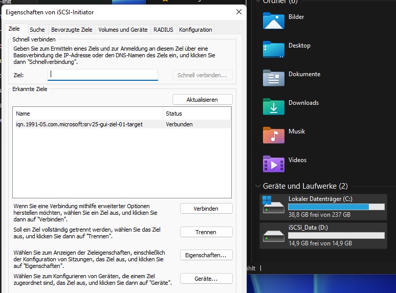

Bemerkenswert ist die Stelle im Explorer: die Platte steht unter **Geräte und Laufwerke**, nicht unter den Netzwerkadressen. Für Windows ist sie eine lokale Festplatte.

Auf der Serverseite liegt sie gleichzeitig als Datei im Ordner:

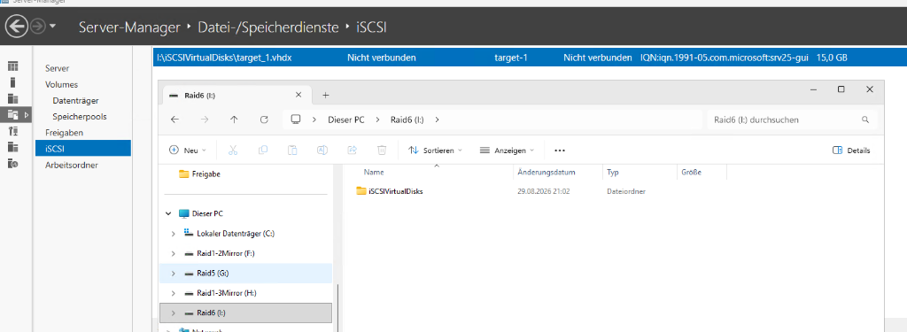

Der Schreibtest schliesst den Kreis. Ein neuer Ordner auf dem Client wird als SCSI-Befehl über das Netz geschickt und landet in der VHDX-Datei auf dem Server:

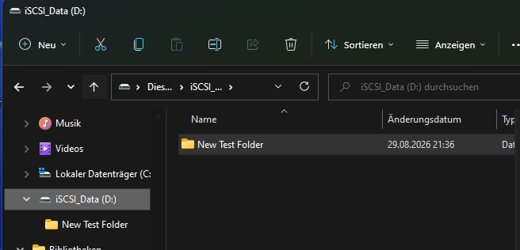

## Test und Verifikation

Bei iSCSI liegen Server und Client auseinander, also prüft man beide Seiten getrennt und dann die Verbindung dazwischen.

### Serverseite: wird das Ziel angeboten?

```powershell
Get-Service -Name WinTarget | Select-Object Name, Status, StartType
Get-IscsiServerTarget | Select-Object TargetName, InitiatorIds, LunMappings, Status
```

```
Name      Status  StartType
----      ------  ---------
WinTarget Running Automatic

TargetName : Ziel-01
InitiatorIds : {IPAddress:172.16.10.30}
LunMappings  : {TargetName:Ziel-01;VHD:"I:\iSCSIVirtualDisks\VDisk-iSCSI.vhdx";LUN:0}
Status       : Connected
```

Drei Angaben zählen: der Dienst läuft, in `InitiatorIds` steht der zugelassene Client `172.16.10.30`, und in `LunMappings` ist die VHDX-Datei mit dem Ziel verbunden. Fehlt die Zuordnung, existiert das Ziel, gibt aber nichts heraus.

```powershell
Get-NetTCPConnection -LocalPort 3260 -State Listen |
    Select-Object LocalAddress, LocalPort, State
```

```
LocalAddress LocalPort State
------------ --------- -----
0.0.0.0           3260 Listen
```

### Die Verbindung dazwischen

```powershell
Test-NetConnection -ComputerName 172.16.10.21 -Port 3260
```

```
ComputerName     : 172.16.10.21
RemoteAddress    : 172.16.10.21
RemotePort       : 3260
TcpTestSucceeded : True
```

Diese eine Zeile trennt "iSCSI hat ein Problem" von "die Maschinen sehen sich nicht". Bei mir war es beim ersten Versuch das Zweite.

### Clientseite: besteht die Sitzung?

```powershell
Get-IscsiSession |
    Select-Object InitiatorNodeAddress, TargetNodeAddress, IsConnected, IsPersistent
```

```
InitiatorNodeAddress : iqn.1991-05.com.microsoft:srv22-core
TargetNodeAddress    : iqn.1991-05.com.microsoft:srv25-gui-ziel-01-target
IsConnected          : True
IsPersistent         : True
```

`IsPersistent` ist die Spalte, die man leicht übersieht. Steht dort `False`, funktioniert alles bis zum nächsten Neustart und danach ist die Platte weg.

### Ist die Platte angekommen?

```powershell
Get-Disk | Where-Object BusType -eq "iSCSI" |
    Select-Object Number, FriendlyName, BusType, OperationalStatus, `
                  @{n='GB';e={[math]::Round($_.Size/1GB,1)}}
```

```
Number FriendlyName    BusType OperationalStatus   GB
------ ------------    ------- -----------------   --
     1 MSFT Virtual HD iSCSI   Online            15.0
```

`BusType = iSCSI` ist der Beweis, dass die Platte über das Netz kommt und nicht lokal steckt. Im Explorer sieht man diesen Unterschied nicht.

```powershell
Get-Volume -DriveLetter F |
    Select-Object DriveLetter, FileSystemLabel, FileSystem, HealthStatus, `
                  @{n='FreiGB';e={[math]::Round($_.SizeRemaining/1GB,1)}}
```

```
DriveLetter FileSystemLabel FileSystem HealthStatus FreiGB
----------- --------------- ---------- ------------ ------
F           iSCSI_Data      NTFS       Healthy        14.9
```

Dieselben Werte hat auch das Windows Admin Center im Screenshot weiter oben gezeigt, nur eben grafisch.

### Schreibtest und Gegenprobe auf dem Server

Der eigentliche Beweis ist, dass ein Schreibvorgang auf dem Client die Datei auf dem Server wachsen lässt:

```powershell
# auf dem Client
New-Item -Path F:\Testordner -ItemType Directory
"Testdaten" | Out-File F:\Testordner\test.txt

# auf dem Server
Get-Item "I:\iSCSIVirtualDisks\VDisk-iSCSI.vhdx" |
    Select-Object Name, @{n='MB';e={[math]::Round($_.Length/1MB,1)}}
```

Weil die VHDX dynamisch angelegt ist, wächst die Datei mit den geschriebenen Daten. Damit ist die ganze Kette bestätigt: Explorer auf dem Client, SCSI-Befehle über TCP 3260, VHDX-Datei auf dem Volume mit doppelter Parität.

### Neustartfestigkeit

```powershell
Restart-Computer -ComputerName 172.16.10.30 -Wait -For PowerShell
Get-Disk | Where-Object BusType -eq "iSCSI"
```

Wenn die Platte danach ohne Zutun wieder da ist, stimmen beide Einstellungen: Dienst auf `Automatic` und Verbindung mit `-IsPersistent`.

## Ein Fehler, der nichts mit iSCSI zu tun hatte

Der erste Verbindungsversuch von meinem Laptop aus lief in eine Zeitüberschreitung:

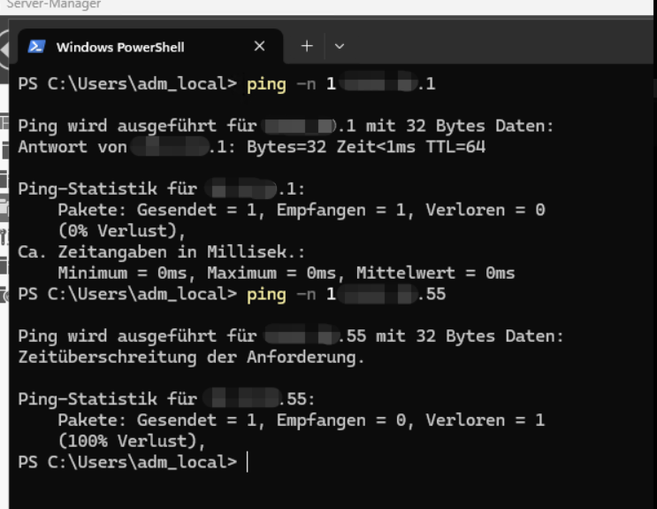

Die Ursache lag nicht bei iSCSI, sondern eine Ebene tiefer: das Lab liegt in einem eigenen, isolierten Netz, und mein Laptop war in einem anderen Segment. Der Router lässt diesen Weg absichtlich nicht zu.

Die Lehre daraus ist banal und trotzdem hilfreich: bevor man einen Dienst debuggt, prüft man, ob die Gegenstelle überhaupt erreichbar ist. Ein `Test-NetConnection` hätte mir das in fünf Sekunden gesagt.

## Fehlersuche

| Symptom | Ursache | Lösung |
| :--- | :--- | :--- |
| Zeitüberschreitung beim Verbinden | Client in einem anderen Segment, Router blockiert | `Test-NetConnection -Port 3260`, aus demselben Netz testen |
| Portal lässt sich nicht hinzufügen | Firewallregel für iSCSI aus | auf dem Server `Enable-NetFirewallRule -DisplayGroup "iSCSI-Dienst"` |
| Ziel erscheint, Anmeldung abgelehnt | Client nicht in der Zugriffsliste | Initiator-ID am Ziel eintragen, `Set-IscsiServerTarget -InitiatorIds` |
| Ziel verbunden, aber keine Platte sichtbar | LUN nicht mit dem Ziel verknüpft | `Add-IscsiVirtualDiskTargetMapping` |
| Platte nach Neustart weg | ohne `-IsPersistent` verbunden | erneut mit `-IsPersistent $true` verbinden |
| Platte nach Neustart weg, trotz Persistent | Initiator-Dienst startet nicht automatisch | `Set-Service MSiSCSI -StartupType Automatic` |
| Platte erscheint als `RAW` | normal, sie wurde noch nie formatiert | initialisieren und formatieren wie eine lokale Platte |
| Dateisystem beschädigt | dieselbe LUN von zwei Rechnern gleichzeitig benutzt | nur ein Initiator pro LUN, sonst Cluster mit CSV |
| VHDX wächst, obwohl Daten gelöscht wurden | dynamische VHDX schrumpft nicht von allein | `Optimize-VHD`, Dienst vorher trennen |

## Begriffe

| Deutsch | Englisch | Bedeutung |
| :--- | :--- | :--- |
| das Speichernetz | SAN | Speicher auf Blockebene über das Netz |
| der Netzwerkspeicher | NAS | Speicher auf Dateiebene, etwa über SMB |
| der Zielserver | iSCSI Target | Seite, die Speicher anbietet |
| der Initiator | iSCSI Initiator | Seite, die den Speicher benutzt |
| die logische Einheit (LUN) | Logical Unit Number | der herausgegebene Speicherbereich |
| der qualifizierte Name (IQN) | iSCSI Qualified Name | eindeutiger Name von Ziel und Initiator |
| das Portal | Target Portal | Adresse und Port, unter der ein Ziel erreichbar ist |
| die dauerhafte Verbindung | Persistent Login | Verbindung wird nach dem Neustart neu aufgebaut |
| die dynamische Erweiterung | Dynamically Expanding | VHDX wächst mit den Daten |
| die CHAP-Anmeldung | CHAP Authentication | Anmeldung mit Benutzername und Kennwort |
| das freigegebene Clustervolume | Cluster Shared Volume | erlaubt mehreren Servern gleichzeitigen Zugriff |
| die Blockebene | Block Level | Zugriff auf rohe Blöcke statt auf Dateien |

## Alles per PowerShell

```powershell
# Serverseite
Install-WindowsFeature -Name FS-iSCSITarget-Server -IncludeManagementTools
New-IscsiVirtualDisk   -Path "I:\iSCSIVirtualDisks\VDisk-iSCSI.vhdx" -SizeBytes 15GB
New-IscsiServerTarget  -TargetName "Ziel-01" -InitiatorIds "IPAddress:172.16.10.30"
Add-IscsiVirtualDiskTargetMapping -TargetName "Ziel-01" `
    -Path "I:\iSCSIVirtualDisks\VDisk-iSCSI.vhdx"

# Clientseite
Start-Service -Name MSiSCSI
Set-Service   -Name MSiSCSI -StartupType Automatic
New-IscsiTargetPortal -TargetPortalAddress "172.16.10.21"
Get-IscsiTarget | Connect-IscsiTarget -IsPersistent $true
```

## Was ich dabei gelernt habe

**Wer das Dateisystem besitzt, entscheidet alles.** Bei einer SMB-Freigabe können viele Benutzer gleichzeitig arbeiten, weil der Server die Zugriffe koordiniert. Bei iSCSI passiert das nicht: jeder Client hält die Platte für seine eigene und führt einen eigenen Zwischenspeicher.

Gibt man dieselbe LUN gleichzeitig an zwei Rechner, die nichts voneinander wissen, schreiben beide in ihre eigene Vorstellung des Dateisystems und beschädigen es. NTFS ist nicht clusterfähig. Für den gleichzeitigen Zugriff mehrerer Server braucht man einen Failover-Cluster mit freigegebenen Clustervolumes. iSCSI transportiert Blöcke, es koordiniert nichts.

**Die Schichten stapeln sich, und das ist kein Zufall.** Die LUN liegt auf einem Volume mit doppelter Parität aus dem Storage-Spaces-Kapitel, der Client bindet sie mit den Befehlen aus dem Kapitel über die Datenträgerverwaltung ein und ich kontrolliere sie über das Windows Admin Center. Jede Ebene weiss nur von der direkt darunter. Genau so sind Speichersysteme aufgebaut, und das habe ich erst verstanden, als ich es einmal selbst gestapelt hatte.

**Zugriffsschutz über die IP-Adresse ist Bequemlichkeit, keine Sicherheit.** Für ein Lab in einem isolierten Netz reicht es. Sobald echte Daten im Spiel sind, gehört CHAP dazu und der Speicherverkehr in ein eigenes Netz.
