# Serverrollen, IIS und DNS

## Worum es geht

Bisher habe ich in diesem Lab an Speicher und Netzwerk gearbeitet. Jetzt kommt zum ersten Mal ein Dienst dazu, den jemand von aussen wirklich benutzt: eine Website.

Das Ziel war eine Kette, die von Anfang bis Ende funktioniert. Nicht nur "IIS ist installiert", sondern: ein Client tippt einen Namen in den Browser, dieser Name wird von meinem eigenen DNS-Server aufgelöst, und der Webserver liefert die Seite aus.

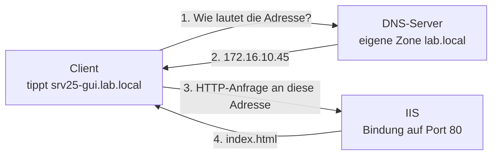
```mermaid
flowchart LR
    C["Client<br/>tippt srv25-gui.lab.local"]
    D["DNS-Server<br/>eigene Zone lab.local"]
    W["IIS<br/>Bindung auf Port 80"]
    C -->|"1. Wie lautet die Adresse?"| D
    D -->|"2. 172.16.10.45"| C
    C -->|"3. HTTP-Anfrage an diese Adresse"| W
    W -->|"4. index.html"| C
```

Genau diese vier Schritte machen den Unterschied zwischen "läuft bei mir" und "läuft im Netz". Wenn ein Benutzer sagt, die Seite geht nicht, muss man wissen, welcher dieser Schritte fehlgeschlagen ist.

Beide Rollen habe ich auf demselben Server installiert: **DNS-Server** und **Webserver (IIS)**.

## Rollen installieren

Windows-Funktionen sind in **Rollen** und **Features** unterteilt. Eine Rolle ist die eigentliche Aufgabe des Servers, etwa Webserver oder DNS. Ein Feature ist ein Hilfsmittel, etwa die Verwaltungswerkzeuge dazu.

Der Assistent startet in der Serververwaltung über den Schnellstart:

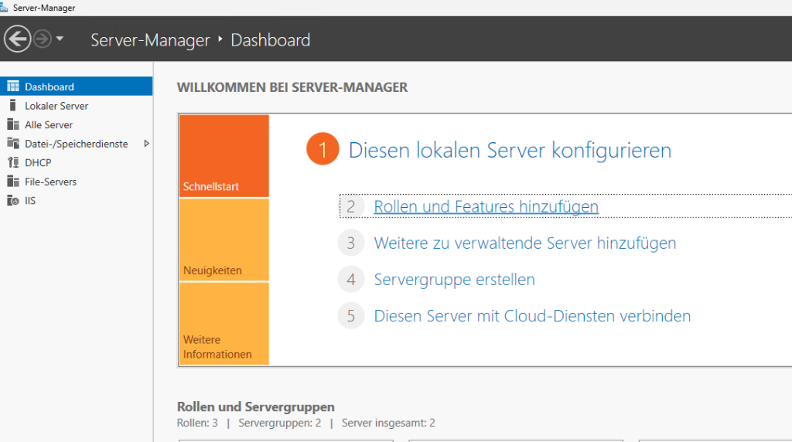

Als Installationsart wählt man **rollenbasiert oder featurebasiert**:

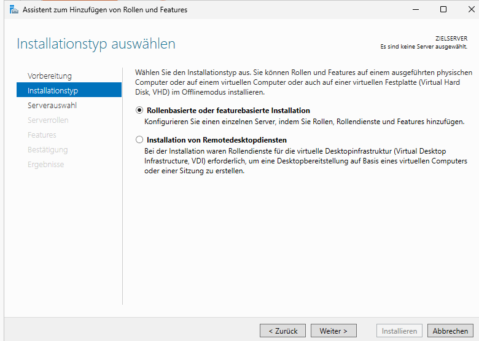

Die zweite Option im Dialog heisst Remotedesktopdienste und macht etwas völlig anderes: sie richtet Terminalserver ein, an denen sich mehrere Benutzer gleichzeitig anmelden. Für einen normalen Dienst nimmt man immer die erste Option.

Im nächsten Schritt fragt der Assistent nach dem Zielserver. Bemerkenswert daran: man kann eine Rolle auch auf einem **anderen** Server im Pool installieren, nicht nur auf dem, an dem man gerade sitzt. Alle Server, die man in die Serververwaltung aufgenommen hat, stehen zur Auswahl.

Danach die eigentliche Auswahl der Rollen:

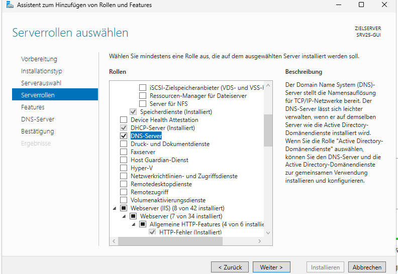

Sobald man eine Rolle anhakt, öffnet sich ein zweites Fenster und schlägt die passenden Verwaltungswerkzeuge vor, die RSAT-Tools. Diesen Vorschlag sollte man annehmen: ohne sie ist die Rolle zwar installiert, aber es gibt keine Konsole, um sie zu bedienen.

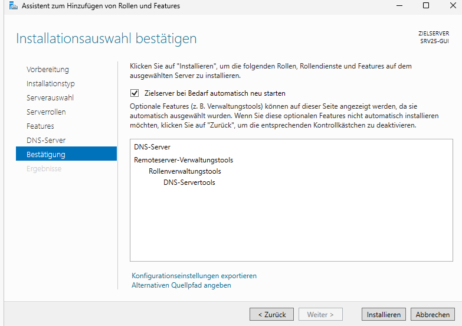

Der Haken **Zielserver bei Bedarf automatisch neu starten** ist praktisch, aber man sollte wissen, was er tut: der Server startet ohne weitere Nachfrage neu, wenn die Installation es verlangt. Auf einer Maschine, auf der andere Dienste laufen, würde man ihn weglassen und den Neustart selbst einplanen.

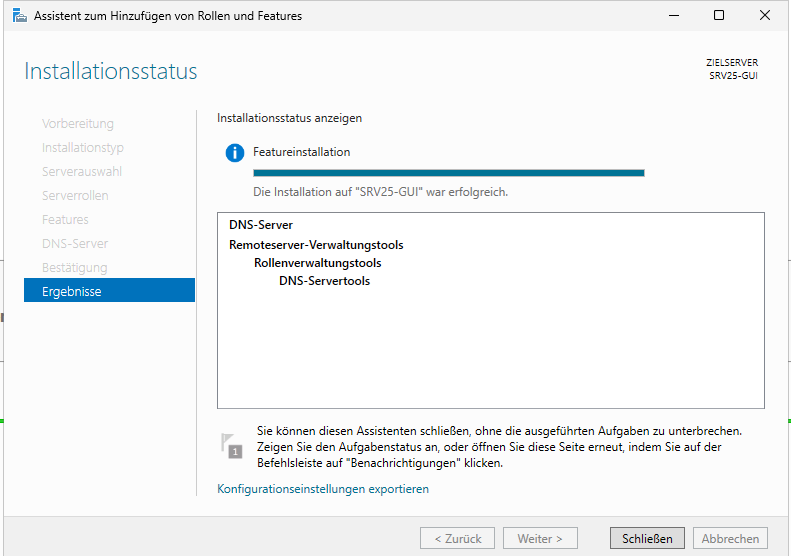

Dasselbe geht auch in einer Zeile, und so würde man es für mehrere Server machen:

```powershell
Install-WindowsFeature -Name Web-Server, DNS -IncludeManagementTools
```

## IIS

Die Konsole heisst **Internetinformationsdienste-Manager** und startet über `inetmgr`:

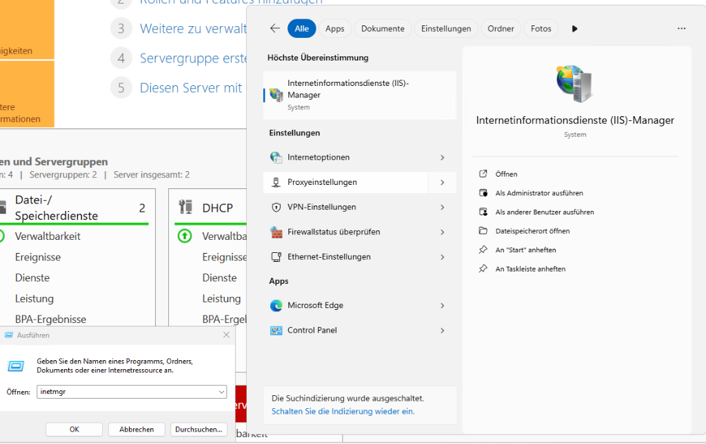

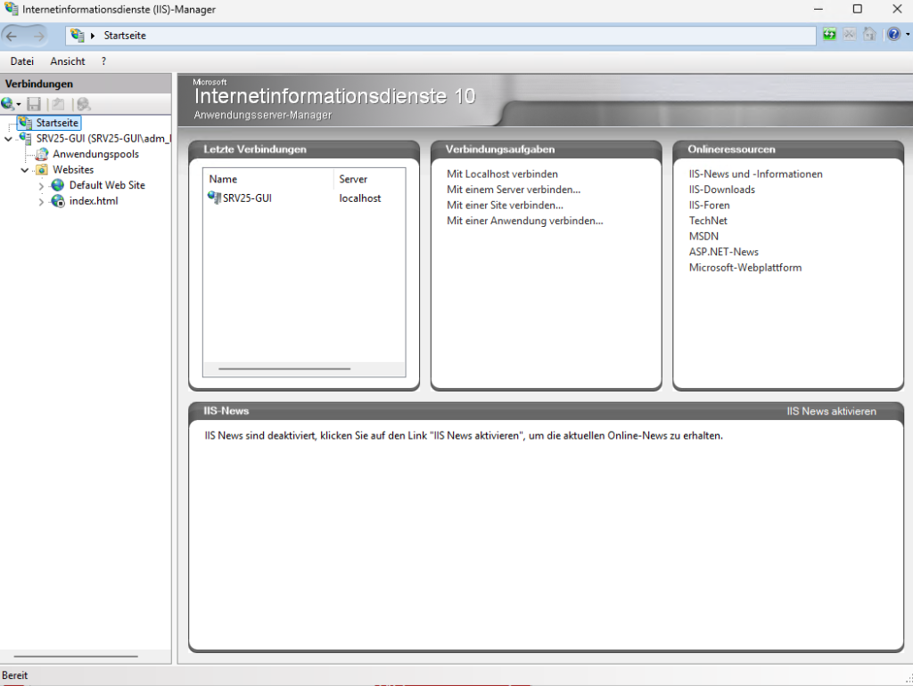

Links steht die Hierarchie: der Server, darunter Anwendungspools und Websites, darunter die **Default Web Site**, die bei der Installation automatisch angelegt wird.

Wählt man eine Website aus, erscheinen in der Mitte deren Einstellungen:

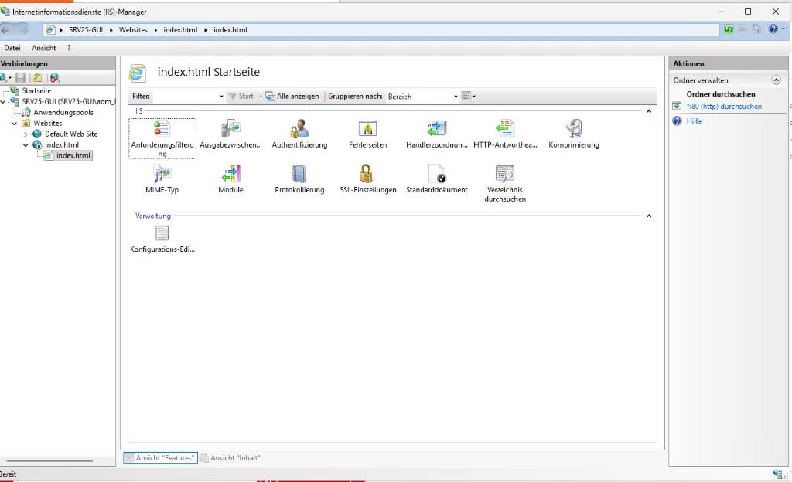

Vier davon braucht man am Anfang:

| Einstellung | Wofür |
| :--- | :--- |
| Standarddokument | welche Datei ausgeliefert wird, wenn nur ein Verzeichnis angefragt wird, etwa `index.html` |
| Authentifizierung | anonym, Basis oder Windows-Anmeldung |
| MIME-Typen | welche Dateitypen ausgeliefert werden dürfen |
| Protokollierung | wohin die Zugriffsprotokolle geschrieben werden |

Das Standarddokument erklärt eine Sache, über die viele beim ersten Mal stolpern. Ruft man `http://server/` auf, ohne einen Dateinamen anzugeben, geht IIS diese Liste von oben nach unten durch und liefert die erste Datei aus, die es findet. Heisst die eigene Datei anders und steht nicht in der Liste, bekommt man einen Fehler, obwohl die Datei da ist.

Meine Seite habe ich als `index.html` unter `C:\inetpub\wwwroot` abgelegt, dem Standardverzeichnis von IIS.

### Bindungen

Eine Bindung legt fest, worauf eine Website überhaupt reagiert. Das ist die wichtigste Einstellung des ganzen Kapitels, weil sie erklärt, warum eine Seite lokal geht und von aussen nicht.

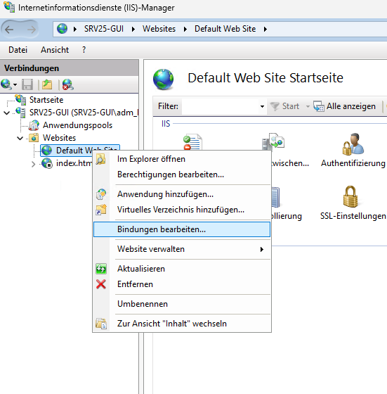

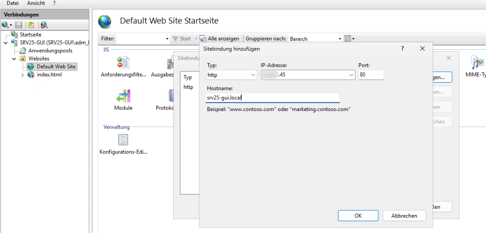

Eine Bindung besteht aus vier Angaben:

| Feld | Mein Wert | Bedeutung |
| :--- | :--- | :--- |
| Typ | `http` | unverschlüsselt; für `https` bräuchte man ein Zertifikat |
| IP-Adresse | `172.16.10.45` | auf welcher Adresse gelauscht wird |
| Port | `80` | Standardport für HTTP |
| Hostname | `srv25-gui.local` | reagiert nur auf diesen Namen |

Der Server hat mehrere Adressen, wie im [Kapitel über NIC-Teaming](06-nic-teaming.md) beschrieben. Ich habe die Website bewusst an die Adresse des zweiten Teams gebunden statt an die Hauptadresse. Damit hört sie nur dort und nicht überall.

Das Feld **Hostname** ist der Punkt, an dem es interessant wird. Trägt man dort etwas ein, prüft IIS bei jeder Anfrage, welchen Namen der Browser geschickt hat. Nur passende Anfragen werden bedient. So können mehrere Websites dieselbe Adresse und denselben Port benutzen und werden trotzdem auseinandergehalten.

Praktisch heisst das: mit einem eingetragenen Hostnamen funktioniert der Aufruf über die reine IP-Adresse nicht mehr, weil dabei kein passender Name mitgeschickt wird. Wer beides braucht, legt zwei Bindungen an, eine mit Namen und eine ohne.

### Test

Zuerst lokal auf dem Server selbst:

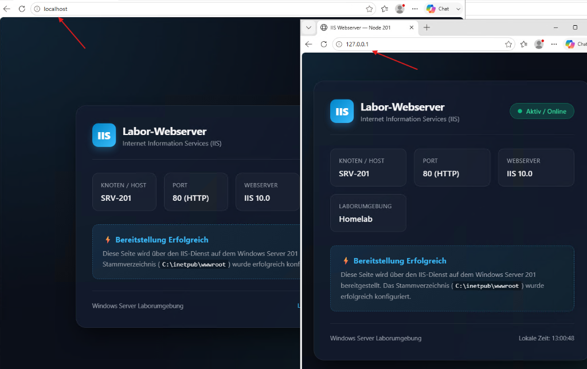

Das beweist nur, dass IIS läuft und die Datei am richtigen Ort liegt. Über `localhost` und `127.0.0.1` bleibt die Anfrage im Server, die Netzwerkkarte und die Firewall sind gar nicht beteiligt.

Der eigentliche Test kommt von einem anderen Rechner:

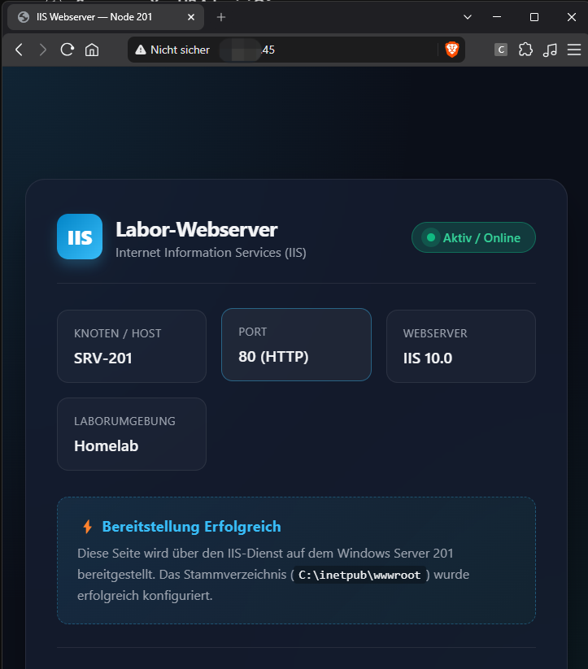

Erst das beweist, dass die Bindung stimmt und die Firewall Port 80 durchlässt. Falls nicht:

```powershell
Enable-NetFirewallRule -DisplayGroup "Weltweites Web (HTTP)"
```

## DNS

Bis hierhin muss man die IP-Adresse kennen. Das ist der Zustand, den ich schon im Teaming-Kapitel unangenehm fand: Adressen ändern sich, Namen bleiben.

Die Konsole heisst **DNS-Manager** und startet über `dnsmgmt.msc`:

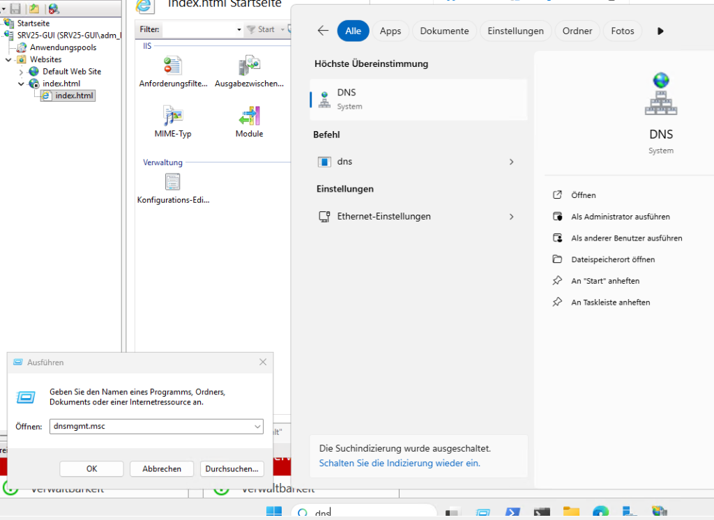

### Zone anlegen

Eine **Zone** ist der Namensbereich, für den dieser Server zuständig ist. Eine **Forward-Lookupzone** beantwortet die Frage "welche Adresse gehört zu diesem Namen". Die Gegenrichtung heisst Reverse-Lookupzone und beantwortet "welcher Name gehört zu dieser Adresse".

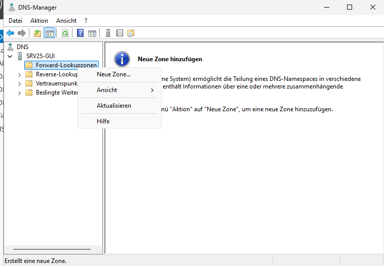

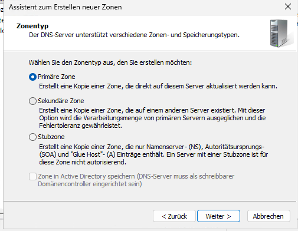

Drei Typen stehen zur Wahl:

| Typ | Bedeutung |
| :--- | :--- |
| Primär | dieser Server führt das Original und darf ändern |
| Sekundär | eine Nur-Lese-Kopie von einem anderen Server |
| Stub | nur die Namensserver der Zone, für Verweise |

Für meinen einzigen DNS-Server ist es eine primäre Zone. Sekundäre Zonen setzt man ein, wenn ein zweiter Server als Reserve mitlaufen soll.

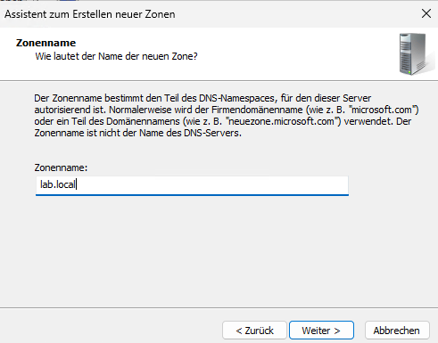

Als Namen habe ich `lab.local` genommen. Zur Endung `.local` gehört ein Hinweis: sie ist eigentlich für ein anderes Verfahren reserviert und kann in gemischten Netzen zu Problemen führen. Für ein abgeschottetes Lab ist sie in Ordnung, produktiv nimmt man besser eine Subdomain einer Domain, die einem gehört.

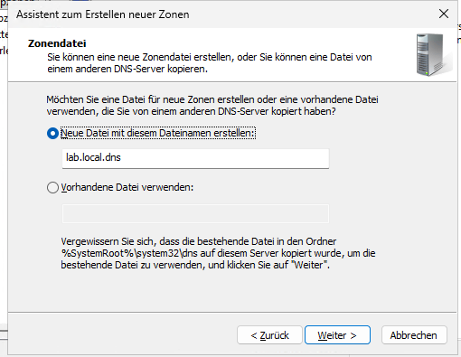

Die Zone landet als Textdatei unter `%SystemRoot%\system32\dns`. Sobald später ein Domänencontroller dazukommt, kann man die Zone stattdessen in Active Directory speichern, dann repliziert sie sich automatisch.

### Einen Namen eintragen

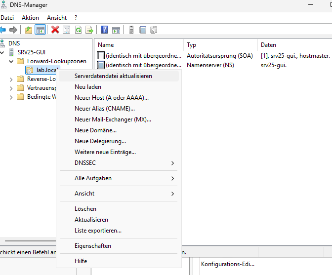

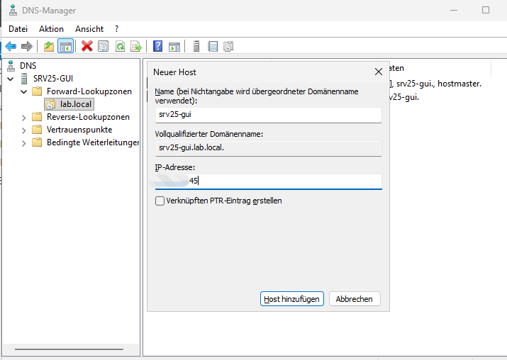

Ein **A-Eintrag** verbindet einen Namen mit einer IPv4-Adresse. Man gibt nur den vorderen Teil ein, den Rest ergänzt der Assistent zum vollständigen Namen `srv25-gui.lab.local`.

Der Punkt ganz am Ende des vollständigen Namens ist übrigens kein Tippfehler. Er steht für die Wurzel des Namensraums und macht den Namen absolut.

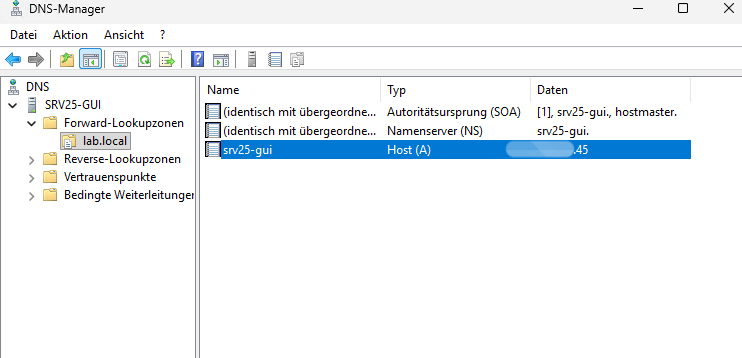

In der fertigen Zone stehen drei Einträge, und zwei davon hat niemand angelegt:

| Eintrag | Bedeutung |
| :--- | :--- |
| SOA | wer für diese Zone zuständig ist, plus Seriennummer und Zeitangaben |
| NS | welcher Server die Zone bedient |
| A | mein Eintrag: Name zu Adresse |

SOA und NS entstehen automatisch beim Anlegen der Zone. Die Seriennummer im SOA-Eintrag ist wichtig, sobald es einen zweiten Server gibt: sie wird bei jeder Änderung erhöht, und ein sekundärer Server erkennt daran, ob er seine Kopie erneuern muss.

### Den Client umstellen

Ein DNS-Server nützt nichts, solange ihn niemand fragt. Deshalb muss auf der Clientseite die DNS-Adresse geändert werden:

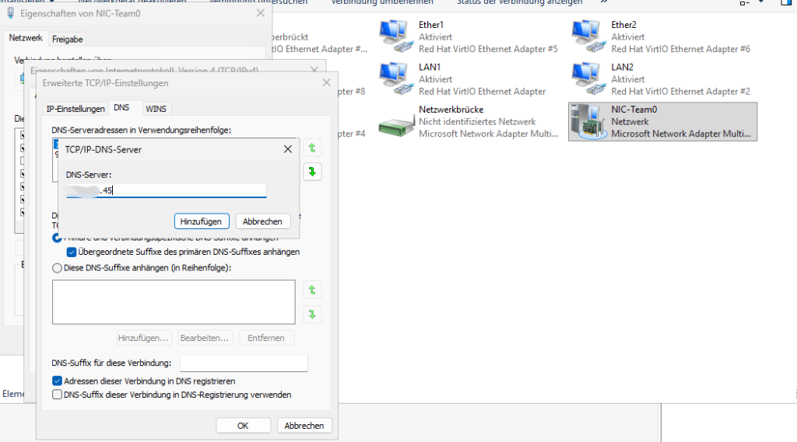

Ich habe als bevorzugten DNS-Server meinen eigenen eingetragen und einen öffentlichen als Ausweichmöglichkeit.

Dazu gehört eine Einschränkung, die ich erst beim Testen verstanden habe: Windows fragt den alternativen Server **nicht**, wenn der erste "kenne ich nicht" antwortet. Der zweite Eintrag hilft nur, wenn der erste gar nicht antwortet. Sauber gelöst wird das mit einer Weiterleitung auf dem DNS-Server selbst, der dann alles Unbekannte nach aussen weitergibt:

```powershell
Add-DnsServerForwarder -IPAddress 1.1.1.1
```

### Auflösung testen

```powershell
ipconfig /flushdns
nslookup srv25-gui.lab.local
```

Der Zwischenspeicher gehört vorher geleert, sonst antwortet der Client aus dem Gedächtnis und man testet nichts.

Die Ausgabe von `nslookup` hat zwei Teile. Oben steht, **wen** man gefragt hat, unten die Antwort. Bei mir stand oben `Server: UnKnown`. Das sieht nach einem Fehler aus, ist aber nur die fehlende Reverse-Lookupzone: der Client kann den Namen des DNS-Servers nicht ermitteln, weil es keinen Eintrag gibt, der von der Adresse zurück zum Namen führt. Die eigentliche Auflösung funktionierte einwandfrei.

### Und jetzt über den Namen

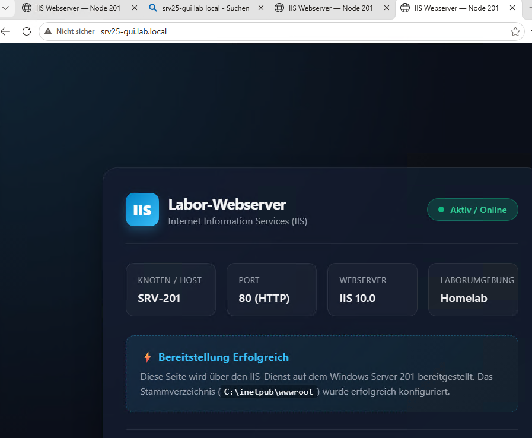

Damit ist die Kette vom Anfang geschlossen: Name eingetippt, vom eigenen DNS aufgelöst, IIS antwortet.

## Zur Kontrolle

```powershell
# Laufen beide Dienste?
Get-Service -Name DNS, W3SVC | Select-Object Name, DisplayName, Status, StartType

# Wird auf den Ports gelauscht?
Get-NetTCPConnection -LocalPort 80, 53 -State Listen |
    Select-Object LocalAddress, LocalPort, State

# Antwortet die Seite?
Invoke-WebRequest -Uri "http://srv25-gui.lab.local" -UseBasicParsing |
    Select-Object StatusCode, StatusDescription
```

`W3SVC` ist der Dienstname von IIS. Die zweite Abfrage ist die nützlichste bei der Fehlersuche: sie zeigt, **auf welcher Adresse** gelauscht wird. Steht dort nur `127.0.0.1`, ist die Bindung falsch und von aussen kommt niemand rein.

## Fehlersuche in der richtigen Reihenfolge

Bei einer Kette aus mehreren Diensten hilft es, von unten nach oben zu prüfen:

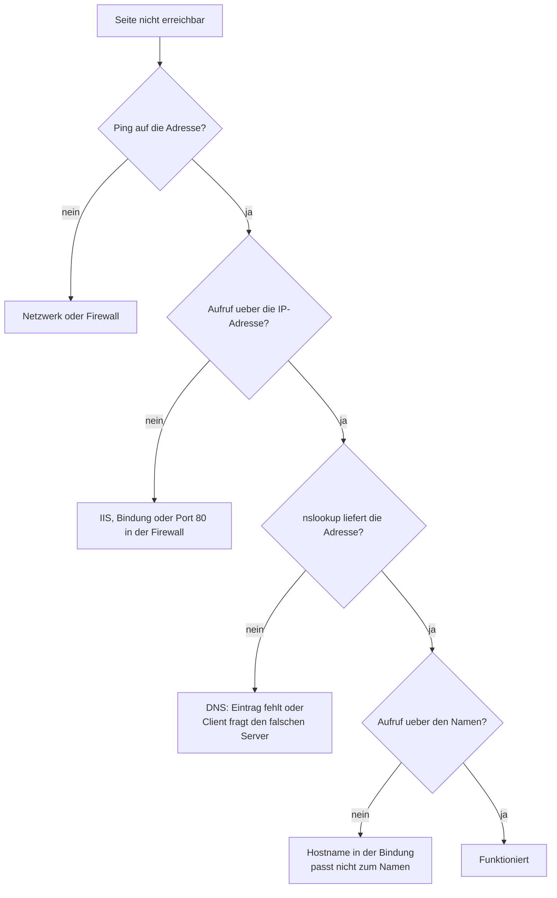
```mermaid
flowchart TD
    A["Seite nicht erreichbar"] --> B{"Ping auf die Adresse?"}
    B -->|nein| B1["Netzwerk oder Firewall"]
    B -->|ja| C{"Aufruf ueber die IP-Adresse?"}
    C -->|nein| C1["IIS, Bindung oder Port 80 in der Firewall"]
    C -->|ja| D{"nslookup liefert die Adresse?"}
    D -->|nein| D1["DNS: Eintrag fehlt oder<br/>Client fragt den falschen Server"]
    D -->|ja| E{"Aufruf ueber den Namen?"}
    E -->|nein| E1["Hostname in der Bindung<br/>passt nicht zum Namen"]
    E -->|ja| F["Funktioniert"]
```

| Symptom | Ursache | Lösung |
| :--- | :--- | :--- |
| lokal geht es, von aussen nicht | Firewall oder Bindung nur auf `127.0.0.1` | Regel für HTTP aktivieren, Bindung prüfen |
| über die IP geht es, über den Namen nicht | DNS-Eintrag fehlt oder Client fragt den falschen Server | `nslookup`, DNS-Adresse am Client prüfen |
| über den Namen geht es, über die IP nicht | Hostname in der Bindung eingetragen | zweite Bindung ohne Hostnamen anlegen |
| Verzeichnis wird angezeigt statt der Seite | Datei steht nicht in der Liste der Standarddokumente | Datei umbenennen oder eintragen |
| Name wird noch alt aufgelöst | Zwischenspeicher | `ipconfig /flushdns` |

## Begriffe

| Deutsch | Englisch | Bedeutung |
| :--- | :--- | :--- |
| Serverrolle | Server Role | Hauptaufgabe eines Servers |
| Sitebindung | Site Binding | Adresse, Port und Name, auf die eine Website reagiert |
| Standarddokument | Default Document | Datei, die ohne Dateinamen ausgeliefert wird |
| Forward-Lookupzone | Forward Lookup Zone | Name zu Adresse |
| Reverse-Lookupzone | Reverse Lookup Zone | Adresse zu Name |
| primäre Zone | Primary Zone | beschreibbares Original |
| Host-A-Eintrag | Host A Record | Name zu IPv4-Adresse |
| Weiterleitung | Forwarder | wohin unbekannte Anfragen gehen |
| Namensauflösung | Name Resolution | vom Namen zur Adresse |

## Was ich dabei gelernt habe

**Namensauflösung ist eine eigene Schicht.** Der Aufruf über die IP-Adresse ging von Anfang an, über den Namen erst nach dem DNS-Eintrag. Beides sind getrennte Fehlerquellen. Wenn etwas "nicht geht", ist die erste sinnvolle Frage: liegt es am Namen oder an der Verbindung? Ein `nslookup` beantwortet das in zwei Sekunden.

**Der Hostname in der Bindung hat zwei Seiten.** Er ist die Grundlage dafür, dass mehrere Websites sich eine Adresse teilen können. Gleichzeitig macht er den Aufruf über die reine IP unmöglich, und danach sucht man lange, wenn man den Zusammenhang nicht kennt.

**Der alternative DNS-Server ist kein Ersatz für eine Weiterleitung.** Ich hatte gedacht, der zweite Eintrag springt ein, wenn der erste einen Namen nicht kennt. Das stimmt nicht: er springt nur ein, wenn der erste gar nicht antwortet. Eine negative Antwort ist auch eine Antwort. Wer im eigenen Netz auflösen und trotzdem ins Internet kommen will, braucht eine Weiterleitung auf dem eigenen Server.

**`Server: UnKnown` bei `nslookup` ist meist harmlos.** Es fehlt nur die Rückwärtsauflösung. Ich habe erst eine Weile nach einem Fehler gesucht, den es gar nicht gab.

## Noch offen

Zwei Screenshots aus diesem Ablauf sind hier nicht enthalten, weil darin Adressen aus meiner Testumgebung ungeschwärzt zu sehen sind. Sie zeigen die Serverauswahl im Rollen-Assistenten und die DNS-Einstellungen der Netzwerkkarte. Beides ist im Text beschrieben.
