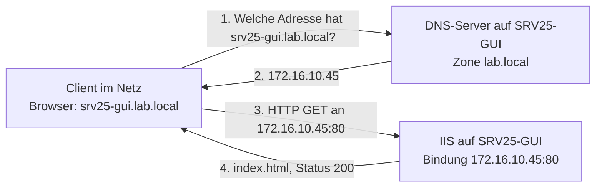
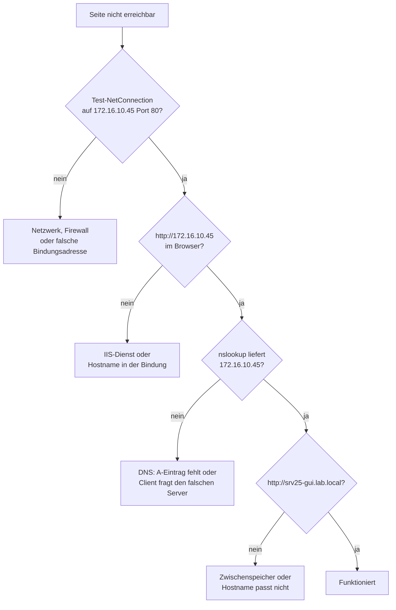

# Serverrollen, IIS und DNS

## Worum es geht

Bisher habe ich in diesem Lab an Speicher und Netzwerk gearbeitet. Jetzt kommt zum ersten Mal ein Dienst dazu, den jemand von aussen wirklich benutzt: eine Website.

Das Ziel war eine Kette, die von Anfang bis Ende funktioniert. Nicht nur "IIS ist installiert", sondern: ein Client an einem anderen Rechner tippt einen Namen in den Browser, dieser Name wird von meinem eigenen DNS-Server aufgelöst, und der Webserver liefert die Seite aus.



Diese vier Schritte sind der Kern des Kapitels. Wenn ein Benutzer sagt "die Seite geht nicht", muss man wissen, welcher der vier Schritte fehlgeschlagen ist, denn jeder hat eine andere Ursache und ein anderes Prüfwerkzeug.

## Aufbau

Beide Rollen laufen auf derselben Maschine.

| Parameter | Wert |
| :--- | :--- |
| Server | `SRV25-GUI`, Windows Server 2025 Standard mit Desktopdarstellung |
| Verwaltungsadresse | `172.16.10.21` (Team 0, mit Standardgateway) |
| Dienstadresse der Website | `172.16.10.45` (Team 2, ohne Gateway) |
| Konto | `.\adm_local` |
| Rolle 1 | DNS-Server |
| Rolle 2 | Webserver (IIS 10.0) |
| Konsolen | `inetmgr.exe`, `dnsmgmt.msc` |
| Webverzeichnis | `C:\inetpub\wwwroot` |
| DNS-Zone | `lab.local` |
| Vollständiger Name | `srv25-gui.lab.local` |
| Ports | `80` für HTTP, `53` für DNS |

Der Server hat mehrere Adressen, weil im [Kapitel über NIC-Teaming](06-nic-teaming.md) zwei Teams und eine Brücke entstanden sind. Ich habe die Website bewusst **nicht** auf die Verwaltungsadresse gelegt, sondern auf `172.16.10.45`, die Adresse des zweiten Teams. Damit ist Verwaltungsverkehr von Nutzverkehr getrennt, was in echten Umgebungen üblich ist.

## Rollen installieren

Windows-Funktionen sind in **Rollen** und **Features** unterteilt. Eine Rolle ist die Aufgabe des Servers, etwa Webserver oder DNS. Ein Feature ist ein Hilfsmittel, etwa die Verwaltungswerkzeuge dazu.

Der Assistent startet in der Serververwaltung über den Schnellstart:


| Option | Bedeutung |
| :--- | :--- |
| Rollenbasierte oder featurebasierte Installation | der Normalfall, einzelne Rolle auf einem Server |
| Installation von Remotedesktopdiensten | richtet Terminalserver für mehrere gleichzeitige Benutzer ein |

Die zweite Option macht etwas völlig anderes und wird hier nicht gebraucht.

Der nächste Schritt fragt nach dem Zielserver aus dem Serverpool. Bemerkenswert daran: man kann eine Rolle auch auf einem **anderen** Server installieren, nicht nur auf dem, an dem man gerade sitzt. In meinem Pool standen `SRV25-GUI` (`172.16.10.21`) und der Core-Server `SRV22-CORE` (`172.16.10.30`) zur Auswahl. Ich habe `SRV25-GUI` genommen. Genau so installiert man Rollen auf Maschinen ohne Oberfläche, ohne sich dort anmelden zu müssen.


Sobald man eine Rolle anhakt, öffnet sich ein zweites Fenster und schlägt die passenden Verwaltungswerkzeuge vor, die RSAT-Tools. Diesen Vorschlag sollte man annehmen: ohne sie ist die Rolle installiert, aber es gibt keine Konsole, um sie zu bedienen.


Der Haken **Zielserver bei Bedarf automatisch neu starten** ist bequem, aber man sollte wissen, was er tut: der Server startet ohne Rückfrage neu, wenn die Installation es verlangt. Auf einer Maschine mit laufenden Diensten würde man ihn weglassen und den Neustart selbst planen.


Dasselbe in einer Zeile, und so würde man es für mehrere Server machen:

```powershell
Install-WindowsFeature -Name Web-Server, DNS -IncludeManagementTools -ComputerName SRV25-GUI
```

## IIS einrichten

Die Konsole heisst Internetinformationsdienste-Manager und startet über `inetmgr`:


Links steht die Hierarchie: der Server `SRV25-GUI`, darunter Anwendungspools und Websites, darunter die **Default Web Site**, die bei der Installation automatisch angelegt wird.


Vier Einstellungen braucht man am Anfang:

| Einstellung | Wofür | Mein Wert |
| :--- | :--- | :--- |
| Standarddokument | welche Datei ohne Dateinamen ausgeliefert wird | `index.html` steht an erster Stelle |
| Authentifizierung | anonym, Basis oder Windows-Anmeldung | anonym, es ist eine öffentliche Seite |
| MIME-Typen | welche Dateitypen ausgeliefert werden dürfen | Standardliste |
| Protokollierung | wohin die Zugriffsprotokolle gehen | `%SystemDrive%\inetpub\logs\LogFiles` |

Das Standarddokument erklärt einen häufigen Stolperstein. Ruft man `http://172.16.10.45/` ohne Dateinamen auf, geht IIS diese Liste von oben nach unten durch und liefert die erste Datei aus, die es findet. Heisst die eigene Datei anders und steht nicht in der Liste, bekommt man einen Fehler, obwohl die Datei vorhanden ist.

Meine Seite liegt als `C:\inetpub\wwwroot\index.html`.

### Bindungen

Eine Bindung legt fest, worauf eine Website überhaupt reagiert. Das ist die wichtigste Einstellung des Kapitels, weil sie erklärt, warum eine Seite lokal geht und von aussen nicht.


| Feld | Mein Wert | Bedeutung |
| :--- | :--- | :--- |
| Typ | `http` | unverschlüsselt; für `https` bräuchte man ein Zertifikat |
| IP-Adresse | `172.16.10.45` | es wird nur auf dieser Adresse gelauscht, nicht auf `172.16.10.21` |
| Port | `80` | Standardport für HTTP |
| Hostname | `srv25-gui.local` | reagiert nur, wenn der Browser diesen Namen mitschickt |

Zwei Punkte daran sind wichtig.

**Die Adressauswahl schliesst aus.** Steht dort `172.16.10.45`, ist die Seite über `172.16.10.21` nicht erreichbar. Wählt man stattdessen "Alle nicht zugewiesenen", hört IIS auf jeder Adresse des Servers.

**Der Hostname schliesst ebenfalls aus.** Ist er eingetragen, prüft IIS bei jeder Anfrage den mitgeschickten Namen. Nur passende Anfragen werden bedient. So teilen sich mehrere Websites dieselbe Adresse und denselben Port und werden trotzdem auseinandergehalten. Die Kehrseite: der Aufruf über die reine IP-Adresse `http://172.16.10.45` funktioniert dann nicht mehr, weil dabei kein passender Name mitkommt. Wer beides braucht, legt zwei Bindungen an, eine mit Namen und eine ohne. Genau das habe ich gemacht, damit der Test über die Adresse weiter möglich ist.

Als Befehl:

```powershell
New-WebBinding -Name "Default Web Site" -IPAddress "172.16.10.45" -Port 80 -Protocol http
New-WebBinding -Name "Default Web Site" -IPAddress "172.16.10.45" -Port 80 `
               -Protocol http -HostHeader "srv25-gui.local"
```

## DNS einrichten

Bis hierhin muss man die Adresse `172.16.10.45` kennen. Adressen ändern sich, Namen bleiben, also kommt jetzt der eigene DNS-Server dazu.


### Zone anlegen

Eine **Zone** ist der Namensbereich, für den dieser Server zuständig ist. Eine **Forward-Lookupzone** beantwortet "welche Adresse gehört zu diesem Namen". Die Gegenrichtung heisst Reverse-Lookupzone und beantwortet "welcher Name gehört zu dieser Adresse".


| Zonentyp | Bedeutung | Wann |
| :--- | :--- | :--- |
| Primär | dieser Server führt das Original und darf ändern | einziger oder erster DNS-Server |
| Sekundär | Nur-Lese-Kopie von einem anderen Server | zweiter Server als Reserve |
| Stub | nur die Namensserver der Zone | Verweis auf eine fremde Zone |

Für meinen einzigen DNS-Server ist es eine primäre Zone.


Als Namen habe ich `lab.local` genommen, die Zonendatei heisst entsprechend `lab.local.dns` und liegt unter `%SystemRoot%\system32\dns`. Zur Endung `.local` gehört ein Hinweis: sie ist eigentlich für ein anderes Verfahren reserviert und kann in gemischten Netzen zu Problemen führen. Für ein abgeschottetes Lab ist sie in Ordnung, produktiv nimmt man besser eine Subdomain einer Domain, die einem gehört.

Sobald später ein Domänencontroller dazukommt, kann man die Zone stattdessen in Active Directory speichern, dann repliziert sie sich automatisch.

### Den A-Eintrag anlegen

Das ist der Kern des ganzen DNS-Teils: hier wird der Name mit der Dienstadresse verbunden.


| Feld | Mein Wert |
| :--- | :--- |
| Name | `srv25-gui` |
| Vollqualifizierter Domänenname | `srv25-gui.lab.local.` |
| IP-Adresse | `172.16.10.45` |

Man gibt nur den vorderen Teil ein, den Rest ergänzt der Assistent aus dem Zonennamen. Der Punkt ganz am Ende ist kein Tippfehler: er steht für die Wurzel des Namensraums und macht den Namen absolut.

Entscheidend ist, dass hier **`172.16.10.45`** steht und nicht die Verwaltungsadresse `172.16.10.21`. Der Name muss auf genau die Adresse zeigen, auf der die Website lauscht. Zeigte er auf `.21`, würde die Auflösung funktionieren und der Seitenaufruf trotzdem scheitern, weil dort keine Bindung existiert. Das ist ein Fehler, den man lange sucht, weil `nslookup` dabei fehlerfrei aussieht.


In der fertigen Zone stehen drei Einträge, zwei davon hat niemand angelegt:

| Eintrag | Inhalt | Bedeutung |
| :--- | :--- | :--- |
| SOA | `srv25-gui.`, `hostmaster.`, Seriennummer | wer für die Zone zuständig ist |
| NS | `srv25-gui.` | welcher Server die Zone bedient |
| Host (A) | `srv25-gui` → `172.16.10.45` | mein Eintrag |

SOA und NS entstehen automatisch. Die Seriennummer im SOA-Eintrag wird bei jeder Änderung erhöht; ein sekundärer Server erkennt daran, ob er seine Kopie erneuern muss.

Als Befehl:

```powershell
Add-DnsServerPrimaryZone -Name "lab.local" -ZoneFile "lab.local.dns"
Add-DnsServerResourceRecordA -ZoneName "lab.local" -Name "srv25-gui" `
                             -IPv4Address "172.16.10.45"
```

### Den Client umstellen

Ein DNS-Server nützt nichts, solange ihn niemand fragt. Auf der Clientseite wird deshalb der bevorzugte DNS-Server geändert:


| Feld | Wert | Warum |
| :--- | :--- | :--- |
| Bevorzugter DNS-Server | `172.16.10.45` | mein eigener DNS-Server, kennt `lab.local` |
| Alternativer DNS-Server | `1.1.1.1` | öffentlicher Server als Ausweichmöglichkeit |

```powershell
Set-DnsClientServerAddress -InterfaceAlias "NIC-Team0" `
                           -ServerAddresses ("172.16.10.45","1.1.1.1")
```

Dazu gehört eine Einschränkung, die ich erst beim Testen verstanden habe: Windows fragt den alternativen Server **nicht**, wenn der erste "kenne ich nicht" antwortet. Der zweite Eintrag hilft nur, wenn der erste gar nicht antwortet. Eine negative Antwort ist eben auch eine Antwort.

Sauber gelöst wird das mit einer Weiterleitung auf dem DNS-Server selbst. Dann beantwortet er alles zu `lab.local` selbst und gibt alles andere nach aussen weiter:

```powershell
Add-DnsServerForwarder -IPAddress 1.1.1.1, 9.9.9.9
```

## Test und Verifikation

Die Kette wird in vier Stufen geprüft, jede Stufe eine Ebene weiter aussen. Das ist die eigentliche Arbeit, denn nur so weiss man hinterher, was tatsächlich funktioniert.

### Stufe 1: Läuft der Dienst überhaupt?

```powershell
Get-Service -Name DNS, W3SVC | Select-Object Name, DisplayName, Status, StartType
```

```
Name   DisplayName                        Status  StartType
----   -----------                        ------  ---------
DNS    DNS-Server                         Running Automatic
W3SVC  Webveröffentlichungsdienst         Running Automatic
```

`W3SVC` ist der Dienstname von IIS. Beide müssen `Running` und `Automatic` sein, sonst sind sie nach dem nächsten Neustart weg.

### Stufe 2: Auf welcher Adresse wird gelauscht?

```powershell
Get-NetTCPConnection -LocalPort 80, 53 -State Listen |
    Select-Object LocalAddress, LocalPort, State
```

```
LocalAddress    LocalPort State
------------    --------- -----
172.16.10.45           80 Listen
0.0.0.0                53 Listen
::                     53 Listen
```

Das ist die nützlichste Abfrage bei der Fehlersuche. Man sieht sofort, dass HTTP nur auf `172.16.10.45` lauscht, so wie die Bindung es vorgibt. Stünde dort `127.0.0.1`, käme von aussen niemand rein. DNS lauscht dagegen auf `0.0.0.0`, also auf allen Adressen des Servers.

### Stufe 3: Lokal auf dem Server


Aufgerufen über `http://localhost` und `http://127.0.0.1`. Die Seite kommt.

Das beweist allerdings weniger, als es scheint: über die Loopback-Adresse bleibt die Anfrage im Server, Netzwerkkarte und Firewall sind gar nicht beteiligt. Ein erfolgreicher `localhost`-Aufruf sagt nur, dass IIS läuft und die Datei am richtigen Ort liegt.

### Stufe 4: Von einem anderen Rechner im Netz

Das ist der Test, auf den es ankommt. Vom Client-PC im selben Netz, über die Adresse:

```
http://172.16.10.45
```


Der Browser lädt die statische Seite `Labor-Webserver (IIS 10.0)`. Damit ist bewiesen:

- die Bindung auf `172.16.10.45:80` ist richtig gesetzt,
- die Windows-Firewall lässt Port 80 von aussen durch,
- der Weg vom Client zum Server über das Netz funktioniert.

Falls hier nichts kommt, während `localhost` geht, ist fast immer die Firewall schuld:

```powershell
Enable-NetFirewallRule -DisplayGroup "Weltweites Web (HTTP)"
Test-NetConnection -ComputerName 172.16.10.45 -Port 80
```

```
ComputerName     : 172.16.10.45
RemoteAddress    : 172.16.10.45
RemotePort       : 80
TcpTestSucceeded : True
```

### Stufe 5: Namensauflösung

Erst jetzt kommt DNS ins Spiel. Zuerst den Zwischenspeicher leeren, sonst antwortet der Client aus dem Gedächtnis und man testet nichts:

```powershell
ipconfig /flushdns
nslookup srv25-gui.lab.local
```

```
Server:  UnKnown
Address:  172.16.10.45

Name:    srv25-gui.lab.local
Address: 172.16.10.45
```

Die Ausgabe hat zwei Teile. Oben steht, **wen** man gefragt hat: den Server unter `172.16.10.45`. Unten steht die Antwort: der Name zeigt auf `172.16.10.45`.

`Server: UnKnown` sieht nach einem Fehler aus, ist aber harmlos. `nslookup` versucht zuerst, den Namen des DNS-Servers zu ermitteln, und dafür bräuchte es eine Reverse-Lookupzone, die ich nicht angelegt habe. Die eigentliche Auflösung funktioniert einwandfrei. Ich habe an dieser Stelle eine Weile nach einem Fehler gesucht, den es gar nicht gab.

### Stufe 6: Über den Namen

```powershell
Invoke-WebRequest -Uri "http://srv25-gui.lab.local" -UseBasicParsing |
    Select-Object StatusCode, StatusDescription
```

```
StatusCode StatusDescription
---------- -----------------
       200 OK
```

Und im Browser:


Damit ist die Kette vom Anfang des Kapitels geschlossen: Name eingetippt, vom eigenen DNS zu `172.16.10.45` aufgelöst, IIS antwortet mit Status 200.

## Fehlersuche

Bei einer Kette aus mehreren Diensten prüft man von unten nach oben. Jede Stufe grenzt die Ursache weiter ein:



| Symptom | Ursache | Lösung |
| :--- | :--- | :--- |
| `localhost` geht, `172.16.10.45` nicht | Firewall blockiert Port 80 | `Enable-NetFirewallRule -DisplayGroup "Weltweites Web (HTTP)"` |
| gar nichts geht, auch lokal nicht | IIS-Dienst gestoppt | `Start-Service W3SVC` |
| Bindung lauscht auf `127.0.0.1` | falsche Adresse in der Bindung | Bindung auf `172.16.10.45` ändern |
| über die IP geht es, über den Namen nicht | A-Eintrag fehlt oder Client fragt falschen DNS-Server | `nslookup`, `Get-DnsClientServerAddress` |
| über den Namen geht es, über die IP nicht | Hostname in der Bindung eingetragen | zweite Bindung ohne Hostnamen anlegen |
| Name löst auf, Seite kommt trotzdem nicht | A-Eintrag zeigt auf die falsche Adresse | Eintrag auf `172.16.10.45` korrigieren |
| Verzeichnis statt Seite | Datei nicht in der Liste der Standarddokumente | umbenennen oder eintragen |
| alter Wert wird aufgelöst | Zwischenspeicher am Client | `ipconfig /flushdns` |
| interne Namen gehen, Internet nicht | keine Weiterleitung gesetzt | `Add-DnsServerForwarder -IPAddress 1.1.1.1` |

## Begriffe

| Deutsch | Englisch | Bedeutung |
| :--- | :--- | :--- |
| die Serverrolle | Server Role | Hauptaufgabe eines Servers |
| das Feature | Feature | Zusatzfunktion, etwa Verwaltungswerkzeuge |
| die Sitebindung | Site Binding | Adresse, Port und Name, auf die eine Website reagiert |
| der Hostname in der Bindung | Host Header | Namensfilter, erlaubt mehrere Sites auf einer Adresse |
| das Standarddokument | Default Document | Datei, die ohne Dateinamen ausgeliefert wird |
| der Anwendungspool | Application Pool | eigener Prozess, in dem eine Website läuft |
| die Forward-Lookupzone | Forward Lookup Zone | Name zu Adresse |
| die Reverse-Lookupzone | Reverse Lookup Zone | Adresse zu Name |
| die primäre Zone | Primary Zone | beschreibbares Original der Zone |
| der Host-A-Eintrag | Host A Record | Name zu IPv4-Adresse |
| der SOA-Eintrag | Start of Authority | Zuständigkeit und Seriennummer einer Zone |
| die Weiterleitung | Forwarder | wohin unbekannte Anfragen gehen |
| die Namensauflösung | Name Resolution | vom Namen zur Adresse |
| die Loopback-Adresse | Loopback Address | `127.0.0.1`, verlässt den Rechner nicht |

## Was ich dabei gelernt habe

**Namensauflösung ist eine eigene Schicht.** Der Aufruf über `172.16.10.45` funktionierte von Anfang an, über `srv25-gui.lab.local` erst nach dem A-Eintrag. Das sind zwei getrennte Fehlerquellen, und die erste sinnvolle Frage bei einer Störung lautet deshalb: liegt es am Namen oder an der Verbindung? Ein `nslookup` beantwortet das in zwei Sekunden.

**Der A-Eintrag muss auf die richtige Adresse zeigen, nicht irgendeine des Servers.** Mein Server hat drei Adressen, die Website lauscht nur auf `172.16.10.45`. Hätte ich im A-Eintrag `172.16.10.21` eingetragen, wäre die Auflösung fehlerfrei gewesen und der Aufruf trotzdem gescheitert. Namensauflösung und Diensterreichbarkeit haben nichts miteinander zu tun.

**Der Hostname in der Bindung hat zwei Seiten.** Er ist die Grundlage dafür, dass sich mehrere Websites eine Adresse teilen. Gleichzeitig macht er den Aufruf über die reine IP unmöglich. Ich habe deshalb zwei Bindungen angelegt.

**Ein `localhost`-Test beweist fast nichts.** Er umgeht Netzwerkkarte und Firewall vollständig. Der erste ernstzunehmende Test ist der von einem anderen Rechner aus, und genau der ist bei mir zuerst an der Firewall gescheitert.

**Der alternative DNS-Server ist kein Ersatz für eine Weiterleitung.** Er springt nur ein, wenn der erste Server gar nicht antwortet, nicht wenn dieser einen Namen nicht kennt. Wer intern auflösen und trotzdem ins Internet kommen will, braucht eine Weiterleitung auf dem eigenen Server.

## Noch offen

Zwei Screenshots aus diesem Ablauf sind hier nicht enthalten, weil darin Adressen meiner Testumgebung ungeschwärzt zu sehen sind: die Serverauswahl im Rollen-Assistenten und die DNS-Einstellungen der Netzwerkkarte. Beide Schritte sind oben mit ihren Werten beschrieben.
